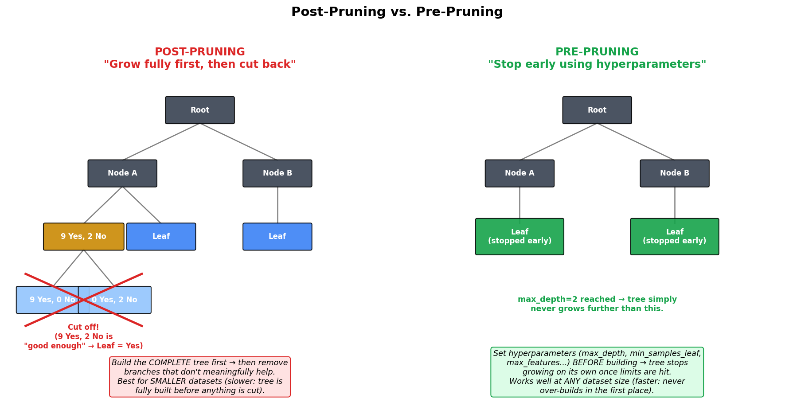

# Decision Tree (Classification) 


## 1. You Already Know Decision Trees — You've Just Never Called Them That

Think about how you've probably written code before:

```python
if age <= 15:
    print("The person is in school")
elif age <= 21:
    print("The person may be in college")
else:
    print("The person has passed college")
```

That's it. That nested if-elif-else logic **is** a Decision Tree. The algorithm doesn't invent anything conceptually new — it just **automatically learns** the best if-else conditions from your data, instead of you hand-writing them.


>  **A Decision Tree is a flowchart-like structure that repeatedly asks yes/no (or category) questions about your features, splitting the data at each step, until it arrives at a final answer.**


| Term | Meaning |
|---|---|
| **Root Node** | The very first question/split — the top of the tree |
| **Decision Node** | Any internal node that splits the data further |
| **Leaf Node** | The final node — this is where a prediction is actually made |
| **Branch** | A connection representing the outcome of a question (e.g., "Yes"/"No") |

**Real-life example:**  **A nurse doing initial triage.** *"Is the patient's temperature above 103°F? → Yes → Is there difficulty breathing? → Yes → Send to ER immediately."* Each question narrows things down — exactly like a decision tree.

---

## 2. Classification vs Regression Trees

Decision Trees can solve **both**:
- **Classification** — predicting a category (e.g., will it rain: Yes/No)
- **Regression** — predicting a number (e.g., predicting house price)

*(These notes focus on classification — regression trees work almost identically, just replacing "majority class" with "average value" at the leaves, similar to how KNN regression worked.)*

---

## 3. ID3 vs CART — The Two Main Flavors

| | ID3 | CART |
|---|---|---|
| Splits | Can create **more than 2** branches from one node | Always creates **binary (2-way)** splits |
| Used by `sklearn` today? | No | **Yes** — `sklearn`'s `DecisionTreeClassifier` uses CART |
| Impurity measure | Typically Entropy | Typically Gini Impurity (though `sklearn` lets you choose either) |

>  Even though CART always splits data into exactly 2 branches, it can still handle a feature with 3+ categories (like "Sunny/Overcast/Rain") — it just does it through a sequence of binary splits (e.g., "is Outlook == Sunny?" Yes/No) rather than one 3-way split.

---

## 4. Worked Example: Should We Play Tennis?

Let's use the same classic dataset from the Naive Bayes notes — 14 days of weather data (`Outlook`, `Temperature`, `Humidity`, `Wind`) predicting whether tennis was played (`Play`). Out of 14 days: **9 said Yes, 5 said No.**

### Step 1 — Pick a feature to split on (let's try `Outlook` first)

`Outlook` has 3 categories: Sunny, Overcast, Rain. Splitting the data by these categories:

| Outlook | Yes | No |
|---|---|---|
| Sunny | 2 | 3 |
| Overcast | 4 | 0 |
| Rain | 3 | 2 |


### Step 2 — Check: is each resulting group "pure" or "impure"?

> A node is **pure** if it contains only one class (all Yes, or all No). A node is **impure** if it's a mix of both.

- **Overcast → 4 Yes, 0 No → 100% pure!** This immediately becomes a **leaf node**: *"If Outlook = Overcast, predict Play = Yes"* — no further splitting needed here.
- **Sunny → 2 Yes, 3 No → impure.** We'll need to split this further using another feature (like Humidity).
- **Rain → 3 Yes, 2 No → impure.** Same story — needs further splitting (like Wind).

This is the core idea of building a decision tree: **keep splitting impure nodes using the best available feature, until every branch ends in a pure (or "pure enough") leaf.**

---

## 5. But *How* Do We Measure "Pure" vs "Impure" Mathematically?

Eyeballing "2 Yes, 3 No" as impure is easy for humans — but a computer needs an actual number to compare different possible splits and decide which feature is "best." This is where **Entropy** and **Gini Impurity** come in.

###  Real-Life Analogy: How Mixed Up Is the Jar?

Imagine a jar of marbles. If every marble is the same color, the jar is perfectly "pure" — there's no uncertainty about what color you'd randomly pull out. If it's an even 50/50 mix of two colors, the jar is maximally "impure" — you genuinely can't guess which color you'd pull out next.


**Entropy** and **Gini Impurity** are just two different mathematical ways to measure exactly this: *how mixed up is a group of labels?*

### 5.1 Entropy

$$ \text{Entropy} = -\sum_{i=1}^{c} p_i \log_2(p_i) $$

For a binary (2-class) case, this simplifies to:

$$ \text{Entropy} = -p \log_2(p) - (1-p)\log_2(1-p) $$

where $p$ = proportion of one class (e.g., proportion of "Yes").

- Entropy = **0** → completely pure (all one class)
- Entropy = **1** → maximum impurity (perfect 50/50 split, for 2 classes)

### 5.2 Gini Impurity

$$ \text{Gini} = 1 - \sum_{i=1}^{c} p_i^2 $$

For binary classification:

$$ \text{Gini} = 1 - p^2 - (1-p)^2 $$

- Gini = **0** → completely pure
- Gini = **0.5** → maximum impurity (50/50 split, for 2 classes)


>  **Entropy vs Gini in practice:** Both measure essentially the same thing and usually lead to very similar trees. Gini is slightly cheaper to compute (no logarithm), so it's `sklearn`'s default (`criterion='gini'`) — but you can switch to `criterion='entropy'` any time.
>
>  *See Section 6.3 below for detailed, dataset-size-based guidance on choosing between the two.*

### 5.3 Quick Calculation: Entropy of the Root Node

For our full dataset (9 Yes, 5 No out of 14):

$$ p_{\text{Yes}} = \frac{9}{14} \approx 0.643, \quad p_{\text{No}} = \frac{5}{14} \approx 0.357 $$

$$ \text{Entropy} = -(0.643 \log_2 0.643) - (0.357 \log_2 0.357) \approx 0.940 $$

This is close to the maximum of 1 — meaning our starting dataset is quite "mixed," which makes sense (9 vs 5 is fairly close to a 50/50 split).

And for the pure **Overcast** node (4 Yes, 0 No):

$$ \text{Entropy} = -(1 \cdot \log_2 1) - (0 \cdot \log_2 0) = 0 $$

*(Exactly what we'd expect — zero impurity for a pure leaf!)*

### 5.4 A Second Worked Example — Directly Comparing a Pure vs. Impure Split

Let's do one more worked example, using the exact numbers from the follow-up video: suppose a feature splits the data into two child nodes:

- **Child C1:** 3 Yes, 3 No (6 total)
- **Child C2:** 3 Yes, 0 No (3 total)

**Entropy of C1 (the impure one):**

$$ p_{\text{Yes}} = \frac{3}{6} = 0.5, \quad p_{\text{No}} = \frac{3}{6} = 0.5 $$

$$ \text{Entropy}(C_1) = -\left(\frac{3}{6}\log_2\frac{3}{6}\right) - \left(\frac{3}{6}\log_2\frac{3}{6}\right) = -\left(0.5 \times -1\right) -\left(0.5 \times -1\right) = 1 $$

An entropy of exactly **1** confirms this is the **most impure a binary split can possibly be** — a perfect 50/50 mix.

**Entropy of C2 (the pure one):**

$$ p_{\text{Yes}} = \frac{3}{3} = 1, \quad p_{\text{No}} = \frac{0}{3} = 0 $$

$$ \text{Entropy}(C_2) = -(1 \times \log_2 1) - (0 \times \log_2 0) = -(1 \times 0) - 0 = 0 $$

*(By convention, $0 \times \log_2 0$ is treated as $0$, since a class that never occurs contributes no uncertainty.)* An entropy of **0** confirms this leaf is perfectly pure.

**Now the same two nodes, using Gini Impurity instead:**

$$ \text{Gini}(C_1) = 1 - \left(\left(\frac{3}{6}\right)^2 + \left(\frac{3}{6}\right)^2\right) = 1 - (0.25 + 0.25) = 0.5 $$

$$ \text{Gini}(C_2) = 1 - \left(\left(\frac{3}{3}\right)^2\right) = 1 - 1 = 0 $$

### 5.5 Interview-Important Callout: The Value Ranges Differ!

This is a genuinely common interview question, so it's worth memorizing directly:

| Measure | Minimum (pure) | Maximum (most impure, binary case) |
|---|---|---|
| **Entropy** | 0 | **1** |
| **Gini Impurity** | 0 | **0.5** |

Both hit **0** for a pure node — but their *maximum* impurity values differ (1 vs 0.5), simply because of how each formula is mathematically defined. This is exactly why the entropy curve in the plot above rises twice as high as the Gini curve, even though both peak at the same point (a 50/50 split).

>  **Multi-class note:** For more than 2 classes, the same formulas generalize directly — just keep adding a $-p_i\log_2(p_i)$ term (for entropy) or $p_i^2$ term (for Gini) for each additional class. For example, with 3 output categories, entropy simply expands to:
>
> $$ H(S) = -p_1\log_2(p_1) - p_2\log_2(p_2) - p_3\log_2(p_3) $$
>
> The overall shape of the logic doesn't change, only the number of terms being summed — so don't be thrown off if you see a longer formula with more categories; it's the exact same idea, just extended.

---

## 6. Choosing the Best Feature to Split On: Information Gain

Now the question : **out of Outlook, Temperature, Humidity, and Wind — which feature should actually become the root node?**

>  **Note:** the video that introduced Entropy and Gini Impurity explicitly leaves this question — *how do we use these impurity measures to actually choose which feature to split on?* — for its follow-up video on Information Gain. The explanation below answers exactly that.

>  **We pick whichever feature gives us the biggest *reduction* in impurity — this reduction is called Information Gain.**

$$ \text{Information Gain} = \text{Entropy(parent)} - \sum_{\text{children}} \left( \frac{|\text{child}|}{|\text{parent}|} \times \text{Entropy(child)} \right) $$

In plain English: *"Start with the parent's entropy. Subtract the weighted-average entropy of the children after the split. Whatever's left over is how much 'confusion' this split actually resolved."*

### 6.1 Full Worked Example

Suppose our root node has **9 Yes, 5 No** (14 total) — the same root we calculated earlier, with entropy $H(S) \approx 0.94$.

**Candidate split on Feature F1** produces two children:
- **C1:** 6 Yes, 2 No (8 total)
- **C2:** 3 Yes, 3 No (6 total)

*(Check: $6+3=9$ Yes and $2+3=5$ No — matches the root exactly, as it should.)*

**Step 1 — Entropy of C1:**

$$ H(C_1) = -\frac{6}{8}\log_2\frac{6}{8} - \frac{2}{8}\log_2\frac{2}{8} \approx 0.81 $$

**Step 2 — Entropy of C2:**

C2 is a perfect 50/50 split (3 Yes, 3 No) — we already know from Section 5.4 that this is the *maximum possible impurity*:

$$ H(C_2) = 1 $$

**Step 3 — Weighted average entropy of the children:**

$$ \sum_{v} \frac{|S_v|}{|S|} H(S_v) = \frac{8}{14}(0.81) + \frac{6}{14}(1) \approx 0.463 + 0.429 = 0.891 $$

**Step 4 — Information Gain:**

$$ \text{Gain}(S, F_1) = H(S) - 0.891 = 0.94 - 0.891 \approx 0.049 $$

### 6.2 Comparing Against a Second Candidate Feature

Now suppose we also try splitting on **Feature F2**, producing children C3 and C4, and (after running through the exact same steps) we calculate:

$$ \text{Gain}(S, F_2) > \text{Gain}(S, F_1) $$

Since **F2 gives a bigger reduction in impurity than F1**, the decision tree algorithm will choose **F2** as the actual splitting feature at this node — not F1, even though F1 was our first candidate. This is exactly the mechanical process `sklearn`'s `DecisionTreeClassifier` runs internally, at *every single node*, using either Gini Impurity or Entropy: **calculate the impurity reduction for every available feature, and greedily pick whichever one gives the biggest gain.**

### 6.3 So... When Should You Use Entropy vs. Gini Impurity?

Here's the actual guidance, straight from the follow-up video:

The core reason to prefer one over the other comes down to **computation cost**: Entropy's formula involves a **logarithm** ($\log_2$), while Gini Impurity only needs squaring and subtraction. Logarithms are more expensive to compute — and a decision tree has to run this calculation **repeatedly, for every candidate feature, at every single node** while it's being built. On a small dataset this cost difference is negligible, but it compounds as your data grows.

| Dataset size | Recommendation | Why |
|---|---|---|
| **Small** (e.g., up to ~10,000 records) | Either works fine — **Entropy is a reasonable choice** | The extra computation from $\log_2$ is minimal at this scale; the time difference between the two is barely noticeable |
| **Large** | **Prefer Gini Impurity** | Avoiding the log calculation adds up to a real speed difference at scale |

>  **The practical bottom line:** if you're ever unsure, just go with **Gini Impurity** — it's `sklearn`'s default (`criterion='gini'`) for exactly this reason, and it performs perfectly well for the vast majority of real-world problems. You generally don't need a strong reason to reach for `criterion='entropy'` instead; Gini is a safe default in almost every practical scenario.

> 📝 **Note on the exact cutoff:** "small" vs "large" doesn't have one universally agreed-upon number — the video itself acknowledges this is somewhat fuzzy (~10,000 records is offered as a rough anchor, not a hard rule). Treat it as a guideline, not a strict threshold — and when in doubt, Gini is the safe, effective default.

**The algorithm's actual process:**
1. Calculate Information Gain for **every candidate feature** (Outlook, Temperature, Humidity, Wind)
2. Pick the feature with the **highest** Information Gain as the split at that node
3. Repeat this process recursively for each child node, using the remaining features
4. Stop when a node is pure (or some stopping condition is met — see below)

>  **Why pick `Outlook` first?** Because (spoiler, based on how this classic dataset is usually analyzed) `Outlook` produces the highest Information Gain among all 4 features — it does the best job of splitting the data into purer groups right away (remember, it even gave us one instantly-pure leaf: Overcast).

---

## 7. Splitting on Continuous (Numerical) Features

Everything so far assumed **categorical** features — `Outlook` was neatly bucketed into Sunny/Overcast/Rain. But what about a **continuous** numeric feature, like `Temperature = 72.5°F` or `Humidity = 63%`, where there's no small, fixed set of categories to split on?

### 7.1 The Core Idea: Try Every Possible Threshold

**Step 1 — Sort the feature's values** in ascending order. This makes it easy to systematically consider every meaningful place a split *could* happen.

**Step 2 — Generate candidate thresholds.** For every pair of consecutive sorted values, take their midpoint as a candidate split point (e.g., if sorted values include `2.3` and `3.6` next to each other, a candidate threshold might be their midpoint, or simply testing "`<= 2.3`"). Each candidate threshold defines a simple binary split: **"is this feature's value ≤ threshold, or not?"**

**Step 3 — Build a temporary decision node for every single candidate threshold**, and count how many Yes/No labels fall on each side.


For example, with threshold `<= 2.3`: everything at or below 2.3 goes left, everything above goes right — and we simply count how many "Yes" and "No" labels ended up in each group, exactly like we did for categorical splits.

### 7.2 Picking the Best Threshold

**Step 4 — Calculate Information Gain for every single candidate threshold**, using the exact same formula from Section 6 — treat each "≤ threshold" split just like any other binary feature split, and compute how much it reduces entropy (or Gini impurity) compared to the parent node.

**Step 5 — Pick the threshold with the highest Information Gain.** If, say, testing thresholds of 2.3, 3.6, and 4.0 (among others) shows that **`<= 4`** produces the best Information Gain of all the candidates tried, then the tree's root node for this feature becomes exactly that: `feature <= 4`.

>  **In short:** a continuous feature doesn't get "one" natural split point the way a categorical feature has natural categories — so the algorithm brute-force tries a candidate threshold between every consecutive pair of sorted values, scores each one with Information Gain, and keeps whichever threshold wins.

### 7.3 The Catch: This Gets Expensive

>  **Disadvantage:** since a separate candidate split (and a full Information Gain calculation) must be tested for essentially every unique value in the sorted feature, this becomes **computationally expensive on datasets with millions of records** — far more candidate thresholds to evaluate compared to a categorical feature with just a handful of fixed categories.

This is a genuine, real trade-off of decision trees on large numeric datasets — and it's part of why efficient implementations (like `sklearn`'s, written in optimized C/Cython under the hood) are important in practice, and why techniques like binning/discretizing continuous features are sometimes used to speed things up on very large datasets.

---

## 8. Advanced: Pre-Pruning vs. Post-Pruning (Preventing Overfitting)

If left unchecked, a decision tree will keep splitting until *every single leaf is 100% pure* — even if that means a leaf contains just **one single data point**. This causes a serious problem:

>  **Overfitting.** A tree that perfectly memorizes every training example (including noise and outliers) will generalize poorly to new, unseen data. In bias-variance terms: **low bias, high variance** — training accuracy looks great, but test accuracy is poor.

**🌳 Real-life analogy:** Think of a gardener trimming a bush. Left alone, a bush grows wild and shapeless. A gardener either (a) lets it grow fully and then **trims it back** into shape, or (b) **controls its growth from the start** with stakes and regular light trims. Decision trees have the exact same two strategies — called **Post-Pruning** and **Pre-Pruning**.




### 8.1 Post-Pruning ("Grow First, Cut Later")

**The process:** let the tree grow to its **full depth** first (every leaf pure), and *afterward* go back and **cut off branches** that don't meaningfully improve results.

**A concrete example:** suppose at some node we already have **9 Yes, 2 No**. The default behavior would keep splitting further — chasing that last impure sliver down to two perfectly pure leaves (9 Yes/0 No, and 0 Yes/2 No). But look at the ratio: 9 Yes vs. 2 No is *already* overwhelmingly one-sided. Post-pruning recognizes that this extra split barely adds value, and **cuts the branch back**, turning `9 Yes, 2 No` directly into a leaf that simply predicts **"Yes"** — accepting a tiny bit of training impurity in exchange for a simpler, more generalizable tree.

> ⚠️ **When to use it:** Post-pruning requires building the **entire** tree first before trimming anything back — which means it's **best suited to smaller datasets**. On a dataset with millions of records, fully growing the tree before pruning becomes very time-consuming (echoing the same "computationally expensive at scale" theme from continuous-feature splitting in Section 7).

`sklearn` implements this via **cost-complexity pruning** (`ccp_alpha`) — you can grow the full tree, then let `sklearn` prune back branches whose contribution to accuracy doesn't justify their added complexity.

### 8.2 Pre-Pruning ("Stop Growth Early")

**The process:** instead of growing the full tree and cutting back afterward, you **restrict the tree's growth from the very beginning** by setting hyperparameters *before* training even starts. The tree simply never grows past the limits you've configured.

This is really just **hyperparameter tuning while constructing the tree** — and it works well **regardless of dataset size**, since the tree never wastes time over-building in the first place.

#### Key `sklearn` `DecisionTreeClassifier` Hyperparameters for Pre-Pruning

| Hyperparameter | What it controls |
|---|---|
| `criterion` | Impurity measure to use: `'gini'`, `'entropy'`, or `'log_loss'` |
| `splitter` | How to choose the split at each node: `'best'` (optimal) or `'random'` |
| `max_depth` | Maximum number of levels the tree is allowed to grow |
| `min_samples_split` | Minimum number of samples required to attempt a split |
| `min_samples_leaf` | Minimum number of samples required to keep a leaf |
| `min_weight_fraction_leaf` | Similar to `min_samples_leaf`, but as a fraction of total weighted samples |
| `max_features` | Maximum number of features considered when looking for the best split |
| `max_leaf_nodes` | Caps the total number of leaf nodes |

>  **How do you find the right values?** Exactly the same way as every other hyperparameter in this notes series (KNN's `k`, SVM's `C`/`gamma`) — **`GridSearchCV`**. You try a range of values for `max_depth`, `min_samples_leaf`, etc., and let cross-validation tell you which combination generalizes best.

### 8.3 Post-Pruning vs. Pre-Pruning — Quick Comparison

| | Post-Pruning | Pre-Pruning |
|---|---|---|
| **When trimming happens** | *After* the full tree is built | *During* construction (tree never over-grows) |
| **Best for** | Smaller datasets | Any dataset size, especially large ones |
| **How it's controlled** | `ccp_alpha` (cost-complexity pruning) | `max_depth`, `min_samples_leaf`, `max_features`, etc. |
| **Core idea** | Build first, then simplify | Restrict growth from the start |

>  Getting this balance right (not too shallow, not too deep) is exactly the kind of hyperparameter tuning mentioned throughout this series — the same `GridSearchCV` approach used for KNN/SVM applies here too.

---

## 9. Real-Life Applications of Decision Trees

| Application | Example Root/Early Splits | Why Decision Trees Fit Well |
|---|---|---|
| **Loan approval** | "Credit score > 650?" → "Income > $50k?" | Rules are naturally interpretable — banks must be able to explain rejections |
| **Medical diagnosis / triage** | "Fever > 103°F?" → "Difficulty breathing?" | Mirrors how clinicians actually reason through symptoms step by step |
| **Customer churn prediction** | "Contract length?" → "Number of support tickets?" | Easy for a business team (not just data scientists) to read and trust |
| **Email spam filtering** | "Contains 'free'?" → "Sender unknown?" | Fast, simple rules; often used as one piece of a larger ensemble |
| **Fraud detection** | "Transaction amount > $10,000?" → "Unusual location?" | High interpretability is often a legal/compliance requirement |

>  **Why are Decision Trees still so popular, even with fancier algorithms available?** Because they're **highly interpretable** — you can literally draw the tree and explain *exactly* why a prediction was made, which matters enormously in regulated industries (finance, healthcare, insurance). This interpretability is also *why* Decision Trees form the building blocks of much more powerful ensemble methods like **Random Forest** and **Gradient Boosting.**
