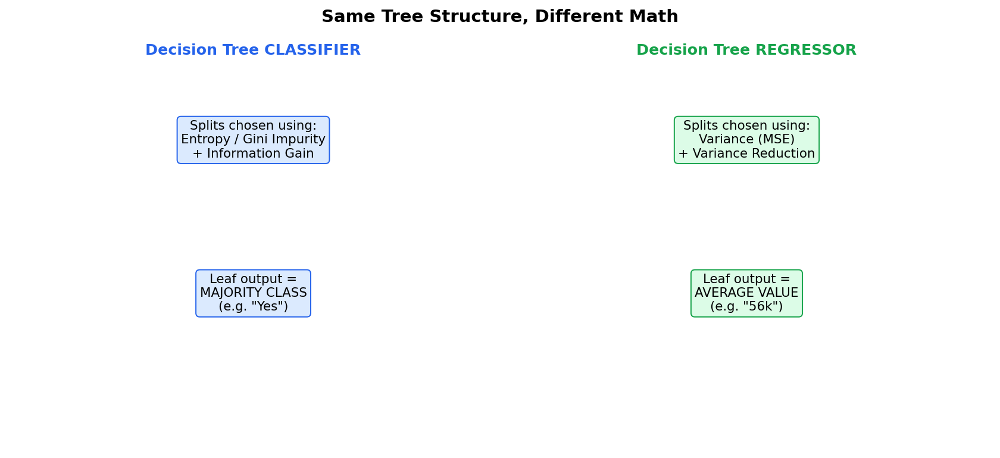
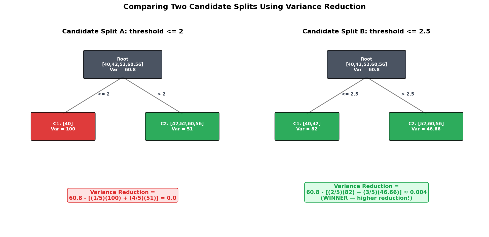
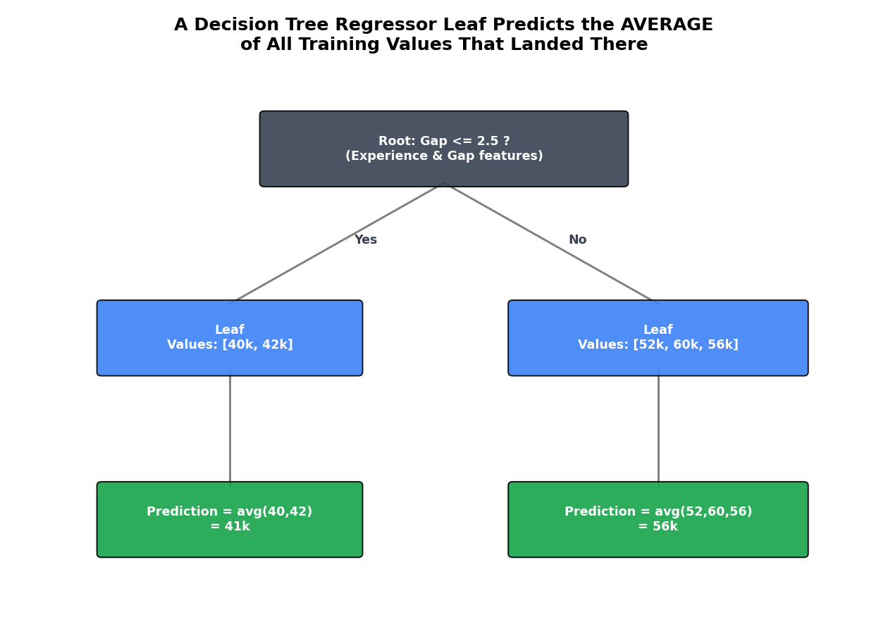

# Decision Tree Regressor 

## 1. From Classification to Regression: What Changes?

In the earlier notes, we built a **Decision Tree Classifier** — predicting categories like "Play Tennis: Yes/No." But Decision Trees can just as easily solve **regression** problems, where the output is a **continuous number** instead of a category.

**Real-life example:** 💼 **Predicting salary from experience and career gap.** Given someone's years of experience and any career gap they've had, predict their expected salary — a continuous number (e.g., $52,000), not a category.

>  **The tree structure stays exactly the same** — still binary splits (CART), still built top-down, still ends in leaf nodes. What changes is **the math used to decide where to split, and what a leaf actually outputs.**

---

## 2. Why Can't We Reuse Entropy, Gini, or Information Gain?

Entropy, Gini Impurity, and Information Gain all fundamentally rely on **counting how many data points fall into each category** (Yes vs. No, Class A vs. Class B). But in regression, the output isn't a fixed set of categories — it's a continuous number like `$52,000` or `$56,300`. There's no "category" to count proportions of.

> **The replacement: Variance Reduction.** Instead of measuring impurity through class proportions, a regressor measures **how spread out (varied) the target values are** — and picks whatever split reduces that spread the most.

This directly mirrors a concept from an earlier algorithm you may already know: **variance here is calculated exactly like Mean Squared Error (MSE) in Linear Regression** — the average squared distance of each value from the mean.

---

## 3. The Variance Formula

$$ \text{Variance} = \frac{1}{n}\sum_{i=1}^{n} (y_i - \bar{y})^2 $$

where $\bar{y}$ (read "y-hat" or "y-bar") is simply the **average (mean)** of all the target values in that node.

- **Low variance** → the values are tightly clustered together (a "purer," more predictable node)
- **High variance** → the values are spread far apart (a "messier," less predictable node)

This is exactly the same computation as **Mean Squared Error** — which makes sense, since we're measuring "how far, on average, is each value from the group's typical value?"

---

## 4. Full Worked Example: Predicting Salary

We have 5 training records with salaries: **[40k, 42k, 52k, 60k, 56k]**, and we're trying to decide the best way to split them using a feature like "career gap" (in years).

### Step 1 — Variance of the Root Node

$$ \bar{y} = \frac{40+42+52+60+56}{5} = 50 \text{ (k)} $$

$$ \text{Var(root)} = \frac{1}{5}\left[(40{-}50)^2 + (42{-}50)^2 + (52{-}50)^2 + (60{-}50)^2 + (56{-}50)^2\right] $$

$$ = \frac{1}{5}\left[100 + 64 + 4 + 100 + 36\right] = \frac{304}{5} = 60.8 $$

### Step 2 — Try Candidate Split A: threshold `≤ 2`

This splits our 5 records into:
- **Child 1:** `[40k]` → only 1 value → $\text{Var}(C_1) = 100$ *(with only one data point, its "variance from itself" calculation still follows the same formula — see note below)*
- **Child 2:** `[42k, 52k, 60k, 56k]` → $\text{Var}(C_2) = 51$

**Variance Reduction:**

$$ VR = \text{Var(root)} - \left[\frac{1}{5}(100) + \frac{4}{5}(51)\right] = 60.8 - [20 + 40.8] = 60.8 - 60.8 = 0 $$

A variance reduction of **zero** — this split doesn't help at all!

### Step 3 — Try Candidate Split B: threshold `≤ 2.5`

This splits our 5 records differently:
- **Child 1:** `[40k, 42k]` → $\text{Var}(C_1) = 82$
- **Child 2:** `[52k, 60k, 56k]` → $\text{Var}(C_2) \approx 46.66$

**Variance Reduction:**

$$ VR = \text{Var(root)} - \left[\frac{2}{5}(82) + \frac{3}{5}(46.66)\right] = 60.8 - [32.8 + 27.996] \approx 0.004 $$

### Step 4 — Pick the Winner

$$ VR_{\text{Split B}} \approx 0.004 \; > \; VR_{\text{Split A}} = 0 $$

Even though both numbers are small, **Split B (threshold ≤ 2.5) wins** — it reduces variance more than Split A. So the tree selects **`Gap ≤ 2.5`** as its actual splitting rule at this node, exactly the same greedy "pick whichever split helps most" logic used by Information Gain in the classifier — just measured with variance instead of entropy.

>  **General formula for Variance Reduction:**
> $$ VR = \text{Var(parent)} - \sum_{i} \frac{n_i}{n} \times \text{Var}(child_i) $$
> This is structurally identical to the Information Gain formula from the classifier notes — "parent's spread, minus the weighted-average spread of the children."

---

## 5. How Does a Leaf Node Make Its Final Prediction?

This is the other key difference from classification. A classifier leaf predicts the **majority class**. A regressor leaf predicts the **average of all training values that landed in that leaf**.

Continuing our example: once splitting is done and we reach our final leaves —

- Leaf 1 (`Gap ≤ 2.5`): contains `[40k, 42k]` → **prediction = (40+42)/2 = 41k**
- Leaf 2 (`Gap > 2.5`): contains `[52k, 60k, 56k]` → **prediction = (52+60+56)/3 = 56k**

So when a brand-new person comes in with `Gap = 1.5` (which is `≤ 2.5`), the tree walks down to Leaf 1 and predicts a salary of **$41k**. Someone with `Gap = 4` walks down to Leaf 2 and gets a prediction of **$56k**.

>  This is the exact same "averaging" logic used by **KNN Regression** — the only difference is *how* the "neighbors" being averaged are chosen (nearest by distance in KNN, vs. grouped by learned tree splits here).

---

## 6. Advanced: What About Pruning, Overfitting, and Hyperparameters?

Everything from the classifier notes carries over directly:

- **Overfitting** is still a real risk — an unpruned regression tree can create one tiny leaf per data point, achieving zero training error but generalizing terribly.
- **Pre-Pruning** (`max_depth`, `min_samples_leaf`, `min_samples_split`, `max_features`) and **Post-Pruning** (`ccp_alpha`) both work identically to control this.
- The impurity `criterion` hyperparameter, however, changes. In `sklearn`'s `DecisionTreeRegressor`, instead of `'gini'`/`'entropy'`, you'll choose from options like:

| `criterion` value | What it measures |
|---|---|
| `'squared_error'` (default) | Standard variance / MSE — exactly what we calculated above |
| `'friedman_mse'` | A variant of MSE with an adjustment that can improve certain splits (originally proposed for use in boosting) |
| `'absolute_error'` | Uses Mean Absolute Error instead of squared error — more robust to outliers |
| `'poisson'` | Useful when predicting count-based data (e.g., number of orders) |

---

## 7. Real-Life Applications of Decision Tree Regressors

| Application | Input Features | Predicted (Continuous) Output |
|---|---|---|
| **Salary prediction** | Experience, career gap, education level | Expected salary |
| **House price estimation** | Size, location, number of rooms | Sale price |
| **Demand forecasting** | Day of week, season, promotions | Units sold |
| **Energy consumption prediction** | Temperature, time of day, building size | kWh usage |
| **Insurance premium estimation** | Age, driving history, vehicle type | Premium amount |

>  **Why use a Decision Tree Regressor instead of plain Linear Regression?** Trees can naturally capture **non-linear relationships and interactions** between features without you having to manually engineer polynomial terms (similar to why SVM kernels were useful for non-linear classification). The trade-off: trees can be less smooth and are prone to overfitting without proper pruning, whereas Linear Regression assumes a single global straight-line relationship.
