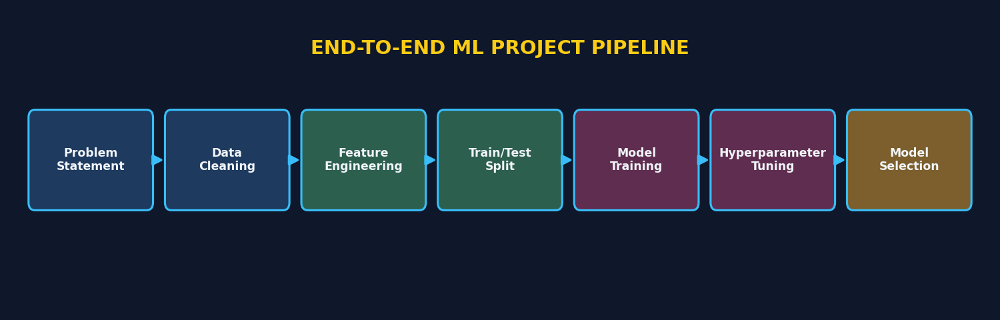
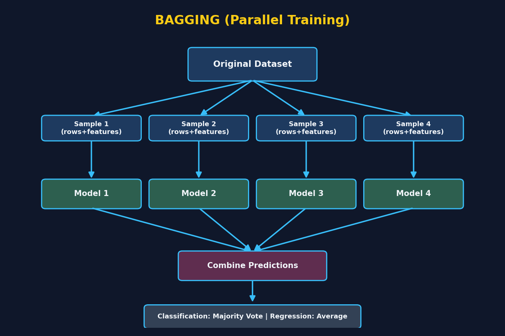
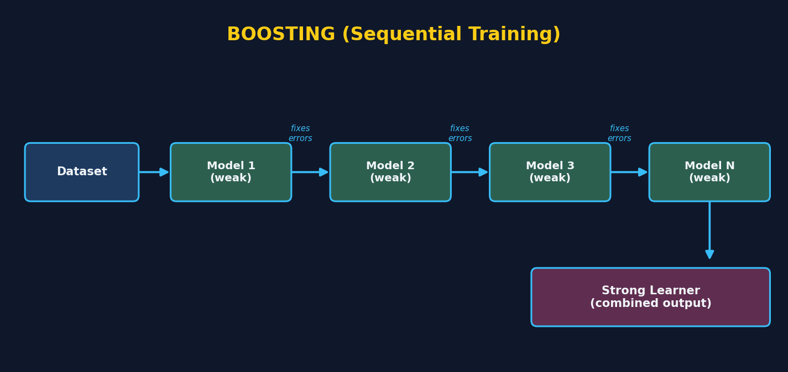
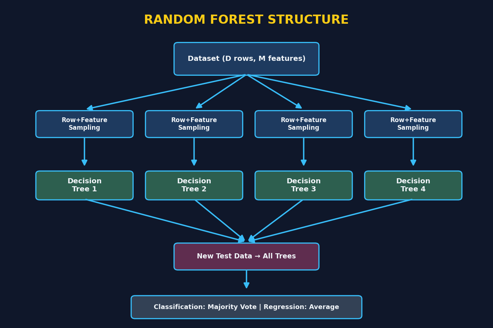
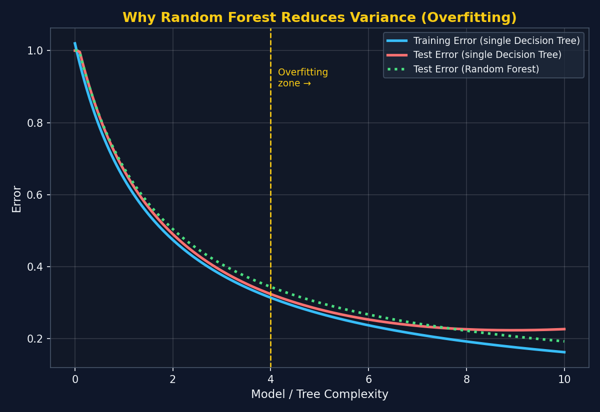
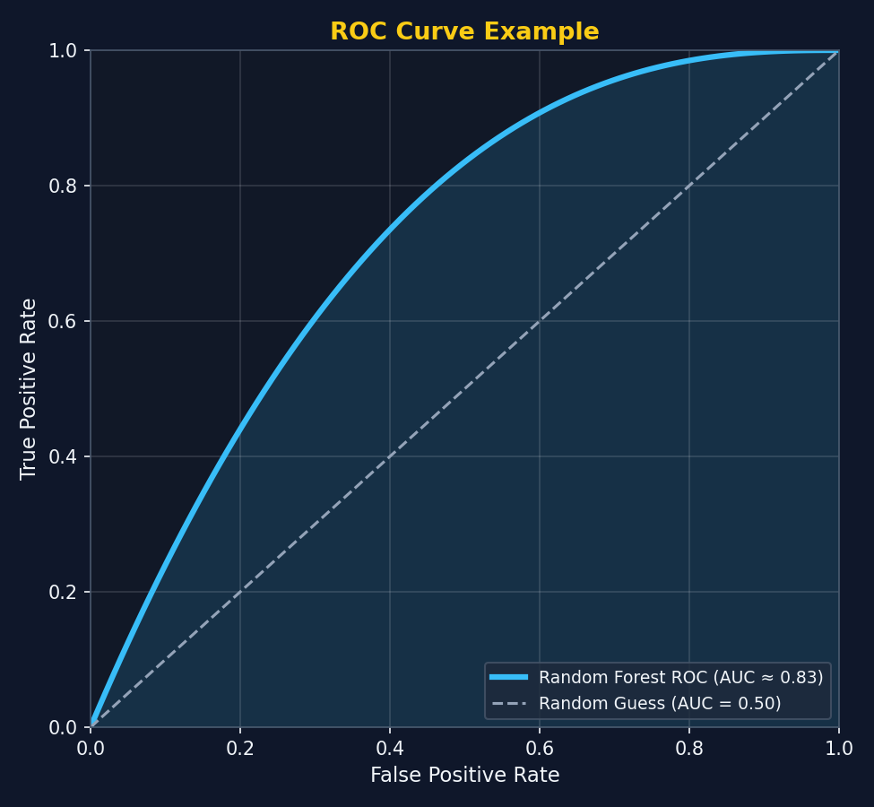
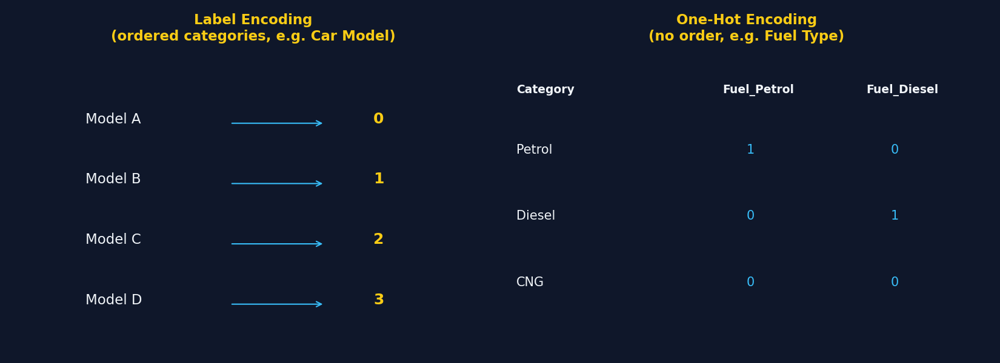

# Ensemble Techniques in Machine Learning — Bagging & Boosting





## 1. What Are Ensemble Techniques? (Basic)

So far in machine learning, you usually train **one algorithm** (like Logistic Regression, Decision Tree, etc.) and use it to make predictions.

**Ensemble techniques** take this a step further — instead of relying on a single model, they **combine multiple machine learning models** together to make a prediction.

### Why combine multiple models?
- A single model may make mistakes or have limited accuracy.
- Combining multiple models usually leads to **better accuracy** and more **robust predictions**.
- This is why ensemble techniques (like Bagging and Boosting) are extremely popular in:
  - **Kaggle competitions**
  - **Hackathons**
  - Real-world ML problem statements

### Two Main Types of Ensemble Techniques
| Type | Core Idea |
|------|-----------|
| **Bagging** | Train multiple models **in parallel** on different samples of data, then combine results |
| **Boosting** | Train multiple models **in sequence**, where each model learns from the mistakes of the previous one |

---

## 1.1  Real-Life Examples & Analogies (For Every Major Concept)

> This section collects **everyday, real-life analogies** for the key concepts across these notes — refer back here anytime a concept feels abstract.

### Ensemble Techniques (General)
- **Doctor's second opinion:** If you're unsure about a diagnosis, you don't rely on just one doctor — you consult **multiple doctors** and go with the majority opinion or an average recommendation. That's exactly what an ensemble model does with multiple ML models.
- **Movie ratings:** A single friend's movie review might be biased, but the **average rating from 1,000 people** (like on IMDb) is usually much more reliable — this is the same idea as combining multiple models.

### Bagging (Bootstrap Aggregating)
- **Exam paper checking by multiple teachers:** Imagine 5 teachers **independently and simultaneously** (in parallel) check the same stack of exam papers, but each teacher only looks at a random subset of questions/students. At the end, the **final grade** is decided by majority agreement (classification) or average score (regression). No teacher waits for another — they all work at the same time. This is Bagging.
- **Panel of judges in a talent show:** Each judge scores a performance independently, based on their own perspective/expertise, and the final score is an average — nobody's judgment depends on what the previous judge said.

### Random Forest
- **Asking multiple friends for restaurant recommendations:** Each friend (decision tree) has tried a different subset of restaurants (row sampling) and cares about different things — one friend focuses on price and location, another on food quality and ambience (feature sampling). When you ask all of them and go with the **most recommended restaurant**, you get a much more reliable answer than asking just one friend — who might be biased or only knows a few places (overfitting risk of a single Decision Tree).

### Boosting
- **Learning to cook from multiple mentors, one after another (sequentially):** Your first mentor teaches you basic recipes, but you still burn a few dishes. Your second mentor specifically focuses on fixing *those exact mistakes* you made, but you're still not perfect on a few tricky dishes. Your third mentor focuses on *those remaining* problem dishes. By the end, combining everything you learned from all three mentors (in sequence, each fixing the previous one's gaps) makes you a much better cook overall — a "strong learner" built from several "weak" lessons.
- **Progressive tutoring for an exam:** A student takes a mock test (Model 1), gets some questions wrong. A tutor then focuses specifically on those weak topics (Model 2), the student improves but still struggles with a few questions, so tutoring continues to target just those (Model 3). Each round builds on the last one's mistakes — that's Boosting.

### Overfitting vs Generalization (Decision Tree vs Random Forest)
- **A student who memorizes vs a student who understands:** A student who **memorizes exact textbook answers** scores 100% on practice questions they've already seen (training data) but struggles when the exam has slightly different wording (test data) — this is like a single, unpruned **Decision Tree overfitting**. A student who **understands the underlying concept** (like Random Forest, learning from many varied examples/perspectives) performs consistently well on both practice and new exam questions.

### Row Sampling + Feature Sampling (with Replacement)
- **Market research surveys:** Different survey teams each interview a **different random sample of people** (row sampling) and ask a **different subset of questions** (feature sampling) about a product, with some overlap allowed between teams. Combining insights from all teams gives a much more well-rounded understanding than one team surveying everyone with the exact same questions.

### Train-Test Split & Data Leakage (fit_transform vs transform)
- **Practice exam vs real exam:** Training data is like your **practice test papers** — you're allowed to study them, learn patterns, and adjust your approach (`fit_transform`). The **real exam** (test data) should be attempted using only what you've already learned — you can't "study" the real exam questions beforehand (`transform` only). If you somehow saw the real exam questions in advance and adjusted your prep around them, your "practice score" would look great, but it wouldn't reflect how well you'd truly perform on genuinely new material — this is **data leakage**.

### Label Encoding vs One-Hot Encoding
- **Label Encoding — Movie ratings example:** Think of star ratings: 1-star, 2-star, 3-star, 4-star, 5-star. These naturally have an **order/relationship** (5-star is better than 1-star) — so assigning numbers (1,2,3,4,5) makes sense, similar to how car `Model` was label-encoded because certain models may consistently relate to higher or lower prices.
- **One-Hot Encoding — T-shirt colors example:** If a T-shirt comes in Red, Blue, or Green, there's **no natural order** between these colors — Red isn't "greater than" Blue. So instead of assigning arbitrary numbers (which could mislead the model into thinking there's a ranking), we create separate Yes/No columns for each color — that's One-Hot Encoding. This matches why `SellerType`, `FuelType`, and `TransmissionType` were one-hot encoded — there's no inherent order among "Petrol," "Diesel," "CNG," etc.

### RandomizedSearchCV vs GridSearchCV (Hyperparameter Tuning)
- **Tasting a buffet:** **GridSearchCV** is like tasting **every single dish** at a huge buffet to find your favorite combination — thorough, but very time-consuming. **RandomizedSearchCV** is like randomly trying a **reasonable sample of dishes** — you likely won't find the absolute best combination every time, but you'll find a really good one much faster.

### ROC-AUC Score
- **A metal detector at airport security:** A good metal detector should correctly flag people carrying metal (true positives) while **rarely** flagging innocent people without metal (false positives). The ROC curve shows this trade-off at different sensitivity settings, and the AUC score (e.g., 0.83) tells you **how good the detector (model) is overall** at telling the two groups apart — 1.0 would be a perfect detector, 0.5 would be like random guessing.

---

## 2. Bagging (Bootstrap Aggregating)



*Visual: the dataset is sampled multiple times (rows + features), each sample trains its own model in parallel, and all outputs are combined.*

### 2.1 Basic Idea
In Bagging:
1. You have one **original dataset**.
2. You create **multiple samples** of this dataset (different subsets, often with repetition — this is called *bootstrapping*).
3. Each sample is given to a **separate base learner** (a machine learning model).
4. All these base learners are trained **independently and in parallel**.
5. Finally, all their predictions are **combined** to produce one final output.

### 2.2 What is a "Base Learner"?
A base learner is simply a machine learning algorithm used inside the ensemble. It can be:
- The **same algorithm** repeated multiple times (e.g., multiple Decision Trees) — this is what **Random Forest** does.
- **Different algorithms** altogether (e.g., Decision Tree + Logistic Regression + XGBoost).

### 2.3 Step-by-Step Flow of Bagging
```
Original Dataset
      |
      ├── Sample 1 → Model 1 (e.g., Decision Tree)
      ├── Sample 2 → Model 2 (e.g., Logistic Regression)
      ├── Sample 3 → Model 3 (e.g., Decision Tree)
      └── Sample N → Model N (e.g., XGBoost)

All models trained PARALLELLY (independent of each other)
      |
New Test Data passed to ALL models
      |
Each model gives its own prediction
      |
Final Output = Combine all predictions
```

### 2.4 How Is the Final Output Decided?

**For Classification problems:**
- Each model gives a prediction (e.g., 0 or 1).
- The final answer is decided using **Majority Voting Classifier** — whichever class gets the most "votes" from the models becomes the final prediction.
- Example: If 3 out of 4 models predict `0`, the final output is `0`.
- This also applies to **multi-class classification** — majority voting still decides the winner.

**For Regression problems:**
- Each model gives a continuous numeric output.
- The final output is the **average of all model outputs**.

### 2.5  Points to Remember About Bagging
- You can choose **any number of base learners** (default is often 100, e.g., in Random Forest).
- Data samples given to each model are usually different (created via bootstrapping — random sampling with replacement).

- **Most important point:** All base learners are trained **PARALLELLY**, not sequentially.
- Common algorithm: **Random Forest** (built entirely on the bagging concept using Decision Trees).

---

## 3. Boosting



*Visual: models are trained one after another (sequentially), each one focused on fixing the mistakes of the one before it, until they combine into a strong learner.*

### 3.1 Basic Idea
Unlike Bagging (parallel), Boosting works **sequentially**:
1. You start with the entire dataset and train **Model 1 (a weak learner)**.
2. Model 1 makes predictions — some are correct, some are **wrong**.
3. The **wrongly predicted records** are passed (along with some more data) to **Model 2**.
4. Model 2 tries to learn better, especially focusing on the mistakes of Model 1 — but it will still make some errors.
5. Those new wrong predictions are passed to **Model 3**, and so on.
6. This continues for **N number of models**, each one trying to correct the mistakes of the one before it.

### 3.2 What is a "Weak Learner"?
- In Boosting, base models are called **weak learners** (not "base learners" like in bagging).
- A weak learner is a model that performs only slightly better than random guessing on its own.
- When you combine many weak learners **sequentially**, you eventually get a **Strong Learner**.

### 3.3 Step-by-Step Flow of Boosting
```
Dataset → Model 1 (Weak Learner)
             |
     Wrong predictions + extra data
             ↓
          Model 2 (Weak Learner)
             |
     Wrong predictions + extra data
             ↓
          Model 3 (Weak Learner)
             |
            ...
             ↓
          Model N

All models trained SEQUENTIALLY (each depends on the previous one)
             |
Combine all models → STRONG LEARNER
```

### 3.4 Real-Life Analogy 
Imagine a group project involving 5 subjects: Physics, Chemistry, Geography, etc.
- One "weak learner" (person) is great at **Geography**, so they solve that part.
- Another is great at **Physics**, so they contribute there.
- Another is good at **Chemistry**, and so on.

Individually, each person only knows a little. But when you **combine all their knowledge**, you get a much stronger, complete solution — this is exactly how Boosting builds a strong learner from many weak learners.

### 3.5 How Is the Final Output Decided?
Just like Bagging:
- **Classification** → Majority Voting Classifier
- **Regression** → Average of all outputs

### 3.6 Popular Boosting Algorithms (to be learned in detail later)
| Algorithm | Notes |
|-----------|-------|
| **AdaBoost** | One of the earliest boosting algorithms |
| **Gradient Boosting** | Builds on the concept of correcting errors using gradients |
| **XGBoost (Extreme Gradient Boosting)** | An optimized, more powerful version of gradient boosting; extremely popular in competitions |

---

## 4. Bagging vs Boosting — Quick Comparison

| Feature | Bagging | Boosting |
|---------|---------|----------|
| Training style | Parallel | Sequential |
| Model type | Base learners (can be strong models) | Weak learners |
| Focus | Reduce variance (overfitting) by combining independent models | Reduce bias by correcting previous errors |
| Data given to models | Random samples (bootstrapped) of the dataset | Full dataset + emphasis on previously misclassified records |
| Final output (Classification) | Majority Voting | Majority Voting |
| Final output (Regression) | Average of outputs | Average of outputs |
| Example Algorithm | Random Forest | AdaBoost, Gradient Boost, XGBoost |
| Goal | Combine many "equally strong" independent models | Combine many "weak" models into one strong model |

---


- Ensemble = combining multiple models to get better accuracy than any single model alone.
- **Bagging** = parallel training + majority voting/averaging → reduces overfitting → e.g., Random Forest.
- **Boosting** = sequential training + each model fixes previous model's mistakes → e.g., AdaBoost, Gradient Boost, XGBoost.

- Both Bagging and Boosting can be used for **Classification** and **Regression** problems.
- Widely used in real-world hackathons and Kaggle competitions because they consistently improve accuracy.

---


# Random Forest (Classification & Regression)

> Random Forest is a **Bagging technique** — this section explains exactly how it works internally, step by step.

## 5. What is Random Forest? (Basic)



*Visual: each Decision Tree in the forest gets its own random sample of rows and features, trains independently, and the forest combines all tree outputs into one final answer.*


Random Forest is one of the most popular **Bagging-based** ensemble algorithms. It follows the same core idea as Bagging (parallel training + combining outputs), but with one special rule:

> **In Random Forest, the base learners are always Decision Trees.** (Not any other algorithm — only Decision Trees.)

So instead of mixing different algorithms like Decision Tree, Logistic Regression, XGBoost, etc. (as in general Bagging), Random Forest builds **many Decision Trees**, each trained a little differently, and combines their results.

### Basic Setup / Notation
- Let the dataset size be `D` (total number of rows/data points).
- Let the number of features be `M` → features: `F1, F2, F3, ... Fm`.
- Base learners: Decision Tree 1, Decision Tree 2, Decision Tree 3, ... Decision Tree N (you can have as many trees as you want).

Recall from earlier: Decision Trees are built using
- **Classification** → Entropy, Gini Impurity, Information Gain
- **Regression** → Mean Squared Error (MSE)

---

## 6. How Random Forest Actually Trains (Core Mechanism)

Random Forest uses **two types of sampling together** for every individual tree:

### 6.1 Row Sampling
- Instead of giving the **entire dataset** to every tree, each tree gets a **random subset of rows**.
- If total rows = `D`, then each tree gets `D'` rows, where `D' < D`.

### 6.2 Feature Sampling
- Similarly, each tree also gets a **random subset of features**, not all `M` features.
- Example: Tree 1 might get features `F1, F2, F4`; Tree 2 might get `F1, F2, F4, F6`, and so on.

### 6.3 Sampling With Replacement (Very Important!)
- This row + feature sampling is done **with replacement**.
- "With replacement" means: some rows/features **may repeat** across different trees, but overall, **most rows and features will differ** between trees.
- This ensures each Decision Tree sees a **slightly different version** of the data — making every tree a bit of an "independent expert."

> Short form used for this combined sampling: **RS + FS** (Row Sampling + Feature Sampling)

### 6.4 Visual Summary
```
Dataset (D rows, M features)
        |
        ├── Row Sampling + Feature Sampling → Decision Tree 1 (trained on subset D1')
        ├── Row Sampling + Feature Sampling → Decision Tree 2 (trained on subset D2')
        ├── Row Sampling + Feature Sampling → Decision Tree 3 (trained on subset D3')
        └── ... up to N Decision Trees

All trees trained PARALLELLY, each on a slightly different sample of data
```

---

## 7. How the Final Prediction Is Made

Once all trees are trained, new/unseen test data is passed to **every tree**, and each tree gives its own prediction.

### Classification
- Suppose: Tree 1 → 0, Tree 2 → 0, Tree 3 → 0, Tree 4 → 1
- Final Output = **Majority Voting Classifier** → here, majority say `0`, so final answer = `0`.

### Regression
- Each tree gives a continuous numeric value.
- Final Output = **Average of all tree outputs**.

*(This is exactly the same combination logic used in general Bagging — Random Forest just specifically uses Decision Trees as its base learners.)*

---

## 8. Interview Question: "Why use Random Forest instead of a single Decision Tree?" 

This is a **commonly asked ML interview question** — here's the full reasoning:



*Visual: a single Decision Tree's test error rises again after a point (overfitting), while Random Forest's test error stays lower and more stable as complexity grows.*

### The Problem With a Single Decision Tree
- By default (without pruning), a Decision Tree tends to grow until it's fully split — this causes **overfitting**.
- Overfitting means:
  - **Training accuracy = High**
  - **Test accuracy = Low**
- In bias-variance terms:
  - High training accuracy → **Low Bias**
  - Low test accuracy → **High Variance**

A good/generalized model should ideally have **Low Bias AND Low Variance** — but a single Decision Tree usually gives Low Bias + High Variance (i.e., it overfits).

### How Random Forest Fixes This
- Random Forest keeps the **Low Bias** (since it still uses Decision Trees which fit data well).
- But it converts the **High Variance → Low Variance**.

### Why does variance reduce?
- Since Random Forest has **many trees**, and each tree is trained on a **different random sample** of rows and features:
  - Each tree becomes a specialized "expert" on its own subset of data.
  - The final prediction combines all these experts (via majority voting or averaging).
- Because predictions come from **many diverse models** rather than one single model, the overall result becomes much more **stable and generalized** — reducing overfitting.

### Practical Example: Adding New Data
- Imagine you add **200 new records** to the dataset.
- In a single Decision Tree, this new data could significantly change the tree structure and predictions.
- In Random Forest:
  - These 200 new records get **distributed/split** across many different trees (since each tree only sees a sample).
  - No single tree is drastically affected.
  - Since the final output still depends on **majority voting / averaging** across many trees, the overall model remains stable.
- This is exactly **why Random Forest is more robust** than a single Decision Tree when new data is introduced.

### ⚖️ Trade-off to Remember
| Aspect | Single Decision Tree | Random Forest |
|--------|----------------------|----------------|
| Bias | Low | Low |
| Variance | High (overfits) | Low (generalizes better) |
| Accuracy | Lower (unstable on new data) | Higher (more robust) |
| Time Complexity (Training) | Low (fast) | High (many trees to train) |
| Interview takeaway | Simple but overfits | Slightly slower, but much more reliable |

---

# Random Forest — Practical Implementation (Problem Statement)

> This part begins a hands-on project to implement **Random Forest Classification**. This video covers the **business problem statement and dataset overview** — before diving into actual coding, EDA, and modeling.

## 9. Business Problem Statement

**Company:** `trips&travel.com` (a travel and tourism company)

**Goal:** Establish a viable business model to **expand the customer base** by introducing new travel packages.

### Current Situation
- The company currently offers **5 types of packages**:
  1. Basic
  2. Standard
  3. Deluxe
  4. Super Deluxe
  5. King
- Looking at last year's data, only **18% of contacted customers** actually purchased a package.
- **Problem:** Marketing cost was very high because customers were contacted **randomly**, without using any available customer data/insights to target the right people.

### New Product Being Launched
- The company wants to launch a new package: **Wellness Tourism Package**.
- **Wellness tourism** = travel that helps a person **maintain, enhance, or kick-start a healthy lifestyle**, and supports/increases their overall sense of well-being.

### The Real Objective (This Time)
Instead of contacting customers randomly again, the company wants to:
- Use the **existing customer data** (past behavior, demographics, etc.)
- Build a **predictive model** to figure out **which customers are likely to purchase** the new Wellness Tourism package.
- This will make marketing spend **more efficient and targeted**, instead of random outreach.

>  **In Machine Learning terms:** This is a **Classification problem** — predicting whether a customer will purchase the package (Yes/No) based on available customer data.

---

## 10. Dataset Overview

- **Source:** Provided as a CSV file (available in the resource/download section).
- **Size:** `4,888 rows` × `20 columns`.

### Sample Features Present in the Dataset
| Feature | Meaning |
|---------|---------|
| CustomerID | Unique identifier for each customer |
| ProductTaken | Target variable — whether the customer purchased a package (this is what we want to predict) |
| Age | Age of the customer |
| TypeOfContact | How the customer was contacted |
| CityTier | Tier/category of the city the customer belongs to |
| DurationOfPitch | How long the sales pitch lasted |
| Occupation | Customer's occupation |
| Gender | Customer's gender |
| NumberOfPersonVisiting | Number of people accompanying the customer on the trip |
| NumberOfFollowups | How many follow-ups were made with the customer |
| ProductPitched | Which product/package was pitched to the customer |
| PreferredPropertyStar | Preferred hotel/property rating |
| MaritalStatus | Customer's marital status |
| ...and several more columns | (20 columns total) |

### Basic Libraries Needed (Setup Step)
Before starting any analysis, the following Python libraries are typically imported:
```python
import pandas as pd
import numpy as np
import matplotlib.pyplot as plt
import seaborn as sns
import plotly.express as px
import warnings
warnings.filterwarnings('ignore')
```
*(Some additional/new libraries will also be introduced as the project progresses.)*

---

## 11. What's the Plan Going Forward? (Project Roadmap)

This project will be built step-by-step across upcoming lessons:

1. **Understand the Problem Statement** *(this section)*
2. **Data Cleaning** — handling missing values, fixing inconsistent entries, etc.
3. **EDA (Exploratory Data Analysis)** — understanding patterns, relationships, and distributions in the data.
4. **Feature Engineering** — preparing/transforming features to make them model-ready.
5. **Model Training** — training multiple models, not just Random Forest:
   - Logistic Regression
   - Decision Tree (Classification)
   - Random Forest (Classification)
   - And possibly other classification models
6. **Model Selection** — comparing all trained models using performance metrics, and selecting the **best-performing model** for the final solution.

> **Good Practice Tip:** It's considered good practice in ML projects to **try multiple models** rather than relying on just one, and then select the best one based on proper **performance metrics** (like accuracy, precision, recall, F1-score, etc., depending on the problem).

---

# Feature Engineering — Data Cleaning

> This part covers the **first stage of Feature Engineering**: cleaning the raw dataset before any modeling begins. Goals for this stage: fix inconsistent categories, handle missing values, drop unnecessary columns, create useful derived features, and identify feature types.

## 12. Why Data Cleaning Comes First 

Before training any model, the dataset must be cleaned. In this stage we specifically handle:
1. **Missing values**
2. **Duplicate values**
3. **Data type checks**
4. **Understanding the dataset** overall (categories, distributions, inconsistencies)

---

## 13. Checking for Missing Values

The simplest way to check for missing (null) values in a DataFrame:

```python
df.isnull().sum()
```

- This tells you, **column by column**, how many missing (NaN) values exist.
- Example from this dataset: one column had **226 null values**.

---

## 14. Fixing Inconsistent Categorical Data (Important, Basic-to-Intermediate)

When a dataset has **categorical features** (like Gender, Marital Status, Type of Contact, Occupation, Product Pitched, Designation, etc.), it's important to check whether each category is **clean and consistent** — because data entered manually (e.g., via forms) often contains **spelling mistakes or duplicate-meaning categories**.

### How to Check Categories
```python
df['Gender'].value_counts()
```

### Real Issues Found in This Dataset
| Column | Issue Found | Fix Applied |
|--------|-------------|-------------|
| Gender | `"Female"` and a misspelled variant (e.g., `"Fe Male"`) were treated as **two different categories** instead of one | Combined into a single `"Female"` category |
| MaritalStatus | `"Single"` and `"Unmarried"` were essentially the same meaning but stored as separate categories | Combined `"Single"` into `"Unmarried"` |
| TypeOfContact | Checked, but this was fine (binary-like, no issue) | No fix needed |

### How the Fix Was Applied
```python
df['Gender'] = df['Gender'].replace('Fe Male', 'Female')
df['MaritalStatus'] = df['MaritalStatus'].replace('Single', 'Unmarried')
```

>  **Key Lesson:** Always inspect `value_counts()` for every categorical column — messy real-world data often hides duplicate categories caused by spelling variations. This step directly affects model accuracy if left unfixed.

---

## 15. Handling Missing Values (Core Concept)

### Step 1: Identify Which Columns Have Missing Values
```python
features_with_na = [feature for feature in df.columns if df[feature].isnull().sum() >= 1]
```
This collects all column names that have **at least one NaN value**.

### Step 2: Calculate the Percentage of Missing Values
```python
for feature in features_with_na:
    print(feature, np.round(df[feature].isnull().mean() * 100, 4))
```
- This gives the **percentage of missing data** per column (e.g., Age → 4.62%, another column → 5.13%, etc.)
- Knowing the percentage helps decide **how serious** the missing-value problem is for each feature.

### Step 3: Use `.describe()` to Check for Outliers
```python
df[features_with_na].describe()
```
- `.describe()` shows **mean, standard deviation, min, 25th/50th/75th percentile, and max**.
- By comparing the **mean vs the 50th percentile (median)**:
  - If they are very close → **not much outlier influence**.
  - If they differ a lot → **outliers likely exist**.
- In this dataset, the difference was small → indicates **few/mild outliers**.

### Step 4: Decide the Imputation Strategy

| Feature Type | Missing Value Fix | Why |
|---------------|--------------------|-----|
| Numerical / Continuous (e.g., Age) | **Median** | Median is robust to outliers, so even if a few outliers exist, they won't distort the fill value |
| Categorical (e.g., TypeOfContact) | **Mode** (most frequent value) | Categorical data doesn't have a numeric average — mode is the best representative value |

### Applying the Fix in Code
```python
# Numerical column → fill with median
df['Age'].fillna(df['Age'].median(), inplace=True)

# Categorical column → fill with mode
df['TypeOfContact'].fillna(df['TypeOfContact'].mode()[0], inplace=True)

# Another numerical column
df['NumberOfTrips'].fillna(df['NumberOfTrips'].median(), inplace=True)
```
>  Note: `mode()` returns a Series, so `mode()[0]` is used to get the **first/most frequent value**.

After applying these fixes to all relevant columns:
```python
df.isnull().sum()   # should now show all zeros
```

> ⚠️ **Important caveat mentioned in the lecture:** This median/mode approach is a **quick and efficient** method for this stage. In a complete end-to-end project, you'd also study the **distribution of each feature** (and possibly apply transformations) before finalizing the imputation strategy.

---

## 16. Dropping Unnecessary Columns

Some columns don't help the model at all — like unique identifiers.

```python
df.drop('CustomerID', axis=1, inplace=True)
```
- **CustomerID** is just a unique row identifier — it holds no predictive value, so it's dropped.

---

## 17. Creating a Derived Feature (Feature Engineering Insight)

While exploring the data, it was noticed that there were **two separate columns**:
- `NumberOfPersonVisiting`
- `NumberOfChildrenVisiting`

Instead of keeping these as two separate features, they were **combined into a single, more meaningful feature**:

```python
df['TotalVisiting'] = df['NumberOfPersonVisiting'] + df['NumberOfChildrenVisiting']

df.drop(['NumberOfPersonVisiting', 'NumberOfChildrenVisiting'], axis=1, inplace=True)
```

### Why do this?
- Reduces the total number of columns (simplifies the dataset).
- `TotalVisiting` is more meaningful than tracking adults and children separately, since we mainly care about the **total group size** for the travel package prediction.

> **Key Lesson:** Always look for opportunities to **combine or simplify features** — reducing redundant columns can make the dataset cleaner and sometimes even improve model performance.

---

## 18. Identifying Feature Types (Numerical, Categorical, Discrete, Continuous)

This step helps understand the dataset structure better before modeling.

### 18.1 Numerical Features
```python
numerical_features = [feature for feature in df.columns if df[feature].dtype != 'O']
```
- `'O'` means **Object type** (i.e., text/categorical).
- So this collects all columns that are **not** object type → these are numerical.
- Result: **12 numerical features**.

### 18.2 Categorical Features
```python
categorical_features = [feature for feature in df.columns if df[feature].dtype == 'O']
```
- Result: **6 categorical features**.

### 18.3 Discrete vs Continuous Features (Important Distinction)

>  **Discrete features**: Numerical columns that only have a **limited/fixed number of unique values** (e.g., up to ~25 categories) — even though they are numbers, they behave more like categories.
>
>  **Continuous features**: Numerical columns with a **large, unbounded range of unique values** (true continuous/measurable data).

**Example given:** A "Pin Code" column might have only 20–25 unique values in a small dataset — even though it's a number, it behaves like a discrete/categorical feature rather than a continuous one.

```python
discrete_features = [feature for feature in numerical_features if df[feature].nunique() <= 25]
continuous_features = [feature for feature in numerical_features if feature not in discrete_features]
```

- Result in this dataset:
  - **9 discrete features**
  - **3 continuous features**

>  **Key Lesson:** Not all numerical columns should be treated the same way — some numeric columns are secretly **discrete/categorical in nature**. Recognizing this distinction is useful for later steps like encoding, scaling, and visualization.


---

# Feature Engineering  — Encoding & Scaling with ColumnTransformer

> This part covers converting categorical features into numerical form (encoding) and scaling numerical features — using **One-Hot Encoding**, **Standard Scaler**, and combining them efficiently with **ColumnTransformer**.

## 19. Step 1: Train-Test Split (Do This First!)

Before applying any encoding/scaling, split the data into input (`X`) and output (`y`), then into train/test sets.

```python
X = df.drop('ProductTaken', axis=1)   # all input features
y = df['ProductTaken']                 # target/output feature
```

- `X.head()` → shows all input features (no target column).
- `y.value_counts()` → in this dataset: **3900 → class 0**, **920 → class 1** (customer took the product).

### ⚠️ Is This an Imbalanced Dataset?
- Yes, there's a noticeable imbalance (3900 vs 920), but:

  >  **Key Insight:** Ensemble techniques like **Random Forest, XGBoost, and Gradient Boost** tend to perform reasonably well even on imbalanced datasets. This will be explored further later in the project.

### Performing the Split
```python
from sklearn.model_selection import train_test_split

X_train, X_test, y_train, y_test = train_test_split(X, y, test_size=0.2, random_state=42)
```
- **20% of data → test set**, 80% → training set.
- `random_state=42` ensures the split is **reproducible** (same split every time you run the code).
- Result: **3910 rows in training data**, **978 rows in test data** (17 columns each).

---

## 20. Step 2: Separating Categorical and Numerical Features (Automatically)

Instead of manually listing categorical/numerical columns, we can use `select_dtypes()`:

```python
category_features = X.select_dtypes(include='object').columns
numerical_features = X.select_dtypes(exclude='object').columns
```

- `include='object'` → picks all columns with data type `object` (i.e., text/categorical columns).
- `exclude='object'` → picks everything **except** object type (i.e., numerical columns — int/float).

>  Tip: Run `X.info()` to visually confirm which columns show up as `object` dtype vs numeric dtype.

---

## 21. Step 3: Understanding the Tools — One-Hot Encoder, Standard Scaler, ColumnTransformer

### 21.1 One-Hot Encoder (Basic)
- Converts categorical values into numerical (binary) columns so the model can understand them.
- Example: A "Gender" column with values Male/Female becomes new columns like `Gender_Male` (0 or 1).

### 21.2 Standard Scaler (Basic)
- Used to bring all **numerical features onto the same scale** (standardization — mean = 0, std = 1).

-  **Note:** Tree-based models like **Random Forest and XGBoost do NOT strictly require feature scaling** to work well. It's shown here mainly to demonstrate how `ColumnTransformer` combines multiple preprocessing steps.

### 21.3 ColumnTransformer (Intermediate/Advanced Concept)
> 📌 **What is ColumnTransformer?**
> It's a class/library (from `sklearn.compose`) that lets you **combine multiple preprocessing transformations** (like One-Hot Encoding + Standard Scaling) and apply each one to **specific columns**, all in a single step.

This is extremely useful because categorical and numerical columns often need **completely different treatments**, and ColumnTransformer lets you apply both **in one clean pipeline**.

---

## 22. Step 4: Setting Up the Transformers

```python
from sklearn.preprocessing import StandardScaler, OneHotEncoder
from sklearn.compose import ColumnTransformer

numeric_transformer = StandardScaler()
oh_transformer = OneHotEncoder(drop='first')
```

### Why `drop='first'`? (Important Detail)
- When One-Hot Encoding creates new columns for a categorical feature, one column is technically **redundant**.
- Rule of thumb: If a feature has `n` categories, only `n - 1` columns are needed to represent all the information (the last category can be inferred from the others being 0).
- Example: A binary "Gender" column (Male/Female) → One-Hot Encoding would normally create 2 columns, but with `drop='first'`, only **1 column** is kept (e.g., `Gender_Male`), since that's enough to represent both categories.
- This avoids **redundant/multicollinear columns** in the dataset.

---

## 23. Step 5: Combining Everything with ColumnTransformer

```python
preprocessor = ColumnTransformer(
    transformers=[
        ('OneHotEncoder', oh_transformer, category_features),
        ('StandardScaler', numeric_transformer, numerical_features)
    ]
)
```

- **First transformer:** Apply One-Hot Encoding → only on `category_features`.
- **Second transformer:** Apply Standard Scaling → only on `numerical_features`.
- `preprocessor` now holds this entire combined transformation pipeline, ready to be applied to data.

---

## 24. Step 6: Applying the Transformation — `fit_transform` vs `transform` (Very Important Concept!)

### On Training Data → use `fit_transform`
```python
X_train = preprocessor.fit_transform(X_train)
```
- `fit_transform` **learns** the transformation rules (e.g., what categories exist, mean/std for scaling) **from the training data**, and then applies them.

### On Test Data → use only `transform`
```python
X_test = preprocessor.transform(X_test)
```
- Here we use **only `transform`**, NOT `fit_transform`.

> **Why the difference matters — Data Leakage:**
> The model (and the preprocessing steps) should **never learn anything from the test data**. If we used `fit_transform` on test data too, the transformer would "see" and adapt to test data statistics — this is called **data leakage**, and it gives a falsely optimistic idea of model performance. Always **fit only on training data**, then just **transform** the test data using those same learned rules.

### Visualizing the Transformed Data
```python
import pandas as pd
pd.DataFrame(X_train)   # optional, just to visualize the transformed array
```
- After transformation, all categorical features are now converted into numeric (one-hot encoded) columns, and numerical features are scaled.
- Example: The "Gender" column, originally Male/Female, now appears as a **single numeric column** (since `drop='first'` removed the redundant one).

---

# Model Training — Random Forest, Multi-Model Comparison & Hyperparameter Tuning

> This part covers actually **training the Random Forest Classifier**, comparing it against other models efficiently, tuning it with **RandomizedSearchCV**, and evaluating it using the **ROC-AUC curve**.

## 25. Step 1: Import Required Libraries

```python
from sklearn.ensemble import RandomForestClassifier
from sklearn.metrics import (
    precision_score, recall_score, f1_score,
    roc_curve, roc_auc_score,
    confusion_matrix, ConfusionMatrixDisplay,
    classification_report, accuracy_score
)
```

> 📌 **Key Lesson (Golden Rule):** Never rely on just **one** machine learning algorithm. Always try **multiple algorithms** (Logistic Regression, Decision Tree, Random Forest, and later XGBoost/Gradient Boost/AdaBoost) and compare their performance before finalizing a model.

---

## 26. Step 2: An Efficient Way to Train & Compare Multiple Models

Instead of writing separate training code for every algorithm, a **dictionary of models** is used — this makes the code reusable and scalable.

```python
models = {
    "Random Forest": RandomForestClassifier()
}
```

- `RandomForestClassifier()` is initialized with **default parameters**.
- 📌 **Default detail to remember:** By default, `RandomForestClassifier` uses **100 decision trees** (`n_estimators=100`).

### Looping Through Models & Evaluating

```python
model_list = list(models.values())

for i in range(len(model_list)):
    model = model_list[i]
    model.fit(X_train, y_train)

    y_train_pred = model.predict(X_train)
    y_test_pred = model.predict(X_test)

    # Training set performance
    print("Training accuracy:", accuracy_score(y_train, y_train_pred))
    print("Training F1:", f1_score(y_train, y_train_pred))
    print("Training precision:", precision_score(y_train, y_train_pred))
    print("Training recall:", recall_score(y_train, y_train_pred))

    # Test set performance
    print("Test accuracy:", accuracy_score(y_test, y_test_pred))
    print("Test F1:", f1_score(y_test, y_test_pred))
    print("Test precision:", precision_score(y_test, y_test_pred))
    print("Test recall:", recall_score(y_test, y_test_pred))
    print("Test ROC-AUC:", roc_auc_score(y_test, y_test_pred))
```

### First Result (Random Forest, Default Parameters)
- **Training Accuracy:** ~100% (very high — near perfect fit on training data)
- **Test Accuracy:** ~92–93%
- ⚠️ **But Recall on test data was quite low.**

> 📌 **Key Insight:** A big gap between training accuracy (100%) and test performance, combined with low recall, is a signal that **hyperparameter tuning** is needed to improve generalization (not necessarily overfitting in the classic sense, but the model isn't capturing the minority class well — recall problem).

---

## 27. Step 3: Adding More Models for Comparison (Easy to Extend)

Because of the dictionary-based approach, adding a new model is as simple as adding one more entry:

```python
from sklearn.tree import DecisionTreeClassifier
from sklearn.linear_model import LogisticRegression

models = {
    "Random Forest": RandomForestClassifier(),
    "Decision Tree": DecisionTreeClassifier(),
    "Logistic Regression": LogisticRegression()
}
```

- Simply re-run the same loop from Step 2 — now it evaluates **all three models** automatically.

### Comparing Results
| Model | Observation |
|-------|-------------|
| **Random Forest** | Best overall accuracy among the three |
| **Decision Tree** | Performs reasonably, but generally not as strong as Random Forest |
| **Logistic Regression** | Lower accuracy and lower recall — expected, since Logistic Regression tries to fit a **linear decision boundary**, which may not capture complex patterns in this data |

>  **Conclusion from this comparison:** Random Forest performed the best → so it's chosen for further **hyperparameter tuning**.

---

## 28. Step 4: Hyperparameter Tuning — Random Forest 

Random Forest has several tunable hyperparameters (previously discussed in theory):
- `n_estimators` → number of decision trees (e.g., 100, 200, 500, 1000)
- `criterion` → splitting criterion (e.g., gini, entropy)
- `min_samples_split`
- `min_samples_leaf`
- `max_depth`
- `max_features`

### Defining the Parameter Grid
```python
rf_params = {
    "n_estimators": [100, 200, 500, 1000],
    "max_depth": [None, 5, 10, 20],
    "max_features": [3, 5, 7],
    "min_samples_split": [2, 5, 10],
    # ... more parameters can be added as needed
}
```
>  You can add **as many parameter values/options** as you want to explore — the search will simply test combinations from this grid.

### Setting Up for RandomizedSearchCV
```python
random_cv_models = [
    ("RF", RandomForestClassifier(), rf_params)
]
```
- This is a list containing a **tuple**: (model name, model object, its parameter grid).
- This structure makes it easy to later loop through and apply **RandomizedSearchCV** to each model systematically.

### Running RandomizedSearchCV
```python
from sklearn.model_selection import RandomizedSearchCV

model_param = {}

for name, model, params in random_cv_models:
    random_search = RandomizedSearchCV(
        estimator=model,
        param_distributions=params,
        n_iter=100,
        cv=3,
        verbose=2,
        n_jobs=-1
    )
    random_search.fit(X_train, y_train)
    model_param[name] = random_search.best_params_
```

### Understanding RandomizedSearchCV vs GridSearchCV (Important Concept)
> 📌 **GridSearchCV** tries **every single combination** of hyperparameters — this can be very slow if there are many parameters/values.
>
> 📌 **RandomizedSearchCV** tries only a **random sample of combinations** (controlled by `n_iter`) — making it **much faster**, while still often finding a good (if not the absolute best) set of parameters.

- In this example: `cv=3` (3-fold cross-validation) × `n_iter=100` → **300 total model fits** performed during the search.

### Best Parameters Found (Example Result)
```
n_estimators = 1000
min_samples_split = 2
max_features = 7
max_depth = None
```

---

## 29. Step 5: Retraining Random Forest with the Best Parameters

```python
best_rf = RandomForestClassifier(
    n_estimators=1000,
    min_samples_split=2,
    max_features=7,
    max_depth=None
)

best_rf.fit(X_train, y_train)
```

- Re-run the same training/evaluation code from **Step 2** using this tuned model.
- **Result:** Recall improved slightly (from ~0.67 baseline to ~0.6702 in this run — the lecturer notes it's a modest improvement, and further parameter experimentation may help more).

>  **Realistic takeaway:** Hyperparameter tuning doesn't always give a huge jump in performance — sometimes improvement is modest, and further experimentation with different parameter ranges is worth trying.

---

## 30. Step 6: Plotting the ROC-AUC Curve (Model Evaluation)



*Visual: the further the curve bulges toward the top-left corner (away from the diagonal "random guess" line), the better the model separates the two classes — here AUC ≈ 0.83.*

```python
from sklearn.metrics import roc_curve, roc_auc_score
import matplotlib.pyplot as plt

y_test_pred_prob = best_rf.predict_proba(X_test)[:, 1]

auc_score = roc_auc_score(y_test, y_test_pred_prob)
print("AUC Score:", auc_score)   # Example result: 0.8325

fpr, tpr, thresholds = roc_curve(y_test, y_test_pred_prob)

plt.plot(fpr, tpr, label=f"Random Forest Classifier (AUC = {auc_score:.4f})")
plt.plot([0, 1], [0, 1], linestyle='--')  # baseline/random guess line
plt.xlabel("False Positive Rate")
plt.ylabel("True Positive Rate")
plt.legend()
plt.show()
```

### Interpreting the Result
- **AUC Score ≈ 0.8325** → this means the Random Forest model correctly distinguishes between the two classes (purchase vs no purchase) about **83.25% of the time** — a solid, though not perfect, result.
- The ROC curve visually shows how well the model separates the two classes across different classification thresholds.

---


# Random Forest Regression — New Project (Problem Statement)

> This starts a **new hands-on project** — this time using **Random Forest Regression** instead of Classification. This section covers the **business problem statement and dataset overview** for a car price prediction task.

## 31. Business Problem Statement

**Domain:** Used car marketplace / pricing prediction

### The Problem
- A person wants to **sell their used car**.
- A company (car marketplace) has data on previously sold used cars and wants to **predict the price** of a car based on its features.
- This is essentially: *"Given the details of a used car, what should its selling price be?"*

### Business Value
- If the model can accurately predict a car's price based on its input features, this prediction can be used to:
  - **Suggest a fair price** to a new seller listing their car.
  - Base that suggestion on **current market conditions** (since the model learns from real, recent sales data).

> 🎯 **In Machine Learning terms:** This is a **Regression problem** — predicting a **continuous numeric value** (the selling price), unlike the earlier classification project which predicted a Yes/No outcome.

---

## 32. Dataset Overview

- **Source:** Data scraped from a car-selling website (`car.com`, based on used cars sold in India).
- **Size:** `13 columns` × `1,415,411 rows` (a much larger dataset compared to the earlier classification project).

### Loading the Dataset
```python
import pandas as pd

df = pd.read_csv('car_imputed.csv', index_col=0)
df.head()
```
- `index_col=0` is used because the CSV already has an index column saved in it — this avoids creating a duplicate/extra unnamed index column.

### Sample Features Present in the Dataset
| Feature | Meaning |
|---------|---------|
| CarName | Full name of the car |
| Brand | Manufacturer brand (e.g., Maruti, Hyundai, etc.) |
| Model | Specific model name |
| VehicleAge | Age of the vehicle (in years) |
| KilometerDriven | Total kilometers the car has been driven |
| SellerType | Type of seller (e.g., Individual, Dealer) |
| FuelType | Type of fuel used (Petrol, Diesel, CNG, Electric, etc.) |
| TransmissionType | Manual or Automatic |
| Mileage | Fuel efficiency of the car |
| Engine | Engine capacity/specification |
| MaxPower | Maximum power output of the engine |
| Seats | Number of seats in the car |
| **SellingPrice** |  **Target/Output variable** — the price we want to predict |

---

## 33. What's Next for This Project?

Just like the earlier classification project, this regression project will follow a similar roadmap:

1. **Understand the Problem Statement** *(this section)*
2.  **Feature Engineering** — cleaning data, handling missing values, encoding categorical features, etc.
3. **Model Training** — applying **multiple regression algorithms**, not just Random Forest Regression:
   - Other regression algorithms already covered previously (e.g., Linear Regression, Decision Tree Regression, etc.)
   - **Random Forest Regression** (the focus of this project)
4. **Model Evaluation & Selection** — comparing models using regression performance metrics (e.g., MAE, MSE, RMSE, R² score).

---


# Feature Engineering — Car Price Prediction

> This part covers cleaning and preparing the car dataset: removing redundant columns, handling categorical features with **Label Encoding** and **One-Hot Encoding**, and applying **ColumnTransformer** with a special `remainder='passthrough'` setting.

## 34. Step 1: Check for Missing Values

```python
df.isnull().sum()
```
- In this dataset, **all columns returned 0** — meaning there are **no missing values** to handle here (unlike the earlier classification project).

---

## 35. Step 2: Removing Redundant Columns (Important Insight)

Looking at the dataset, three columns were found to carry **overlapping/duplicate information**:
- `CarName`
- `Brand`
- `Model`

**Example:** For "Maruti Alto" → Brand = Maruti, Model = Alto. For "Hyundai Grand" → Brand = Hyundai, Model = Grand.

### Why Keep Only `Model`?
- **CarName** and **Brand** can repeat a lot across many cars (many cars share the same brand).
- **Model** is more specific and has a **stronger, more direct relationship with price** — different models of the same brand can have very different prices.

### Dropping the Redundant Columns
```python
df.drop(['CarName', 'Brand'], axis=1, inplace=True)
```

> 📌 **Key Lesson:** When multiple columns represent overlapping information, keep the **most specific/informative** one and drop the rest — this reduces redundancy without losing predictive signal.

---

## 36. Step 3: Identifying Feature Types (Same Process as Before)

Just like the earlier classification project, features are separated into:

```python
numerical_features = [feature for feature in df.columns if df[feature].dtype != 'O']
categorical_features = [feature for feature in df.columns if df[feature].dtype == 'O']

discrete_features = [feature for feature in numerical_features if df[feature].nunique() < 25]
continuous_features = [feature for feature in numerical_features if feature not in discrete_features]
```
- This gives counts of numerical, categorical, discrete, and continuous features for this dataset.

---

## 37. Step 4: Train-Test Split Setup (Independent vs Dependent Features)

```python
X = df.drop('SellingPrice', axis=1)   # independent features
y = df['SellingPrice']                 # dependent/target feature
```
- `X.head()` shows all input features (car specs), without the target `SellingPrice`.

---

## 38. Step 5: Handling the `Model` Column — Why Label Encoding (Not One-Hot)? (Key Concept)



*Visual: Label Encoding assigns a single ordered number per category (good for high-cardinality or naturally-ordered features); One-Hot Encoding creates separate binary columns (good for a few unordered categories).*

### The Situation
```python
df['Model'].unique()
df['Model'].nunique()      # 120 unique car models
df['Model'].value_counts()
```
- The `Model` column has **120 unique categories** — a **high-cardinality categorical feature**.

### Why NOT One-Hot Encode `Model`?
- One-Hot Encoding a column with 120 categories would create **~119 extra columns** — massively increasing dimensionality for little benefit.

### Why Use Label Encoding Instead?
```python
from sklearn.preprocessing import LabelEncoder

le = LabelEncoder()
df['Model'] = le.fit_transform(df['Model'])
```
- **Label Encoding** assigns each category a **single integer label** (e.g., 0, 1, 2, ...) instead of creating many new columns.
- **Reasoning given:** Since `Model` has a meaningful relationship with `SellingPrice` (some models are inherently more expensive than others), assigning numeric labels allows the model to potentially **capture this relationship** through the label values — without exploding the number of columns.

### How Label Encoder Works (Simple Example)
```python
from sklearn.preprocessing import LabelEncoder

le = LabelEncoder()
le.fit([1, 2, 2, 6])
le.transform([1, 2, 2, 6])   # → [0, 1, 1, 2]
```
- Categories are assigned labels in order of appearance/sorting: `2 → 0`, `6 → 1`, etc. (the exact mapping depends on internal sorting logic).

>  **Alternative approach mentioned:** Instead of Label Encoding all 120 categories, you could also take the **top N most frequent categories** (e.g., top 15) and label the rest as `"Other"` — reducing cardinality while still preserving the most useful category information. This wasn't used here, but is a good technique to know for high-cardinality features.

---

## 39. Step 6: Handling Low-Cardinality Categorical Features — One-Hot Encoding

Unlike `Model`, the following columns have **very few unique categories**, so **One-Hot Encoding** is appropriate for them:

| Feature | Number of Unique Categories |
|---------|------------------------------|
| SellerType | 3 |
| FuelType | 5 |
| TransmissionType | 2 |

> 📌 **Rule of Thumb:** 
> - **Low number of categories** (a handful) → **One-Hot Encoding** works well.
> - **High number of categories** (dozens/hundreds) → **Label Encoding** (or grouping rare categories into "Other") is more practical.

---

## 40. Step 7: Setting Up ColumnTransformer (With a New Parameter!)

```python
from sklearn.preprocessing import OneHotEncoder, StandardScaler
from sklearn.compose import ColumnTransformer

numeric_features = X.select_dtypes(exclude='object').columns
onehot_columns = ['SellerType', 'FuelType', 'TransmissionType']

numeric_transformer = StandardScaler()
oh_transformer = OneHotEncoder(drop='first')

preprocessor = ColumnTransformer(
    transformers=[
        ('OneHotEncoder', oh_transformer, onehot_columns),
        ('StandardScaler', numeric_transformer, numeric_features)
    ],
    remainder='passthrough'
)
```

### 🌟 New & Important Parameter: `remainder='passthrough'`
- By default, `ColumnTransformer` **drops any column** that isn't explicitly included in one of the listed transformers.
- Setting `remainder='passthrough'` tells it: **"Keep all other columns as they are — don't delete them, just don't transform them either."**
- This is useful here because the `Model` column (already label-encoded earlier) isn't part of the `OneHotEncoder` or `StandardScaler` steps, but we still want to **keep it in the final dataset** rather than lose it.

> 📌 **Key Lesson:** Without `remainder='passthrough'`, any column not explicitly mentioned in the transformer list would be **silently dropped** from the output — a common and easy-to-miss mistake when building preprocessing pipelines.

---

## 41. Step 8: Applying the Transformation

```python
X = preprocessor.fit_transform(X)

import pandas as pd
pd.DataFrame(X)   # optional, to visualize the transformed data
```

### Result
- Original dataset had **13 columns** → after dropping `CarName` and `Brand` (2 columns removed) → after One-Hot Encoding (with `drop='first'`) and keeping other columns via passthrough → final transformed dataset has **14 columns**.
- This is considered efficient — the dataset stayed compact instead of exploding into dozens of columns (which would've happened if `Model` was also one-hot encoded).

---

## 42. Step 9: Train-Test Split (Final Step Before Modeling)

```python
from sklearn.model_selection import train_test_split

X_train, X_test, y_train, y_test = train_test_split(X, y, test_size=0.2, random_state=42)
```
- Data is now fully numeric and ready for **model training**.

---

# Model Training & Model Selection — Car Price Prediction (Regression)

> This part covers training and comparing **multiple regression algorithms** on the car price dataset, evaluating them with proper regression metrics, and then performing **hyperparameter tuning** on the top-performing models.

## 43. Step 1: Import All Regression Models & Metrics

For this regression problem, several algorithms are compared together:
- **Linear Regression**
- **Ridge Regression**
- **Lasso Regression**
- **K-Nearest Neighbors (KNN) Regressor**
- **Decision Tree Regressor**
- **Random Forest Regressor**

```python
from sklearn.linear_model import LinearRegression, Ridge, Lasso
from sklearn.neighbors import KNeighborsRegressor
from sklearn.tree import DecisionTreeRegressor
from sklearn.ensemble import RandomForestRegressor
from sklearn.metrics import r2_score, mean_absolute_error, mean_squared_error
```

> **Key Lesson:** Just like in the classification project, the same principle applies here — **never rely on a single regression algorithm**. Train several, evaluate them fairly, and pick the best-performing one(s).

---

## 44. Step 2: Creating a Reusable `evaluate_model` Function

Instead of repeating metric calculations for every model, a single helper function is created:

```python
import numpy as np

def evaluate_model(true, predicted):
    mae = mean_absolute_error(true, predicted)
    mse = mean_squared_error(true, predicted)
    rmse = np.sqrt(mse)
    r2 = r2_score(true, predicted)
    return mae, mse, rmse, r2
```

- **MAE (Mean Absolute Error):** average absolute difference between actual and predicted values.
- **MSE (Mean Squared Error):** average squared difference (penalizes larger errors more).
- **RMSE (Root Mean Squared Error):** square root of MSE — brings the error back to the same unit as the target (price, in this case).
- **R² Score:** how much of the variance in the target is explained by the model (closer to 1 = better fit).

---

## 45. Step 3: Training & Comparing Multiple Models (Same Efficient Pattern as Before)

```python
models = {
    "Linear Regression": LinearRegression(),
    "Ridge": Ridge(),
    "Lasso": Lasso(),
    "K-Neighbors Regressor": KNeighborsRegressor(),
    "Decision Tree": DecisionTreeRegressor(),
    "Random Forest Regressor": RandomForestRegressor()
}

for name, model in models.items():
    model.fit(X_train, y_train)

    y_train_pred = model.predict(X_train)
    y_test_pred = model.predict(X_test)

    train_mae, train_mse, train_rmse, train_r2 = evaluate_model(y_train, y_train_pred)
    test_mae, test_mse, test_rmse, test_r2 = evaluate_model(y_test, y_test_pred)

    print(name)
    print("Training set performance -> R2:", train_r2)
    print("Test set performance -> R2:", test_r2)
```

### Results Comparison (R² Score, Train / Test)
| Model | Train R² | Test R² | Observation |
|-------|----------|---------|-------------|
| Linear Regression | 62% | 66% | Underperforms — likely a non-linear relationship in the data |
| Ridge Regression | 62% | 66% | Similar to Linear Regression — regularization didn't help much here |
| **K-Nearest Neighbors** | 86% | 91% | 🎯 **Strong performance** |
| Decision Tree | 99% | 87% | High train score but noticeably lower test score → **overfitting signal** |
| **Random Forest Regressor** | 97% | 93% | 🎯 **Best overall performance** — high accuracy on both train and test |

> **Key Insight:** Linear models (Linear Regression, Ridge) underperform here — this suggests the relationship between car features and price is **non-linear**, which tree-based/distance-based models (Random Forest, KNN) capture much better.
>
>  **Key Insight:** Decision Tree's gap between train (99%) and test (87%) is a classic **overfitting** pattern — reinforcing why **Random Forest** (which reduces variance through many trees) performs more reliably.

### 🏆 Top 2 Models Selected for Further Tuning
1. **Random Forest Regressor**
2. **K-Nearest Neighbors (KNN) Regressor**

---

## 46. Step 4: Hyperparameter Tuning — Random Forest & KNN

### Parameters Explored
**Random Forest Regressor:**
- `n_estimators` (number of trees)
- `max_depth`
- `max_features`
- `min_samples_split` (and other params discussed in theory — can add more as needed)

**K-Nearest Neighbors Regressor:**
- `n_neighbors` — tested with values like `[2, 3, 10, 20, 40, 50]`

### Setting Up the Tuning Structure (Same Tuple-Based Pattern as Before)
```python
random_cv_models = [
    ("RF", RandomForestRegressor(), rf_params),
    ("KNN", KNeighborsRegressor(), knn_params)
]
```

### Running RandomizedSearchCV
```python
from sklearn.model_selection import RandomizedSearchCV

model_param = {}

for name, model, params in random_cv_models:
    random_search = RandomizedSearchCV(
        estimator=model,
        param_distributions=params,
        n_iter=100,
        cv=3,
        verbose=2,
        n_jobs=-1
    )
    random_search.fit(X_train, y_train)
    model_param[name] = random_search.best_params_
```
- `n_iter=100`, `cv=3` → performs a randomized search across combinations, using **3-fold cross-validation**.
- `verbose=2` shows detailed progress logs (number of candidates, folds, fit timings, etc., during execution).

### Best Parameters Found
```
KNN → n_neighbors = 10
Random Forest → n_estimators = 100, min_samples_split = 2, max_features = 'auto', max_depth = None, n_jobs = 1
```

---

## 47. Step 5: Retraining With Best Parameters & Final Comparison

```python
best_rf = RandomForestRegressor(
    n_estimators=100,
    min_samples_split=2,
    max_features='auto',
    max_depth=None
)

best_knn = KNeighborsRegressor(n_neighbors=10)

# retrain and re-evaluate both using the same training/evaluation code from Step 3
```

### Final Results After Tuning
| Model | Train R² | Test R² |
|-------|----------|---------|
| **Random Forest Regressor** | 98% | 93% |
| **K-Nearest Neighbors** | 83% | 90% |

>  **Conclusion:** **Random Forest Regressor** remains the **best-performing model** for this car price prediction problem, closely followed by **KNN**.

---


- Extending this same approach to **Gradient Boosting** and other boosting algorithms for the regression problem, following the same efficient training/tuning methodology.
