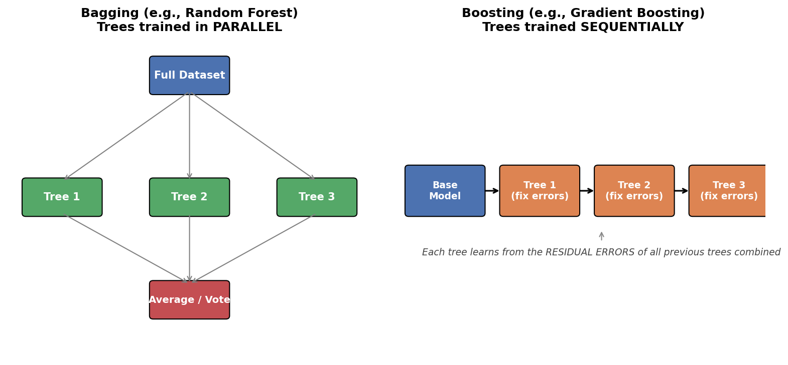
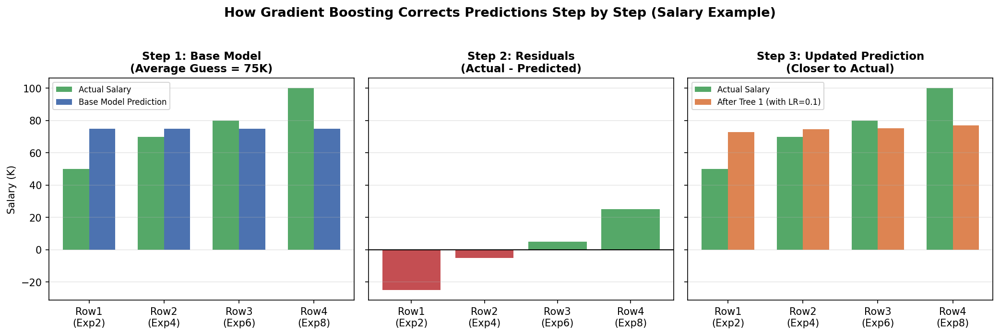
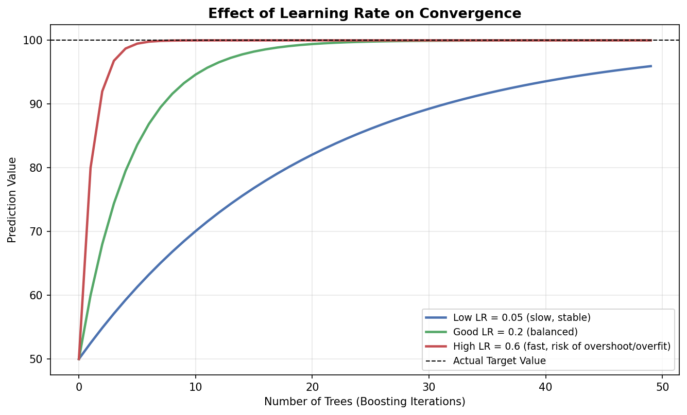
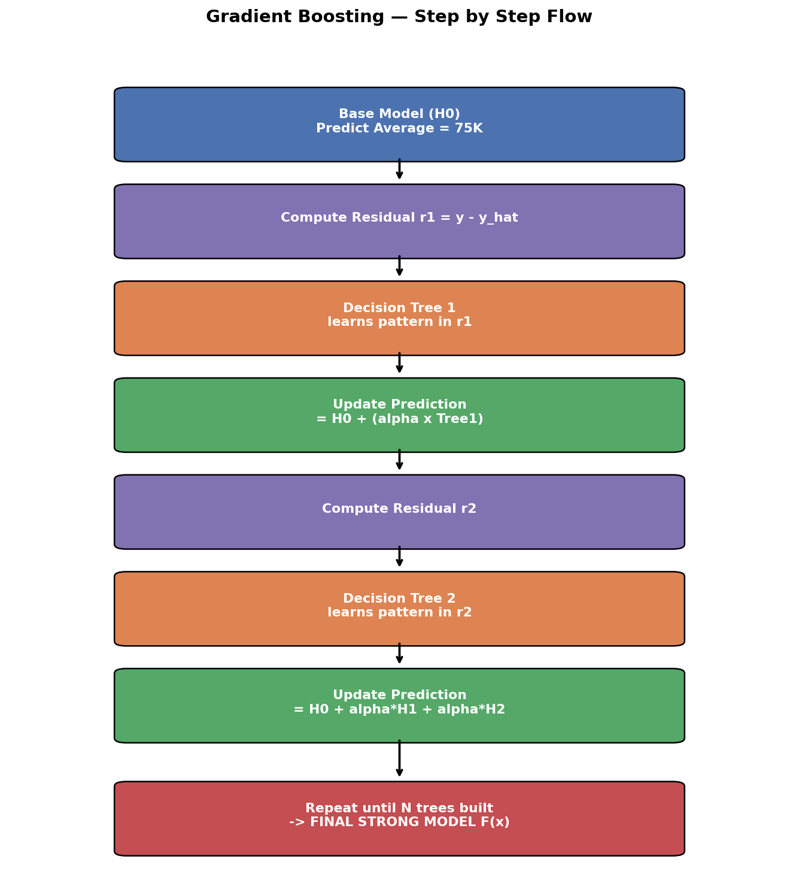
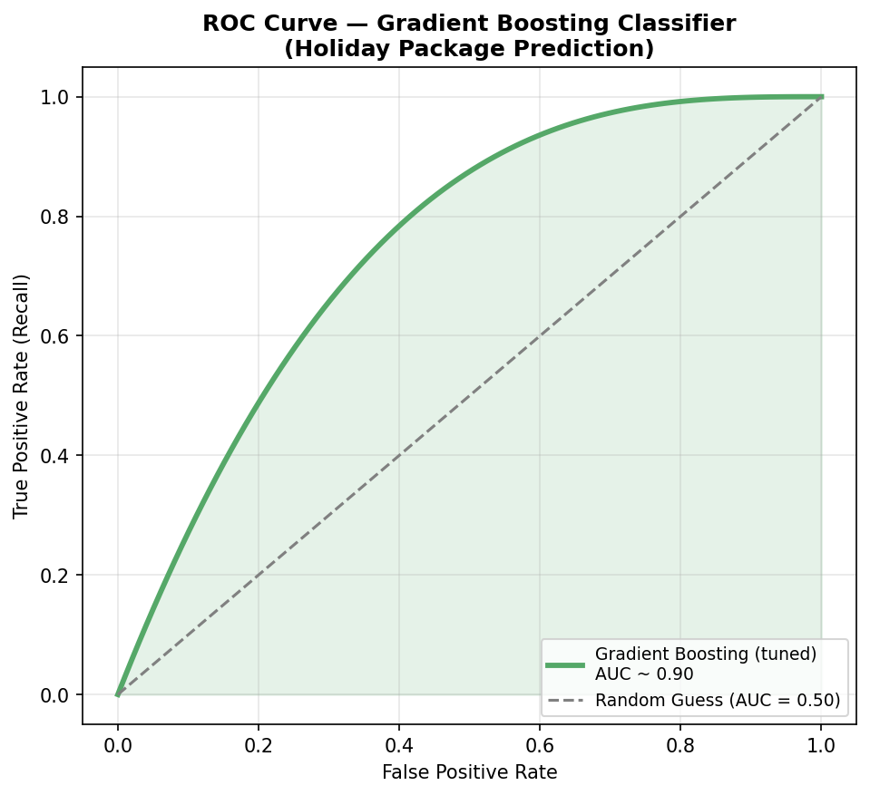
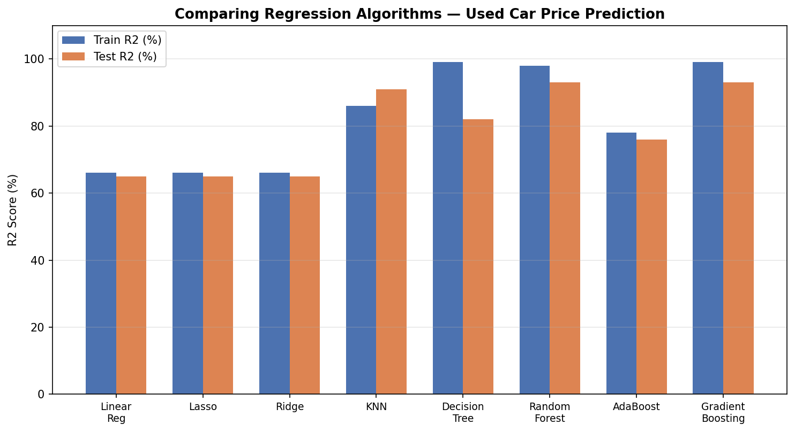

# 🌱 Gradient Boosting Machine Learning


---

##  Table of Contents
1. [What is Gradient Boosting?](#1-what-is-gradient-boosting)
2. [Boosting Family — Where Does GBM Fit?](#2-boosting-family--where-does-gbm-fit)
3. [Real-Life Analogy (Must Read First!)](#3-real-life-analogy-must-read-first)
4. [The Dataset We Will Use](#4-the-dataset-we-will-use)
5. [Step-by-Step Working of Gradient Boosting](#5-step-by-step-working-of-gradient-boosting)
6. [The Role of Learning Rate (α)](#6-the-role-of-learning-rate-α)
7. [The Final Mathematical Formula](#7-the-final-mathematical-formula)
8. [Visual Summary Diagram](#8-visual-summary-diagram)
9. [Gradient Boosting vs AdaBoost](#9-gradient-boosting-vs-adaboost)
10. [Advantages & Disadvantages](#10-advantages--disadvantages)
11. [Where is Gradient Boosting Used in Real Life?](#11-where-is-gradient-boosting-used-in-real-life)
12. [Key Takeaways (Quick Revision)](#12-key-takeaways-quick-revision)
13. [Gradient Boosting for Classification — Practical Walkthrough](#13-gradient-boosting-for-classification--practical-walkthrough)
14. [Comparing Algorithms on the Same Problem](#14-comparing-algorithms-on-the-same-problem)
15. [Hyperparameter Tuning with RandomizedSearchCV](#15-hyperparameter-tuning-with-randomizedsearchcv)
16. [Key Gradient Boosting Hyperparameters Explained](#16-key-gradient-boosting-hyperparameters-explained)
17. [Evaluating the Model: F1, Recall & ROC-AUC](#17-evaluating-the-model-f1-recall--roc-auc)
18. [Sample Python Code (End-to-End)](#18-sample-python-code-end-to-end)
19. [Final Quick Revision (Classification)](#19-final-quick-revision-classification)
20. [Gradient Boosting for Regression — Practical Walkthrough](#20-gradient-boosting-for-regression--practical-walkthrough)
21. [Comparing Regression Algorithms on the Same Problem](#21-comparing-regression-algorithms-on-the-same-problem)
22. [Regression Hyperparameter Tuning (Practical Code)](#22-regression-hyperparameter-tuning-practical-code)
23. [Understanding Regression Evaluation Metrics](#23-understanding-regression-evaluation-metrics)
24. [Practical Workflow Checklist (Any ML Project)](#24-practical-workflow-checklist-any-ml-project)

---

## 1. What is Gradient Boosting?

**Gradient Boosting** is a **Machine Learning algorithm** that builds a strong predictive model by combining many **weak models** (usually small decision trees), where **each new tree tries to correct the mistakes (errors) of the previous trees**.

- It can solve **both**:
  - ✅ **Regression** problems (predicting a number, e.g., salary, price)
  - ✅ **Classification** problems (predicting a category, e.g., spam/not spam)
- It belongs to a family of algorithms called **Boosting Ensemble Techniques**.

> **In one line:** Gradient Boosting = Build a simple model → Find out where it went wrong → Build a new tree to fix those mistakes → Repeat → Combine everything into one strong model.

---

## 2. Boosting Family — Where Does GBM Fit?

```
Ensemble Learning
│
├── Bagging  → e.g., Random Forest (trees built in PARALLEL)
│
└── Boosting → trees built SEQUENTIALLY (one after another)
       │
       ├── AdaBoost              (uses small trees called "stumps")
       └── Gradient Boosting     (uses full decision trees, corrects "residual errors")
```



**Key idea of Boosting:** Combine many **weak learners** (models that are only slightly better than random guessing) **sequentially**, so that the final combined model becomes a **strong learner**.

🔑 The big difference from AdaBoost: AdaBoost focuses on **misclassified data points** (by increasing their weight), while Gradient Boosting focuses on the **residual errors** (the mathematical difference between actual and predicted values).

---

## 3. Real-Life Analogy (Must Read First!)

### 🎯 Analogy: A Student Preparing for an Exam with a Tutor

Imagine a student trying to predict their exam score based on "hours studied" and "sleep hours."

1. **Base Model (Tutor's first guess):** Without knowing anything about the student, the tutor just says: *"On average, students score 75 marks."* This is a rough starting guess for everyone.
2. **Check the Error:** The tutor compares this guess to each student's actual score and notes the **gap (error)** — e.g., "Student A actually scored 50, so I was off by -25 marks."
3. **Correction Round 1:** The tutor studies *why* the guess was wrong (using hours studied, sleep hours) and creates a **correction rule** — a small tree of "if-else" conditions — to reduce that gap.
4. **Apply Correction (carefully, not fully):** The tutor doesn't apply the full correction at once (that would be like memorizing answers = overfitting). Instead, they apply only a **small fraction** of the correction, controlled by a **learning rate**.
5. **Repeat:** The tutor keeps repeating this — check error, build a new correction rule, apply a small fraction of it — again and again, slowly getting closer and closer to the real score.

This is **exactly** how Gradient Boosting works — each new "decision tree" is like a new correction rule that fixes leftover mistakes from before.

### 🏠 Another Analogy: House Price Prediction
Imagine 3 friends estimating the price of a house:
- Friend 1 gives a rough average price of all houses in the city.
- Friend 2 looks at the error Friend 1 made and adjusts based on "number of rooms."
- Friend 3 looks at the remaining error and adjusts based on "location."

Combine all three opinions (with small weightage to each) → you get a much more accurate price than any single friend alone. **That combined opinion is Gradient Boosting.**

---

## 4. The Dataset We Will Use

This is a **Regression problem** — because the output (Salary) is a continuous number.

| Experience (yrs) | Degree | Salary (Output) |
|---|---|---|
| 2  | B.Tech | 50 K |
| 4  | M.Tech | 70 K |
| 6  | B.Tech | 80 K |
| 8  | M.Tech | 100 K |

- **Independent Features (Inputs):** Experience, Degree
- **Dependent Feature (Output/Target):** Salary

---

## 5. Step-by-Step Working of Gradient Boosting

### 🔹 Step 1: Create a Base Model (Starting Guess)

The very first model should **not be biased** toward any particular row — so instead of using a decision tree, we simply predict the **average of the output column** for every input.

```
Average Salary = (50 + 70 + 80 + 100) / 4 = 75 K
```

So our **Base Model (H₀)** always predicts **75 K**, no matter what the input is.

| Experience | Degree | Actual Salary (y) | Base Model Prediction (ŷ) |
|---|---|---|---|
| 2 | B.Tech | 50 K | 75 K |
| 4 | M.Tech | 70 K | 75 K |
| 6 | B.Tech | 80 K | 75 K |
| 8 | M.Tech | 100 K | 75 K |

> 💡 **Real-life example:** This is like guessing "the average house price in the city" before you know anything about a specific house — a safe, unbiased starting point.

---

### 🔹 Step 2: Compute the Residuals (Errors)

**Residual = Actual value − Predicted value**

```
Residual (r₁) = y − ŷ
```

| Actual (y) | Predicted (ŷ) | Residual r₁ = y − ŷ |
|---|---|---|
| 50 | 75 | **−25** |
| 70 | 75 | **−5** |
| 80 | 75 | **+5** |
| 100 | 75 | **+25** |

These residuals tell us: **"How far off was our guess, and in which direction?"**

> 💡 **Real-life example:** If a weather app predicts 30°C every day (base model) but the actual temperature varies, the residual tells the app "you were 3°C too high on Monday, 2°C too low on Tuesday," etc. — useful info to improve the next prediction.

---

### 🔹 Step 3: Build a Decision Tree on the Residuals

Now, instead of predicting Salary directly, we build **Decision Tree 1** to predict the **residual (r₁)**, using the same input features (Experience, Degree).

```
Decision Tree 1:  Inputs → (Experience, Degree)     Output → r₁ (residual)
```

This tree learns patterns like: *"People with more experience tend to have a more positive residual."* It works exactly like a **regular regression decision tree** (splits using Mean Squared Error / Variance Reduction, just like we studied in the Decision Tree topic).

Once trained, this tree gives its own predicted residuals for each row, e.g.:

| Row | Tree 1 Output |
|---|---|
| 1 | −23 |
| 2 | −3 |
| 3 | 3 |
| 4 | 20 |

---

### 🔹 Step 4: Combine Base Model + Tree (with a Learning Rate)

Here's the **most important trick** in Gradient Boosting. You might think:

```
New Prediction = Base Model + Tree 1 Output
              = 75 + (−23) = 52
```

Since actual value was 50, this looks *very* accurate — but **DON'T be fooled!** This is a classic case of **overfitting** — the model has basically memorized the training data instead of learning general patterns.

### ⚠️ Solution: Introduce a Learning Rate (α)

Instead of adding the full correction, we add only a **small fraction (controlled by learning rate α)**:

```
New Prediction = Base Model + (α × Tree Output)
```

If **α = 0.1**:

```
New Prediction (Row 1) = 75 + (0.1 × −23) = 75 − 2.3 = 72.7
```

| Row | Base Model | Tree 1 Output | α × Tree Output | New Prediction |
|---|---|---|---|---|
| 1 | 75 | −23 | −2.3 | **72.7** |
| 2 | 75 | −3  | −0.3 | **74.7** |
| 3 | 75 | 3   | 0.3  | **75.3** |
| 4 | 75 | 20  | 2.0  | **77.0** |



> 💡 **Real-life example:** Think of the learning rate like taking **small, careful steps** while adjusting a shower's water temperature instead of cranking the knob all the way — small steps prevent "overshooting" (too hot/too cold = overfitting).

---

### 🔹 Step 5: Compute New Residuals & Repeat

Now we calculate the **new residual (r₂)** using the *updated* prediction:

```
r₂ = Actual (y) − New Prediction
```

| Actual (y) | New Prediction | Residual r₂ |
|---|---|---|
| 50 | 72.7 | **−22.7** |
| 70 | 74.7 | **−4.7** |
| ... | ... | ... |

We then build **Decision Tree 2** on these new residuals (r₂), get a new correction, update our prediction again (with the same learning rate), and compute **r₃**. This cycle **keeps repeating**, gradually reducing the error a little bit at a time, for as many trees as we choose (say, 100 trees).

```
Base Model → Tree 1 (fix errors) → Tree 2 (fix remaining errors) → Tree 3 (fix remaining errors) → ... → Tree N
```

> 💡 **Real-life example:** This is like **editing an essay draft** — first draft has many mistakes, editor 1 fixes grammar (big improvement), editor 2 fixes structure (smaller improvement), editor 3 fixes tone (even smaller improvement) — each round improves the essay a little more, without any single editor rewriting the whole thing from scratch.

---

## 6. The Role of Learning Rate (α)

| Learning Rate | Effect |
|---|---|
| **Too High** (close to 1) | Learns fast but risks **overfitting** — like memorizing answers |
| **Too Low** (close to 0) | Learns slowly, needs many more trees, but usually **generalizes better** |
| **Typical Value** | Between **0.01 and 0.3** (commonly 0.1) |



> 🧠 It's a trade-off between **number of trees** and **learning rate** — smaller learning rate usually needs more trees to reach good accuracy.

---

## 7. The Final Mathematical Formula

After adding up the base model and all the sequential trees (each scaled by its learning rate), the final Gradient Boosting model looks like this:

```
F(x) = H₀(x) + α₁H₁(x) + α₂H₂(x) + α₃H₃(x) + ... + αₙHₙ(x)
```

Or in compact summation form:

```
        n
F(x) =  Σ   αᵢ Hᵢ(x)
       i=0
```

Where:
- **H₀(x)** → Base model (average prediction)
- **H₁(x), H₂(x), ... Hₙ(x)** → Sequential decision trees, each trained on the residuals of the previous stage
- **α (alpha)** → Learning rate, controlling how much each tree contributes
- **n** → Total number of trees (a hyperparameter you choose)

---

## 8. Visual Summary Diagram

```
                        ┌─────────────────────┐
                        │   Base Model (H₀)    │
                        │  Predicts Avg = 75K  │
                        └──────────┬───────────┘
                                   │
                          Compute Residual r₁
                                   │
                                   ▼
                        ┌─────────────────────┐
                        │   Decision Tree 1     │
                        │  Learns pattern in r₁ │
                        └──────────┬───────────┘
                                   │  × learning rate (α)
                                   ▼
                     Updated Prediction = H₀ + α·H₁
                                   │
                          Compute Residual r₂
                                   │
                                   ▼
                        ┌─────────────────────┐
                        │   Decision Tree 2     │
                        │  Learns pattern in r₂ │
                        └──────────┬───────────┘
                                   │  × learning rate (α)
                                   ▼
                     Updated Prediction = H₀ + α·H₁ + α·H₂
                                   │
                                  ...
                                   ▼
                     Repeat until N trees are built
                                   │
                                   ▼
                        ┌─────────────────────┐
                        │   FINAL STRONG MODEL  │
                        │      F(x)             │
                        └─────────────────────┘
```



**Simple way to remember:** Each tree is a small "correction layer" stacked on top of the previous prediction — like adding thin layers of paint, each one refining the picture a bit more.

---

## 9. Gradient Boosting vs AdaBoost

| Feature | AdaBoost | Gradient Boosting |
|---|---|---|
| Tree type | Shallow "stumps" (1 split) | Full decision trees (can go deeper) |
| What it corrects | Misclassified points get **higher weight** | Model fits the **residual errors** directly |
| Combination method | Weighted majority voting | Additive: base + Σ(α × tree output) |
| Sensitivity to outliers | High | Can be high too, but more tunable via learning rate |
| Typical use | Simpler, faster problems | More complex problems (often more accurate) |

---

## 10. Advantages & Disadvantages

### ✅ Advantages
- Usually **very high accuracy**, especially on structured/tabular data.
- Works for **both regression and classification**.
- Flexible — supports pruning, regularization, custom loss functions.
- Powers popular real-world libraries: **XGBoost, LightGBM, CatBoost**.

### ❌ Disadvantages
- **Slow to train** because trees are built sequentially (one after another, not in parallel like Random Forest).
- Prone to **overfitting** if learning rate is too high or too many trees are used without control.
- Requires careful **hyperparameter tuning** (learning rate, number of trees, tree depth).
- Less interpretable than a single decision tree ("black box" nature increases with more trees).

---

## 11. Where is Gradient Boosting Used in Real Life?

| Real-World Use Case | How Gradient Boosting Helps |
|---|---|
| 🏦 **Loan Default Prediction** (Banks) | Predicts probability a customer will default on a loan based on income, credit history, etc. |
| 🛒 **E-commerce Recommendation Ranking** | Ranks which products to show first based on likelihood of purchase |
| 🏥 **Healthcare Risk Scoring** | Predicts risk of disease based on patient records |
| 📈 **Kaggle Competitions** | XGBoost/LightGBM (Gradient Boosting variants) are among the most winning algorithms |
| 🚗 **Insurance Claim Prediction** | Predicts the likelihood and cost of a claim |
| 📧 **Spam Detection** | Classifies emails as spam/not spam using a boosted ensemble of trees |

---

## 12. Key Takeaways (Quick Revision)

- ✅ Gradient Boosting = Sequential ensemble of decision trees where each tree fixes the **residual errors** of the previous combined model.
- ✅ **Step 1:** Base model = average of target (for regression).
- ✅ **Step 2:** Compute residuals = actual − predicted.
- ✅ **Step 3:** Train a new tree to predict these residuals using the input features.
- ✅ **Step 4:** Update prediction = previous prediction + (learning rate × new tree's output).
- ✅ **Step 5:** Repeat steps 2–4 for N trees.
- ✅ Learning rate (α) prevents overfitting by applying corrections gradually.
- ✅ Final formula: **F(x) = Σ αᵢ Hᵢ(x)** for i = 0 to n.
- ✅ Same core idea extends to classification too (using log-loss instead of simple residuals).

---

### 📌 Study Tip
Revisit the numeric example in **Section 5** with pen and paper — recompute the residuals and updated predictions yourself. Once you can redo those 4 rows of numbers without looking, you've truly understood Gradient Boosting. Practical coding implementation (Python + Scikit-learn `GradientBoostingRegressor`) is the natural next step after these concepts are clear.

---

## 13. Gradient Boosting for Classification — Practical Walkthrough

Everything you learned above (base model → residuals → sequential trees → learning rate) works for **classification** too — the only difference is the "error" is measured using a **loss function suited for classes** (like log-loss) instead of a simple subtraction. In practice, though, you rarely do this math by hand — you use a ready-made library.

### 🎯 Real-World Problem: Holiday Package Prediction

> A travel company wants to predict **whether a customer will purchase a holiday package** (Yes/No) based on features like age, income, number of children, past travel history, etc. This is a **binary classification** problem — exactly the kind of real business use case Gradient Boosting is used for.

### 📦 Importing the Classifier (Scikit-learn)

```python
from sklearn.ensemble import GradientBoostingClassifier

model = GradientBoostingClassifier()
model.fit(X_train, y_train)

y_pred_train = model.predict(X_train)
y_pred_test = model.predict(X_test)
```

> 💡 **Real-life example:** Think of this like a **loan approval system** at a bank — instead of predicting a number (salary), the model predicts a **category**: "will approve" or "will reject," based on a customer's profile.

---

## 14. Comparing Algorithms on the Same Problem

A very common real-world practice is to **not rely on just one algorithm** — you train several and compare their performance before choosing the best one. Here's what was observed on the holiday package dataset:

| Algorithm | Behavior Observed |
|---|---|
| **Logistic Regression** | ~84% accuracy, but **recall was low** (misses many actual buyers) |
| **Decision Tree** | Performed well on training data but showed **overfitting** (train accuracy ≫ test accuracy) |
| **Random Forest** | Fit well overall, but again **recall was low** |
| **AdaBoost** | Performed the **worst** among all algorithms tested |
| **Gradient Boosting (default settings)** | ~88–89% F1 score — good, but recall was still low before tuning |

> 🧠 **Key lesson:** A high "accuracy" number can be misleading. If a model rarely predicts "Yes" (buys package) correctly, its **recall** will be poor even if accuracy looks fine — very important in real business cases like fraud detection or churn prediction, where missing the rare positive case is costly.

---

## 15. Hyperparameter Tuning with RandomizedSearchCV

Instead of manually guessing the best settings, we give the algorithm a **range of possible values** for each hyperparameter, and let `RandomizedSearchCV` **randomly sample combinations**, train multiple models, and pick the best-performing combination through cross-validation.

### Example Parameter Grid Used

```python
gradient_params = {
    "loss": ["log_loss", "exponential"],
    "criterion": ["friedman_mse", "squared_error"],
    "min_samples_split": [2, 5, 10, 20],
    "n_estimators": [100, 200, 300, 500],
    "max_depth": [3, 5, 10, 15],
    "learning_rate": [0.01, 0.05, 0.1, 0.2]
}
```

> ⚠️ **Version note:** `"deviance"` (loss) and `"mse"` (criterion) appear in some older tutorials/notebooks
> but have since been **removed** from scikit-learn (`"deviance"` was renamed to `"log_loss"`; `"mse"` was
> replaced by `"squared_error"`). Using the removed names will raise a `ValueError` on current scikit-learn
> versions — the grid above uses the **currently valid** option names.

### Running the Search

```python
from sklearn.ensemble import RandomForestClassifier
from sklearn.model_selection import RandomizedSearchCV

rf_params = {
    "n_estimators": [100, 200, 500],
    "max_depth": [5, 10, 15, None],
    "min_samples_split": [2, 5, 10]
}

random_cv_models = [
    ("Gradient Boost", GradientBoostingClassifier(), gradient_params),
    ("Random Forest", RandomForestClassifier(), rf_params)
]

for name, model, params in random_cv_models:
    search = RandomizedSearchCV(estimator=model, param_distributions=params,
                                 cv=5, n_jobs=-1, verbose=2)
    search.fit(X_train, y_train)
    print(name, "Best Params:", search.best_params_)
```

### Best Parameters Found (Example Result)

```python
{
    "n_estimators": 500,
    "min_samples_split": 20,
    "max_depth": 15,
    "loss": "exponential",
    "criterion": "squared_error"
}
```

> 💡 **Real-life example:** This is like a **chef testing multiple recipe variations** (different spice amounts, cooking times, temperatures) on a small scale, before finalizing the exact recipe used for the full restaurant menu — instead of guessing the "best" recipe on the first try.

### 📈 Result After Tuning

After plugging in the best-found parameters and retraining:
- **F1 score, recall, and overall accuracy all improved** noticeably on both train and test sets.
- The **ROC-AUC curve** improved significantly — area under the curve reached **~90%**, showing the model separates the two classes (buy / not buy) very well.

---

## 16. Key Gradient Boosting Hyperparameters Explained

| Hyperparameter | What It Controls | Real-Life Analogy |
|---|---|---|
| `n_estimators` | Number of sequential trees to build | Number of "correction rounds" an editor does on your essay |
| `learning_rate` | How much each tree's correction is applied | Size of each "step" while adjusting shower temperature |
| `max_depth` | How deep/complex each individual tree can grow | How many follow-up questions a doctor asks before diagnosing |
| `min_samples_split` | Minimum data points needed to split a tree node | Minimum group size needed before a teacher creates a new sub-group in class |
| `loss` | The function used to measure "how wrong" predictions are | The specific grading rubric used to measure a mistake |
| `criterion` | The formula used to decide the best split point in a tree | The rule used to decide how to best organize a bookshelf |

> ⚠️ **Tuning tip:** `n_estimators` and `learning_rate` are usually tuned **together** — more trees generally need a smaller learning rate, and vice versa, to avoid overfitting.

---

## 17. Evaluating the Model: F1, Recall & ROC-AUC

When working on classification (especially real business problems like "will the customer buy?"), accuracy alone is not enough. Here's why each metric matters:

| Metric | What It Tells You | Why It Matters |
|---|---|---|
| **Accuracy** | % of total correct predictions | Can be misleading if classes are imbalanced (e.g., 95% don't buy, 5% buy) |
| **Precision** | Out of all predicted "Yes," how many were actually "Yes"? | Important when false positives are costly (e.g., spam filters) |
| **Recall** | Out of all actual "Yes," how many did we correctly catch? | Important when missing a positive case is costly (e.g., disease detection, fraud) |
| **F1 Score** | Harmonic mean of precision & recall (weighted average) | Balances both — good single number to compare models |
| **ROC-AUC Curve** | Plots True Positive Rate vs False Positive Rate across thresholds | A curve closer to the top-left corner (AUC near 1.0 / 100%) means the model separates classes very well |

```
ROC-AUC Curve (Conceptual)

 True Positive
 Rate (Recall)
     1.0 |                        ●●●●●●●
         |                  ●●●●●
         |             ●●●●          ← Good model (AUC ~ 0.90)
         |         ●●●
         |      ●●
         |   ●●
         | ●● - - - - - - - - - - - -  ← Random guess line (AUC = 0.5)
     0.0 |________________________________
        0.0                            1.0
              False Positive Rate
```



> 💡 **Real-life example:** In a **cancer screening test**, high **recall** matters most — you'd rather flag a few healthy patients for extra tests (false positives) than **miss** an actual cancer patient (false negative). Gradient Boosting lets you tune this balance via hyperparameters and threshold selection.

---

## 18. Sample Python Code (End-to-End)

```python
from sklearn.ensemble import GradientBoostingClassifier
from sklearn.model_selection import RandomizedSearchCV, train_test_split
from sklearn.metrics import f1_score, recall_score, roc_auc_score, roc_curve

# 1. Split data
X_train, X_test, y_train, y_test = train_test_split(X, y, test_size=0.2, random_state=42)

# 2. Define hyperparameter grid
gradient_params = {
    "loss": ["log_loss", "exponential"],
    "n_estimators": [100, 300, 500],
    "max_depth": [3, 10, 15],
    "min_samples_split": [2, 10, 20],
    "learning_rate": [0.01, 0.1, 0.2]
}

# 3. Randomized Search for best parameters
gb = GradientBoostingClassifier()
search = RandomizedSearchCV(gb, gradient_params, cv=5, n_jobs=-1, verbose=1)
search.fit(X_train, y_train)

print("Best Parameters:", search.best_params_)

# 4. Train final model with best parameters
best_model = search.best_estimator_

# 5. Predictions & Evaluation
y_pred = best_model.predict(X_test)
y_proba = best_model.predict_proba(X_test)[:, 1]

print("F1 Score:", f1_score(y_test, y_pred, average="weighted"))
print("Recall:", recall_score(y_test, y_pred))
print("ROC-AUC:", roc_auc_score(y_test, y_proba))

# 6. Plot ROC Curve
fpr, tpr, thresholds = roc_curve(y_test, y_proba)
```

---

## 19. Final Quick Revision (Classification)

- ✅ Gradient Boosting works for classification the same way as regression — sequential trees correcting previous mistakes — just uses a classification-friendly loss function (e.g., log-loss).
- ✅ Always **compare multiple algorithms** (Logistic Regression, Decision Tree, Random Forest, AdaBoost, Gradient Boosting) before picking one for production.
- ✅ Default hyperparameters rarely give the best result — **hyperparameter tuning** (via RandomizedSearchCV/GridSearchCV) is essential.
- ✅ Watch **recall**, not just accuracy — especially in real-world imbalanced problems (fraud, churn, disease detection).
- ✅ A well-tuned Gradient Boosting Classifier can push **ROC-AUC to ~90%**, showing strong separation between classes.
- ✅ Key hyperparameters to tune: `n_estimators`, `learning_rate`, `max_depth`, `min_samples_split`, `loss`, `criterion`.

---

## 20. Gradient Boosting for Regression — Practical Walkthrough

### 🎯 Real-World Problem: Used Car Price Prediction

> An online marketplace (like CarDekho or OLX) wants to predict the **selling price of a used car** based on features like year, kilometers driven, fuel type, transmission, owner history, etc. This is a **regression problem** — the output (price) is a continuous number, just like the "Salary" example in Section 4, but on real data.

```python
from sklearn.ensemble import GradientBoostingRegressor

model = GradientBoostingRegressor()
model.fit(X_train, y_train)

y_pred_train = model.predict(X_train)
y_pred_test = model.predict(X_test)
```

> 💡 **Real business lesson:** In any real-world project, you **don't just pick one algorithm and stop** — you train and compare many algorithms (Linear, Ridge, Lasso, KNN, Decision Tree, Random Forest, AdaBoost, Gradient Boosting) side-by-side on the **same** train/test split, then choose the best performer for further tuning. This is standard industry practice, not a shortcut.

---

## 21. Comparing Regression Algorithms on the Same Problem

Here's what was observed while comparing multiple regression algorithms on the used-car price dataset (R² score = how well the model explains the variation in price; closer to 100% is better):

| Algorithm | Approx. Performance | Observation |
|---|---|---|
| **Linear Regression** | ~66% R² | Underfitting — relationship is not simply linear |
| **Lasso Regression** | ~66% R² | Similar to Linear Regression |
| **Ridge Regression** | ~66% R² | Similar to Linear Regression |
| **K-Nearest Neighbors (KNN)** | 86% (train) / 91% (test) | Decent, but not the best |
| **Decision Tree** | Very high train, much lower test | **Overfitting** — memorized training data |
| **Random Forest** | High and consistent | Strong candidate for tuning |
| **AdaBoost** | Poor performance | Not selected for this problem |
| **Gradient Boosting (default)** | 94% (train) / 91% (test) | Much better than Decision Tree, close to Random Forest |

> 🧠 **Why compare so many models?** Just like a hiring manager wouldn't hire the first candidate without interviewing others, a data scientist shouldn't finalize the first model without comparing alternatives — different algorithms capture different types of patterns (linear vs non-linear, simple vs complex).



Based on this comparison, **Random Forest and Gradient Boosting** were shortlisted for further **hyperparameter tuning** (since Linear/Ridge/Lasso underfit, KNN was mediocre, Decision Tree overfits, and AdaBoost underperformed).

---

## 22. Regression Hyperparameter Tuning (Practical Code)

Just like in classification (Section 15), we define a **range of hyperparameter values** and let `RandomizedSearchCV` search for the best combination — this time for a regression target (price).

```python
from sklearn.ensemble import GradientBoostingRegressor, RandomForestRegressor
from sklearn.model_selection import RandomizedSearchCV

gradient_params = {
    "loss": ["squared_error", "absolute_error", "huber"],
    "criterion": ["friedman_mse", "squared_error"],
    "min_samples_split": [2, 8, 15, 20],
    "n_estimators": [100, 200, 300, 500],
    "max_depth": [3, 5, 8, 10],
    "learning_rate": [0.001, 0.01, 0.03, 0.1],
    "subsample": [0.6, 0.8, 1.0]
}

rf_params = {
    "n_estimators": [100, 200, 500],
    "max_depth": [5, 10, 15, None],
    "min_samples_split": [2, 5, 10]
}

random_cv_models = [
    ("Random Forest", RandomForestRegressor(), rf_params),
    ("Gradient Boost", GradientBoostingRegressor(), gradient_params)
]

model_param = {}
for name, model, params in random_cv_models:
    search = RandomizedSearchCV(estimator=model,
                                 param_distributions=params,
                                 n_iter=100, cv=3, verbose=2, n_jobs=-1)
    search.fit(X_train, y_train)
    model_param[name] = search.best_params_
    print(name, "Best Params:", search.best_params_)
```

### Example Best Parameters Found (Gradient Boosting)

```python
{
    "subsample": 0.8,
    "n_estimators": 300,
    "min_samples_split": 15,
    "max_depth": 10,
    "loss": "huber",
    "learning_rate": 0.03,
    "criterion": "squared_error"
}
```

### Training the Final Tuned Model

```python
final_gb_model = GradientBoostingRegressor(
    subsample=0.8,
    n_estimators=300,
    min_samples_split=15,
    max_depth=10,
    loss="huber",
    learning_rate=0.03,
    criterion="squared_error"
)
final_gb_model.fit(X_train, y_train)
```

### 📈 Result After Tuning

| Model | Train R² | Test R² |
|---|---|---|
| Random Forest (tuned) | 97.8% | 93% |
| **Gradient Boosting (tuned)** | **99%** | **93%** |

Gradient Boosting also showed **lower RMSE and lower MAE** compared to Random Forest — meaning its price predictions were, on average, **closer to the actual selling price**. So in this case, **Gradient Boosting was chosen as the final model** for deployment.

> ⏱️ **Practical note:** Hyperparameter tuning with many parameter combinations can take significant time (several minutes) — the number of "fits" = `n_iter × cv folds`. This is completely normal; more powerful hardware (more RAM/CPU cores) speeds this up.

---

## 23. Understanding Regression Evaluation Metrics

| Metric | Formula (Concept) | What It Means | Real-Life Analogy |
|---|---|---|---|
| **R² Score (R-squared)** | 1 − (Error variance / Total variance) | % of price variation explained by the model (closer to 100% = better) | A student's exam score explaining how well they understood the syllabus |
| **MAE** (Mean Absolute Error) | Average of \|Actual − Predicted\| | On average, how far off (in ₹/$) is each prediction | If MAE = ₹20,000, your price prediction is off by ₹20,000 on average |
| **MSE** (Mean Squared Error) | Average of (Actual − Predicted)² | Like MAE, but **punishes large errors more heavily** | A stricter teacher who penalizes big mistakes much more than small ones |
| **RMSE** (Root Mean Squared Error) | √MSE | Same unit as the target (₹/$), easier to interpret than MSE | The "typical" prediction error, in real currency terms |

> 💡 **Real-life example:** If you're predicting a used car's price and your model has **RMSE = ₹15,000**, it means your predictions are typically off by around ₹15,000 — useful for the business to decide if that error margin is acceptable for pricing decisions.

```python
from sklearn.metrics import mean_absolute_error, mean_squared_error, r2_score
import numpy as np

def evaluate_model(true, predicted):
    mae = mean_absolute_error(true, predicted)
    mse = mean_squared_error(true, predicted)
    rmse = np.sqrt(mse)
    r2 = r2_score(true, predicted)
    return mae, rmse, r2
```

---

## 24. Practical Workflow Checklist (Any ML Project)

Whether it's regression (car price) or classification (holiday package), the same real-world workflow applies:

```
1. Do EDA & Feature Engineering
        │
        ▼
2. Train MULTIPLE baseline algorithms
   (Linear/Logistic, Ridge, Lasso, KNN, Decision Tree,
    Random Forest, AdaBoost, Gradient Boosting)
        │
        ▼
3. Compare performance (R²/RMSE/MAE for regression,
   F1/Recall/ROC-AUC for classification)
        │
        ▼
4. Shortlist 1–2 best-performing algorithms
        │
        ▼
5. Perform Hyperparameter Tuning
   (RandomizedSearchCV / GridSearchCV)
        │
        ▼
6. Retrain with best parameters & re-evaluate
        │
        ▼
7. Select final model for deployment
```

> ✅ **Golden rule from the practical sessions:** Initial (default) training is enough to **shortlist** candidate algorithms — you don't need to hyperparameter-tune every single algorithm. Once you've picked the top 1–2 performers, *then* spend your time and compute budget on tuning them properly.

### 📌 What's Next?
The natural next step after mastering Gradient Boosting is learning **XGBoost** (Extreme Gradient Boosting) — an optimized, faster, and more regularized version of Gradient Boosting that is extremely popular in the industry and machine learning competitions.
