# 🚀 XGBoost (Extreme Gradient Boosting) — Complete Notes (Beginner to Advanced)

> Goal of this note: If you already understand **Gradient Boosting** (see `Gradient_Boosting_Notes.md`), this note builds directly on top of it and shows you what makes **XGBoost** an "extreme," faster, and more powerful version of it — explained with numbers, diagrams, and real-life examples.

---

## 📑 Table of Contents
1. [What is XGBoost?](#1-what-is-xgboost)
2. [Why "Extreme"? XGBoost vs Regular Gradient Boosting](#2-why-extreme-xgboost-vs-regular-gradient-boosting)
3. [Real-Life Analogy (Must Read First!)](#3-real-life-analogy-must-read-first)
4. [The Dataset We Will Use](#4-the-dataset-we-will-use)
5. [Step-by-Step Working of XGBoost (Classification)](#5-step-by-step-working-of-xgboost-classification)
6. [Similarity Weight & Gain — How XGBoost Picks the Best Split](#6-similarity-weight--gain--how-xgboost-picks-the-best-split)
7. [Making a Prediction: Log-Odds → Sigmoid → Probability](#7-making-a-prediction-log-odds--sigmoid--probability)
8. [Cover Value & Lambda — Controlling Overfitting](#8-cover-value--lambda--controlling-overfitting)
9. [The Final Mathematical Formula](#9-the-final-mathematical-formula)
10. [Visual Summary Diagram](#10-visual-summary-diagram)
11. [Key Hyperparameters in XGBoost](#11-key-hyperparameters-in-xgboost)
12. [Advantages & Disadvantages](#12-advantages--disadvantages)
13. [Where is XGBoost Used in Real Life?](#13-where-is-xgboost-used-in-real-life)
14. [Key Takeaways (Quick Revision)](#14-key-takeaways-quick-revision)
15. [XGBoost for Regression — Practical Walkthrough](#15-xgboost-for-regression--practical-walkthrough)
16. [Similarity Weight Formula: Classification vs Regression](#16-similarity-weight-formula-classification-vs-regression)
17. [Worked Example: Building the Regression Tree](#17-worked-example-building-the-regression-tree)
18. [Making a Prediction (Regression) — Worked Example](#18-making-a-prediction-regression--worked-example)
19. [Key Takeaways (Regression)](#19-key-takeaways-regression)
15. [XGBoost for Regression — Practical Walkthrough](#15-xgboost-for-regression--practical-walkthrough)
16. [Similarity Weight & Gain for Regression (Worked Example)](#16-similarity-weight--gain-for-regression-worked-example)
17. [Making a Regression Prediction (No Sigmoid Needed)](#17-making-a-regression-prediction-no-sigmoid-needed)
18. [XGBoost Classification vs Regression — Key Formula Differences](#18-xgboost-classification-vs-regression--key-formula-differences)
19. [Final Quick Revision (Regression)](#19-final-quick-revision-regression)

---

## 1. What is XGBoost?

**XGBoost** stands for **eXtreme Gradient Boosting**. It is an optimized, industry-favorite implementation of the Gradient Boosting idea — it builds decision trees **sequentially**, where each new tree tries to correct the errors of all previous trees combined, just like Gradient Boosting.

- Solves **both Classification and Regression** problems.
- Extremely popular in **real-world production systems** and **Kaggle competitions** because of its speed and accuracy.
- Adds mathematical refinements (Similarity Weight, Gain, Cover, Regularization) on top of plain Gradient Boosting to make it **faster, more accurate, and less prone to overfitting**.

> 🧠 **In one line:** XGBoost = Gradient Boosting + smarter math for choosing tree splits + built-in regularization + engineering optimizations for speed.

---

## 2. Why "Extreme"? XGBoost vs Regular Gradient Boosting

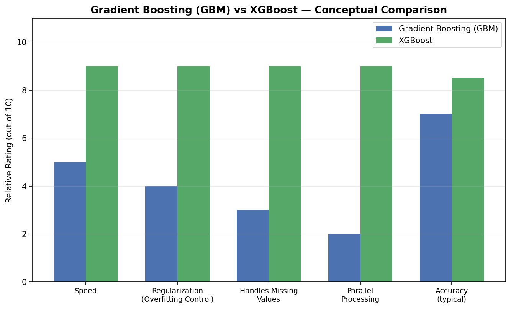

| Feature | Gradient Boosting (GBM) | XGBoost |
|---|---|---|
| Tree building | Uses MSE / variance reduction | Uses **Similarity Weight & Gain** (a more refined splitting criterion) |
| Overfitting control | Mainly learning rate | Learning rate **+ built-in regularization (lambda)** |
| Handling missing values | Needs manual handling | **Automatically** learns the best direction for missing values |
| Speed | Slower (sequential, less optimized) | Much **faster** due to parallelized tree construction internally |
| Pruning | Grows tree, then may prune | Uses a **Cover Value** to decide early when to stop splitting |
| Popularity | Common baseline algorithm | Industry & competition favorite |

---

## 3. Real-Life Analogy (Must Read First!)

### 💳 Analogy: A Bank Deciding Credit Card Approvals

Imagine a bank that wants to predict: *"Should we approve this person's credit card application?"* — a **Yes/No (classification)** decision, based on **Salary** and **Credit Score**.

1. **Base Model (Bank's starting assumption):** Before looking at any applicant details, the bank assumes a **neutral 50% chance of approval** for everyone — completely unbiased.
2. **Track the Error:** For each applicant, the bank checks: *"Was my 50% guess too high or too low compared to the actual approved/rejected outcome?"* This gap is the residual.
3. **Build a Smart Rule (Decision Tree):** The bank studies patterns — e.g., *"Applicants with salary > 50K and good credit tend to get approved."* But instead of guessing which feature (Salary or Credit) to split on, the bank **mathematically measures** which split best separates "approved" applicants from "rejected" ones (this is the **Gain** calculation).
4. **Decide When to Stop Digging Deeper:** The bank doesn't keep making the rules infinitely specific (e.g., "salary between 50,001 and 50,050") — it uses a **Cover Value** as a stopping rule, so the model doesn't overfit to tiny, meaningless patterns.
5. **Combine Everything Carefully:** Just like Gradient Boosting, each new "rule" (tree) is added with a small **learning rate**, and the final decision is converted back into a clean probability using a **sigmoid function** — similar to how a loan officer converts a raw "risk score" into a clean approval percentage.

This is exactly the workflow XGBoost follows internally!

---

## 4. The Dataset We Will Use

This is a **Classification problem** — the output (Approval) is a category: Yes/No.

| Salary | Credit Score | Approval (Output) |
|---|---|---|
| ≤ 50K | Bad | No |
| ≤ 50K | Good | Yes |
| ≤ 50K | Normal | Yes |
| > 50K | Bad | No |
| > 50K | Good | Yes |
| > 50K | Normal | Yes |
| ≤ 50K | Normal | No |

- **Independent Features (Inputs):** Salary, Credit Score
- **Dependent Feature (Output/Target):** Approval (binary: Yes = 1 / No = 0)

---

## 5. Step-by-Step Working of XGBoost (Classification)

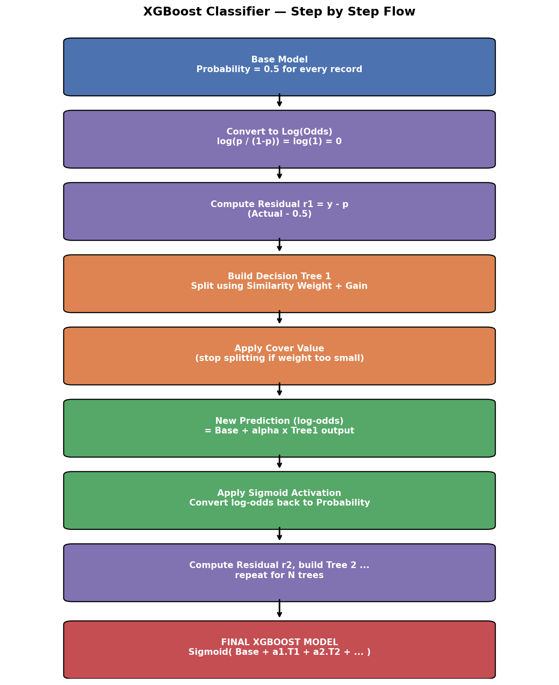

### 🔹 Step 1: Create a Base Model

For binary classification, the base model doesn't predict an average — it predicts a **neutral probability of 0.5** for every record (again, to stay unbiased at the start).

```
Base Model Prediction = 0.5 (for every record)
```

> 💡 **Real-life example:** It's like a new loan officer, on their very first day, having **no bias** and assuming a "50-50 chance" for every applicant before reviewing any details.

---

### 🔹 Step 2: Compute the Residuals

**Residual = Actual value − Predicted probability**

Since Approval is either 1 (Yes) or 0 (No), and the base model always predicts 0.5:

| Actual (y) | Base Prediction | Residual r1 = y − 0.5 |
|---|---|---|
| 0 (No)  | 0.5 | **−0.5** |
| 1 (Yes) | 0.5 | **+0.5** |
| 1 (Yes) | 0.5 | **+0.5** |
| 0 (No)  | 0.5 | **−0.5** |
| 1 (Yes) | 0.5 | **+0.5** |
| 1 (Yes) | 0.5 | **+0.5** |
| 1 (Yes) | 0.5 | **−0.5** |

---

### 🔹 Step 3: Build Decision Tree 1 (Using Residuals as Output)

Now XGBoost builds a decision tree using **Salary and Credit Score** as inputs, and the **residual (r1)** as the target — just like Gradient Boosting. But **how** it decides where to split is different (and smarter) — using **Similarity Weight** and **Gain**, explained next.

---

## 6. Similarity Weight & Gain — How XGBoost Picks the Best Split

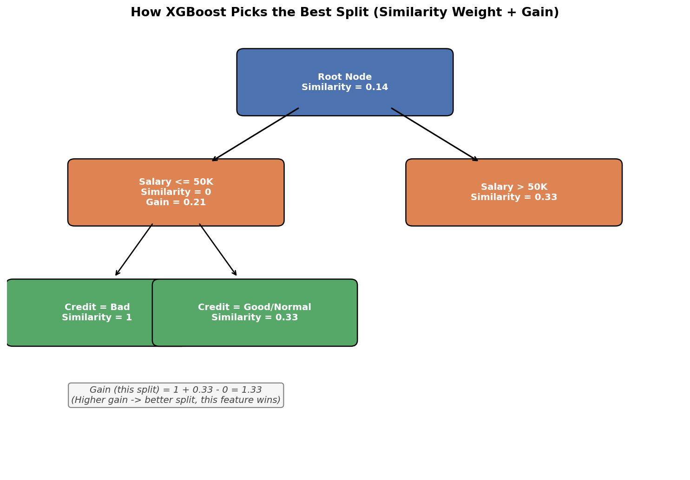

### 📐 Similarity Weight Formula

```
Similarity Weight = (Sum of Residuals)²  /  (Sum of [P × (1 − P)])
```
Where **P** is the base model's probability (0.5 in our case).

### 🧮 Worked Example — Splitting on "Salary"

**Left Child (Salary ≤ 50K)** — residuals: −0.5, 0.5, 0.5, −0.5
```
Similarity (Left) = (−0.5 + 0.5 + 0.5 + −0.5)² / (4 × 0.5 × 0.5)
                  = (0.0)² / 1.0  =  0  
```

**Right Child (Salary > 50K)** — residuals: −0.5, 0.5, 0.5
```
Similarity (Right) = (0.5)² / (3 × 0.25) = 0.25 / 0.75 = 0.33
```

**Root Node (all 7 records combined)**
```
Similarity (Root) = 0.14   (computed the same way, using all 7 residuals)
```

### 📐 Gain Formula

```
Gain = Similarity(Left Child) + Similarity(Right Child) − Similarity(Root)
```

```
Gain (Salary split) = 0 + 0.33 − 0.14 = 0.21
```

We repeat this calculation for **every possible feature and split point** (e.g., splitting on Credit Score too), and **whichever split gives the HIGHEST Gain is selected** for that branch of the tree.

> 🧠 **Why this matters:** Gain tells XGBoost **"how much better does this split make my model"** — it's a more mathematically rigorous version of what Gini Impurity / Information Gain does in a normal Decision Tree, tuned specifically for the boosting residual-fitting process.

> 💡 **Real-life example:** This is like a manager deciding whether to split a large team into two smaller teams by "experience level" or by "department" — they'd measure which split creates groups with the **most similar/consistent performance** within each group, and pick that split.

---

## 7. Making a Prediction: Log-Odds → Sigmoid → Probability

Since we are doing classification, we can't directly add up probabilities like we add numbers in regression. XGBoost works in the **log-odds** space internally, then converts back to probability at the end.

### Step A: Convert Base Probability to Log-Odds

```
Log(Odds) = log( P / (1 − P) )
Log(Odds) = log( 0.5 / 0.5 ) = log(1) = 0
```

So the base model's raw output (before sigmoid) is **0**.

### Step B: Add Tree Output (scaled by Learning Rate)

For a new record that ends up in a leaf with **Similarity Weight = 1** (e.g., "Salary ≤ 50K AND Credit = Bad"), and learning rate **α = 0.1**:

```
New raw score = Base(log-odds) + (α × Tree1 Similarity Weight)
             = 0 + (0.1 × 1) = 0.1
```

### Step C: Apply Sigmoid Activation to Get Final Probability

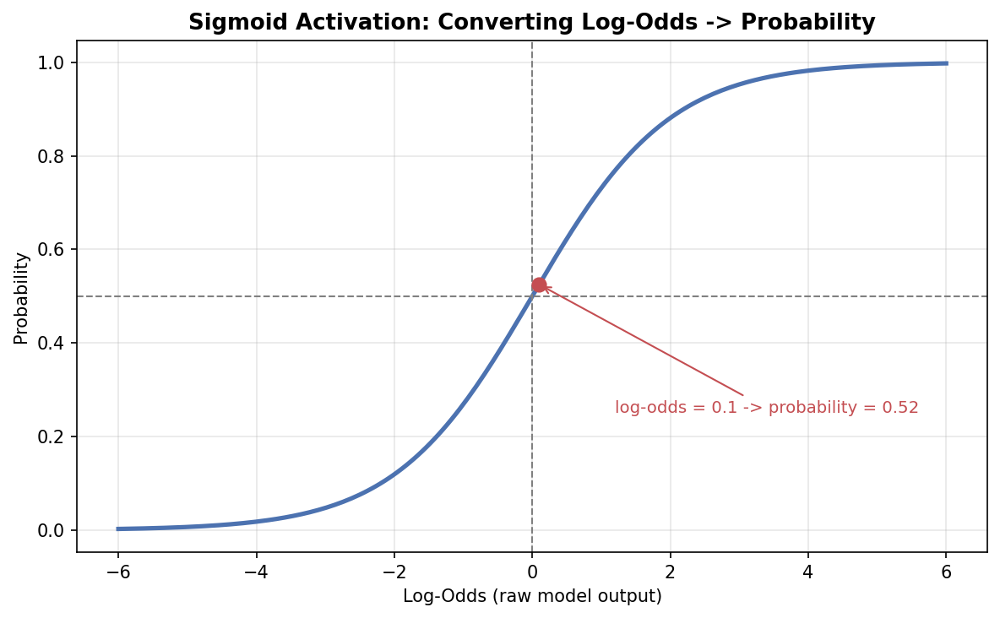

```
Sigmoid(x) = 1 / (1 + e^(−x))
Sigmoid(0.1) = 1 / (1 + e^(−0.1)) ≈ 0.52
```

So the **final predicted probability** for this record is **0.52** (52% chance of approval) — this becomes our new "predicted" value to compute the next residual (r2), and the whole cycle repeats for the next tree.

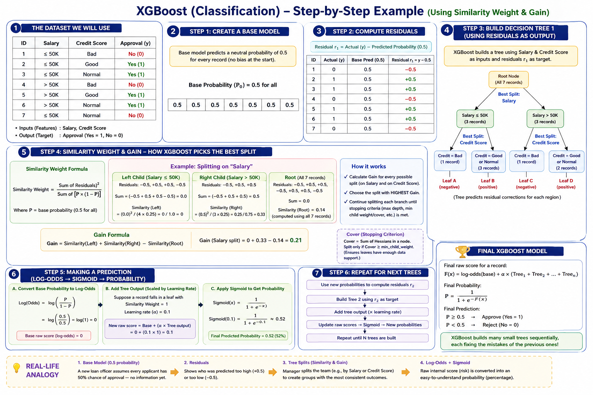

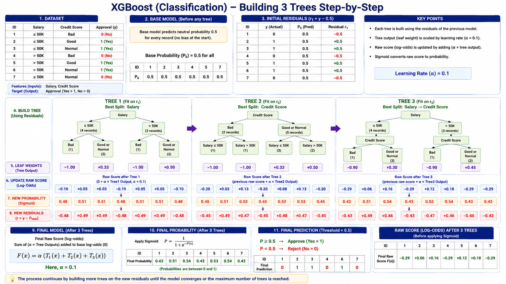
> 💡 **Real-life example:** Think of the raw log-odds score like a **credit risk score** a bank computes internally (which can be any number, positive or negative) — the sigmoid function is what converts that raw internal score into a clean, easy-to-understand **percentage chance of approval** that a customer actually sees.

---

## 8. Cover Value & Lambda — Controlling Overfitting

XGBoost has two extra knobs (compared to plain Gradient Boosting) specifically to prevent overfitting:

| Term | What It Does | Real-Life Analogy |
|---|---|---|
| **Lambda (λ)** | A regularization hyperparameter added to the Similarity Weight denominator, which **shrinks/penalizes** similarity weights — reduces overfitting on noisy data | Adding a "safety margin" to a financial forecast so you don't overreact to one unusual month |
| **Cover Value** | Calculated as `P × (1 − P)` summed over a node — if a node's cover value is **too small**, XGBoost **stops splitting further** at that branch | A teacher deciding a study group is "too small to bother splitting further" once it only has 1–2 students left |

> ⚠️ Without these controls, a boosting model (or any tree-based model) can keep splitting until every leaf has just one training record — perfectly memorizing the training data but performing terribly on new, unseen data (classic overfitting).

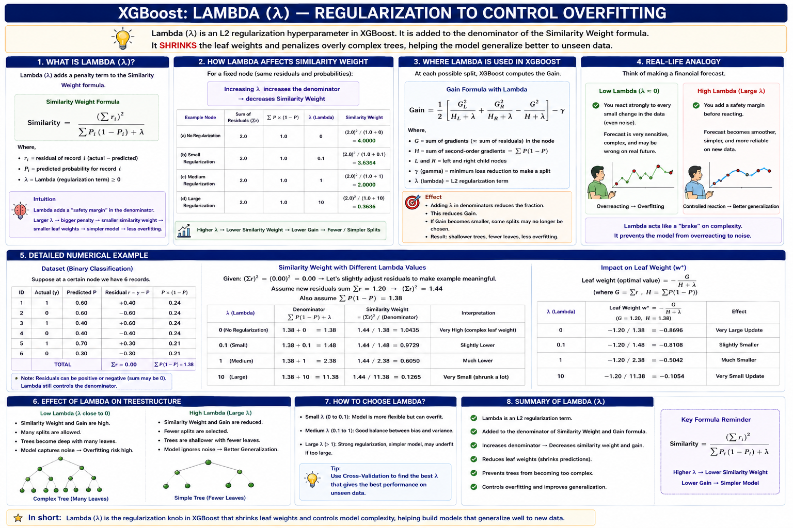
---

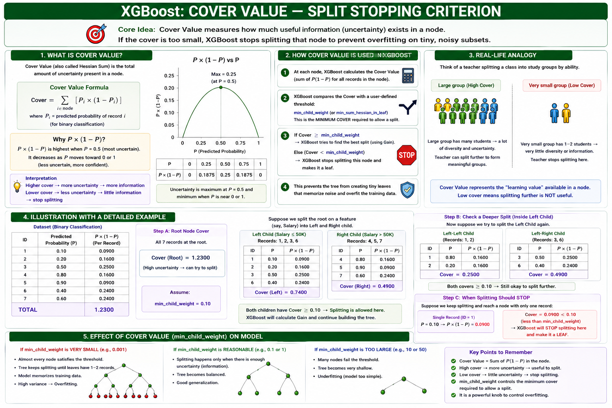

## 9. The Final Mathematical Formula

Putting it all together, the final XGBoost classifier's predicted probability is:

```
ŷ = Sigmoid( Base(log-odds) + α·H1(x) + α·H2(x) + α·H3(x) + ... + α·Hn(x) )
```

Or in compact form:

```
              n
ŷ = Sigmoid(  Σ  αᵢ Hᵢ(x)  )
             i=0
```

Where:
- **H0** → Base model, in log-odds form (0, since base probability = 0.5)
- **H1(x), H2(x), ... Hn(x)** → Sequential trees, each built on residuals of the previous stage using Similarity Weight & Gain
- **α (alpha)** → Learning rate
- **Sigmoid( )** → Converts the final combined raw score back into a clean 0–1 probability

> 📌 **For multi-class classification** (more than 2 categories), the Sigmoid function is replaced by the **Softmax function**, which outputs a probability distribution across all classes.

---

## 10. Visual Summary Diagram

```
    Salary, Credit ──► Base Model (P = 0.5) ──► Log-Odds = 0
                                │
                        Compute Residual r1
                                │
                                ▼
                Build Tree 1 (split using Similarity + Gain)
                     (stop splitting via Cover Value)
                                │
                     × learning rate (α) and ADD
                                │
                                ▼
                New raw score → Sigmoid → New Probability
                                │
                        Compute Residual r2
                                │
                                ▼
                     Build Tree 2 ... repeat for N trees
                                │
                                ▼
                     FINAL XGBOOST PREDICTION
```

**Simple way to remember:** XGBoost = Gradient Boosting's "correction layers" idea + a smarter ruler (Similarity/Gain) to measure each split + safety brakes (Lambda, Cover) to avoid overfitting.

---

## 11. Key Hyperparameters in XGBoost

| Hyperparameter | What It Controls | Real-Life Analogy |
|---|---|---|
| `n_estimators` | Number of sequential trees | Number of correction rounds applied |
| `learning_rate (eta)` | Size of each correction step | How boldly you adjust the shower temperature |
| `max_depth` | Maximum depth of each tree | How many follow-up questions before a final decision |
| `lambda (reg_lambda)` | L2 regularization strength | The "safety margin" added to avoid overreacting to noise |
| `gamma` | Minimum gain required to make a further split | The minimum "improvement bar" a split must clear to be worth doing |
| `subsample` | Fraction of training data used per tree | Randomly polling only part of a population instead of everyone, each round |
| `colsample_bytree` | Fraction of features used per tree | Only asking a random subset of questions in each interview round |

---

## 12. Advantages & Disadvantages

### ✅ Advantages
- **Faster** than traditional Gradient Boosting due to internal parallelization and optimized computation.
- Built-in **regularization (Lambda, Gamma)** reduces overfitting more effectively than plain GBM.
- **Automatically handles missing values** by learning the best default direction during training.
- Highly **flexible** — huge range of tunable hyperparameters.
- Extremely **popular and battle-tested** in real-world production systems and competitions (e.g., Kaggle).

### ❌ Disadvantages
- **More hyperparameters** to tune compared to simpler models — steeper learning curve.
- Can still **overfit** if not tuned carefully, especially on small datasets.
- **Less interpretable** than a single decision tree — many trees combined = harder to explain to non-technical stakeholders.
- Requires more **memory** for large datasets compared to simpler models.

---

## 13. Where is XGBoost Used in Real Life?

| Real-World Use Case | How XGBoost Helps |
|---|---|
| 💳 **Credit Card / Loan Approval** | Predicts approval probability from salary, credit score, repayment history |
| 🏆 **Kaggle & ML Competitions** | One of the most consistently winning algorithms for structured/tabular data |
| 🛍️ **Customer Churn Prediction** | Predicts which customers are likely to stop using a service |
| 🏥 **Disease Risk Prediction** | Predicts likelihood of a medical condition from patient records |
| 🚦 **Fraud Detection** | Identifies suspicious transactions in banking/fintech systems |
| 📊 **Search Ranking & Recommendation** | Powers ranking algorithms at companies like search engines & e-commerce sites |

---

## 14. Key Takeaways (Quick Revision)

- ✅ XGBoost = "Extreme" Gradient Boosting — same sequential, residual-correcting idea, but with smarter math and engineering for speed and accuracy.
- ✅ **Base model** for classification predicts a neutral probability (0.5), converted internally to **log-odds = 0**.
- ✅ Instead of MSE, XGBoost uses **Similarity Weight** and **Gain** to decide the best feature/split at each node.
- ✅ **Cover Value** decides when to stop splitting (prevents overly deep, overfit trees).
- ✅ **Lambda (λ)** adds regularization to reduce overfitting further.
- ✅ Final prediction = **Sigmoid(Base + Σ(α × Tree outputs))** — sigmoid converts the raw combined score into a clean 0–1 probability.
- ✅ For multi-class problems, **Softmax** replaces Sigmoid.
- ✅ Extremely popular in the industry for tabular/structured data problems — often the **first choice** algorithm to try after baseline comparisons.

### 📌 Study Tip
Compare this note side-by-side with `Gradient_Boosting_Notes.md` — notice how the *overall skeleton* (base model → residual → tree → update → repeat) is identical, and focus your energy on understanding the **three new ingredients**: Similarity Weight, Gain, and Cover Value. Once those three click, XGBoost stops feeling like a "new" algorithm and starts feeling like "Gradient Boosting with better tools."

---

## 15. XGBoost for Regression — Practical Walkthrough

Everything from Sections 5–10 (base model → residual → similarity/gain → predictions) applies to **regression** too. The core skeleton is identical to XGBoost Classification — only **one formula changes**: the denominator of the Similarity Weight.

### 🎯 Real-World Problem: Salary Prediction

> An HR analytics team wants to predict an employee's **expected salary** based on **Years of Experience** and whether they have a **Career Gap** (Yes/No). This is a **regression** problem — the output (Salary) is a continuous number, not a category.

| Experience (yrs) | Career Gap | Salary (Output) |
|---|---|---|
| 2 | Yes | 40 K |
| 2.5 | Yes | 42 K |
| 3 | No  | 52 K |
| 4 | No  | 60 K |
| 4.5 | No  | 62 K |

- **Independent Features:** Experience, Career Gap
- **Dependent Feature (Target):** Salary

> 💡 **Real-life example:** Think of this like **Glassdoor or LinkedIn Salary Insights** predicting your expected pay band from your work history — a continuous number, not a "Yes/No" label.

### 🔹 Step 1: Base Model

Just like in Gradient Boosting Regression, the base model predicts the **average salary**:

```
Base Model = (40 + 42 + 52 + 60 + 62) / 5 ≈ 51 K
```

### 🔹 Step 2: Compute Residuals

```
Residual = Actual Salary − 51K
```

| Actual | Predicted | Residual |
|---|---|---|
| 40 | 51 | **−11** |
| 42 | 51 | **−9** |
| 52 | 51 | **+1** |
| 60 | 51 | **+9** |
| 62 | 51 | **+11** |

---

## 16. Similarity Weight Formula: Classification vs Regression

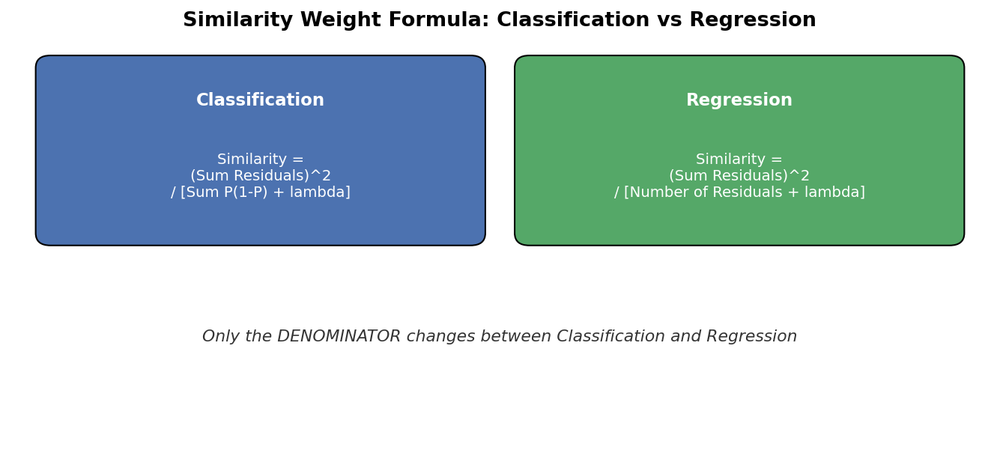

The **only** change between XGBoost Classification and XGBoost Regression is what goes in the **denominator** of the Similarity Weight formula:

```
Classification:  Similarity = (Sum of Residuals)^2 / [ Sum of P(1-P) + lambda ]
Regression:       Similarity = (Sum of Residuals)^2 / [ Number of Residuals + lambda ]
```

- `lambda (λ)` is a **regularization hyperparameter** — as lambda increases, the similarity weight decreases (this is how XGBoost fights overfitting).
- The **Gain formula stays the same** for both: `Gain = Similarity(Left) + Similarity(Right) − Similarity(Root)`.

> 🧠 **Why this makes sense:** In classification, the "spread" of a node depends on class probability P(1−P). In regression, the "spread" simply depends on how many data points (residuals) landed in that node — a simpler, more direct measure of node size.

---

## 17. Worked Example: Building the Regression Tree


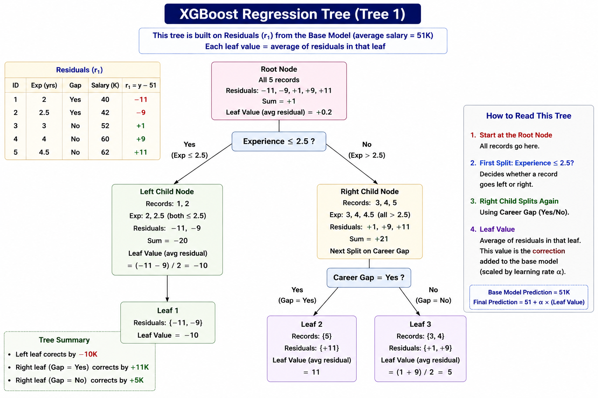

### Splitting on Experience (threshold = 2)

**Left Child (Experience ≤ 2)** — residual: −11
```
Consider λ = 1
Similarity = (−11)² / (1 + λ) = 121 / (1 + 1) = 60.5     
```

**Right Child (Experience > 2)** — residuals: −9, 1, 9, 11
```
Similarity = (−9+1+9+11)² / (4 + 1) = (12)² / 5 = 144 / 5 = 28.8
```

**Root Node (all 5 residuals)**
```
Similarity (Root) ≈ 1.16
```

```
Gain (threshold = 2) = 60.5 + 28.8 − 1.16 ≈ 98.34
```

### Splitting on Experience (threshold = 2.5) — a Better Split

**Left Child (Experience ≤ 2.5)** — residuals: −11, −9
**Right Child (Experience > 2.5)** — residuals: 1, 9, 11

```
Gain (threshold = 2.5) ≈ 143.42
```

Since **143.42 > 98.34**, the split at **threshold = 2.5** wins and is used to build the tree. XGBoost repeats this Gain comparison across **every possible threshold and every feature** (Experience, Career Gap) and always picks the split with the **highest Gain**.

### Further Splitting (using Career Gap)

On the right branch (**Experience > 2.5**, residuals 1, 9, 11), XGBoost can split further using **Career Gap**:
- **Gap = Yes** → leaf value = **11**
- **Gap = No** → leaf value = average(1, 9) = **5**

And on the left branch (**Experience ≤ 2.5**, residuals −11, −9):
- Leaf value = average(−11, −9) = **−10**

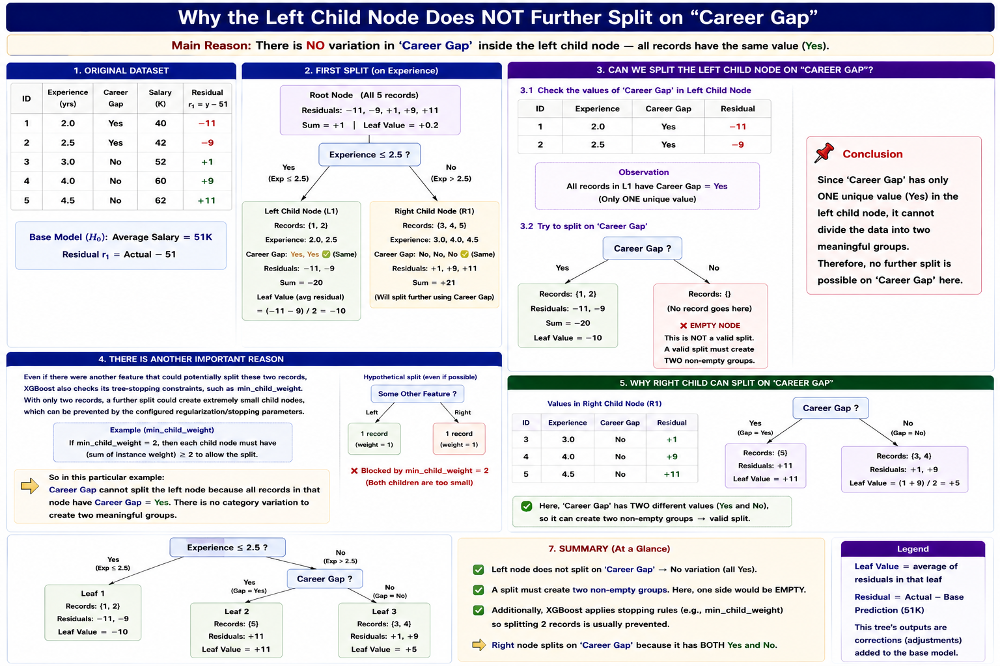

> 💡 **Real-life example:** This is exactly how a **salary benchmarking tool** works internally — it doesn't just look at "years of experience" alone, it keeps refining the estimate by also checking "did they have a career break?", narrowing down to more precise, similar peer groups at each step.

---

## 18. Making a Prediction (Regression) — Worked Example

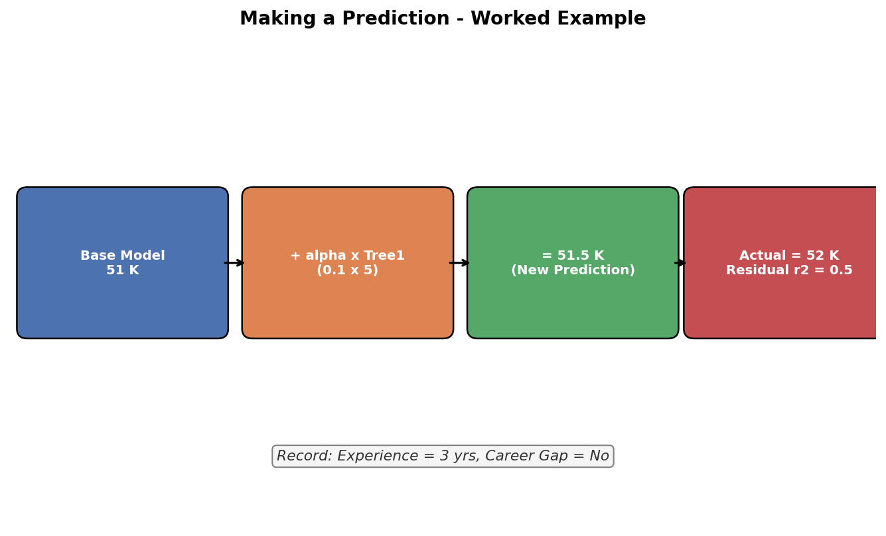

Let's predict the salary for a **new employee**: Experience = 3 years, Career Gap = No.

### Step 1: Pass through Base Model
```
Base Model Output = 51 K
```

### Step 2: Pass through Decision Tree 1
```
Experience = 3 > 2.5  → go right
Career Gap = No       → leaf value = 5
```

### Step 3: Combine with Learning Rate (α = 0.1)
```
New Prediction = Base Model + (α × Tree1 Leaf Value)
              = 51 + (0.1 × 5)
              = 51 + 0.5 = 51.5 K
```

### Step 4: Compute the Next Residual
If the actual salary for a similar record was **52K**:
```
Residual r2 = 52 − 51.5 = 0.5
```

This new residual (r2) becomes the target for **Decision Tree 2**, and the whole process (build tree → compute similarity/gain → combine with learning rate → compute new residual) **repeats** for as many trees as configured (`n_estimators`).

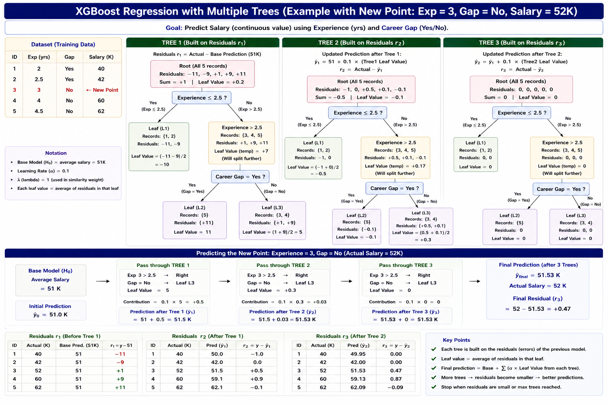

### 📐 Final Regression Formula

```
ŷ = H0(x) + α·H1(x) + α·H2(x) + ... + α·Hn(x)
```

(No sigmoid needed here — regression output stays as a direct numeric value, unlike classification which needed `Sigmoid()` to convert to a probability.)

---

## 19. Key Takeaways (Regression)

- ✅ XGBoost Regression follows the **exact same workflow** as XGBoost Classification: base model → residuals → build tree using Similarity & Gain → combine with learning rate → repeat.
- ✅ **Base model** = average of the target column (like plain Gradient Boosting Regression).
- ✅ The **only formula change**: Similarity Weight's denominator becomes `(Number of Residuals + λ)` instead of `Sum of P(1−P) + λ`.
- ✅ **Gain** is still `Similarity(Left) + Similarity(Right) − Similarity(Root)` — the split with the **highest Gain wins**.
- ✅ A leaf's predicted value = **average of the residuals** that landed in that leaf.
- ✅ Final prediction = **Base + Σ(learning rate × tree outputs)** — no sigmoid needed (unlike classification).
- ✅ `lambda (λ)` regularizes the tree — higher lambda shrinks similarity weights, reducing overfitting, exactly as it does in classification.

---

## 15. XGBoost for Regression — Practical Walkthrough

### 🎯 Real-World Problem: Salary Prediction (with a Career Gap)

> An HR analytics team wants to predict a candidate's **expected salary** based on **Years of Experience** and whether they have a **Career Gap** (Yes/No). This is a **regression problem** — the output (Salary) is a continuous number, so it works exactly like the used-car-price example in the Gradient Boosting notes, but now using XGBoost's specialized formulas.

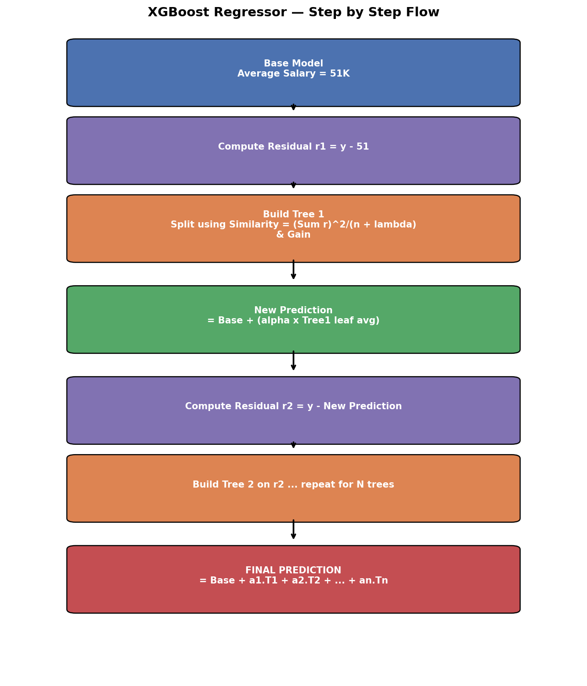

| Experience (yrs) | Career Gap | Salary (Output) |
|---|---|---|
| 1 | Yes | 40 K |
| 2 | No  | 42 K |
| 3 | No  | 52 K |
| 4 | No  | 60 K |
| 5 | No  | 62 K |

### 🔹 Step 1: Base Model = Average Salary

```
Average = (40 + 42 + 52 + 60 + 62) / 5 ≈ 51 K
```

So the **Base Model always predicts 51K**, regardless of input — same unbiased-starting-point idea as before.

### 🔹 Step 2: Compute Residuals

| Actual (y) | Base Prediction | Residual r1 = y − 51 |
|---|---|---|
| 40 | 51 | **−11** |
| 42 | 51 | **−9** |
| 52 | 51 | **+1** |
| 60 | 51 | **+9** |
| 62 | 51 | **+11** |

### 🔹 Step 3: Build Decision Tree 1 (on Residuals)

Just like before, we build a tree using **Experience** and **Career Gap** as inputs and **r1** as the output — but the formula used to measure the quality of each split is **slightly different for regression**, explained next.

---

## 16. Similarity Weight & Gain for Regression (Worked Example)

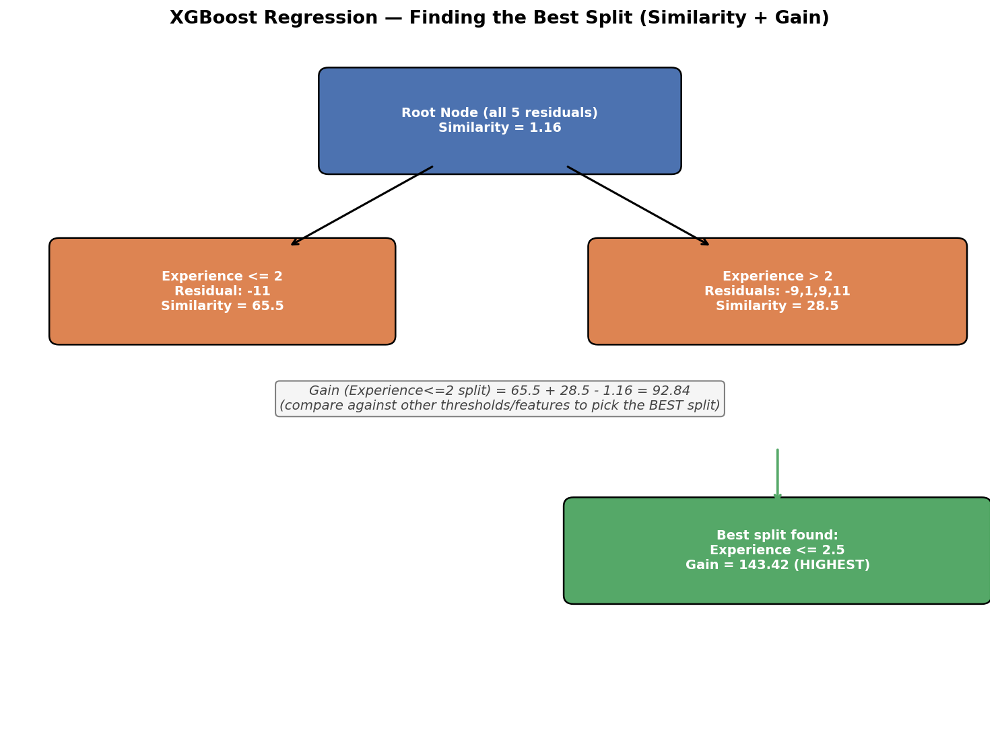

### 📐 Similarity Weight Formula (Regression Version)

```
Similarity Weight = (Sum of Residuals)²  /  (Number of Residuals + λ)
```

> 🔑 **Key difference from classification:** In classification, the denominator was `Σ[P × (1−P)]`. In regression, it's simply the **count of residuals plus lambda (λ)** — much simpler, since there's no probability involved.

### 🧮 Worked Example — Splitting on "Experience ≤ 2"

**Left Child (Experience ≤ 2)** — residual: −11 (1 record)
```
Similarity (Left) = (−11)² / (1 + λ)     [λ = 1]
                  = 121 / 2 = 65.5
```

**Right Child (Experience > 2)** — residuals: −9, 1, 9, 11 (4 records)
```
Similarity (Right) = (−9+1+9+11)² / (4 + 1)
                   = (12)² / 5 = 144 / 5 = 28.8 (≈28.5)
```

**Root Node (all 5 residuals combined)**
```
Similarity (Root) = 1.16   (computed the same way, using all 5 residuals + λ)
```

### 📐 Gain Formula (Same Concept as Classification)

```
Gain = Similarity(Left Child) + Similarity(Right Child) − Similarity(Root)
Gain (Experience<=2 split) = 65.5 + 28.5 − 1.16 = 92.84
```

We then try **other thresholds** too (e.g., splitting at Experience ≤ 2.5 instead of ≤ 2):

```
Gain (Experience<=2.5 split) = 143.42   ← HIGHER gain, so this split WINS
```

> 🧠 **Lesson:** XGBoost doesn't just try one threshold per feature — it tests **multiple possible split points** (and multiple features, like Career Gap too) and picks whichever gives the **highest Gain**, exactly like tuning a recipe by testing many small variations and keeping the best one.

> 💡 **Real-life example:** This is like an HR analyst testing different experience "cutoffs" (2 years? 2.5 years? 3 years?) to see which cutoff best separates lower-paid from higher-paid employees — and picking the cutoff that creates the cleanest, most meaningful separation.

The tree keeps growing — further splitting the "Experience > 2.5" branch using the **Career Gap** feature (Yes/No), until a full sequential decision tree (like Decision Tree 1) is built.

---

## 17. Making a Regression Prediction (No Sigmoid Needed)

Unlike classification, **regression doesn't need log-odds or a sigmoid function** — the tree's leaf output is already in the same unit as the target (salary), so we simply **add it directly** (scaled by the learning rate).

### Example: Predicting for a New Record (Experience = 3, Gap = No)

This record falls into the leaf with residuals **{1, 9}** → average = **5**

```
New Prediction = Base Model + (α × Leaf Average)
               = 51 + (0.1 × 5)     [α = 0.1]
               = 51 + 0.5 = 51.5 K
```

### Example: Predicting for (Experience = 2, Gap = Yes)

This record falls into a leaf with residuals **{−11, −9}** → average = **−10**

```
New Prediction = 51 + (0.1 × −10) = 51 − 1.0 = 49.9 K
```

### Example: Predicting for (Experience = 1, Gap = Yes)

This record falls into a leaf with just **{11}** → average = **11**

```
New Prediction = 51 + (0.1 × 11) = 51 + 1.1 = 52.1 K
```

After computing updated predictions for **all** records, we calculate the **new residual (r2)** = Actual − New Prediction, and build **Decision Tree 2** on r2 — the exact same repeating cycle as Gradient Boosting, just using XGBoost's Similarity/Gain math at every step.

> 💡 **Real-life example:** Think of this like a **salary negotiation process** — HR starts with a flat company-wide average offer (base model), then makes small, incremental adjustments (learning-rate-scaled corrections) based on specific factors like experience and career gaps, refining the offer round by round rather than jumping straight to a final number.

---

## 18. XGBoost Classification vs Regression — Key Formula Differences

| Aspect | Classification | Regression |
|---|---|---|
| Base model output | Probability = 0.5 | Average of target values |
| Base model internal form | Converted to Log-Odds (0) | Used directly (no conversion needed) |
| Similarity Weight denominator | `Σ[P × (1−P)] + λ` | `(Number of Residuals) + λ` |
| Final prediction | `Sigmoid(Base + Σ α·Tree)` | `Base + Σ α·Tree` (no activation function) |
| Multi-output version | Softmax (multi-class) | N/A (regression outputs one continuous value) |

> 🔑 **Everything else is identical:** base model → residuals → sequential trees → Similarity/Gain-based splitting → Cover Value stopping rule → Lambda regularization → learning-rate-scaled combination.

---

## 19. Final Quick Revision (Regression)

- ✅ XGBoost Regression follows the **same 5-step process** as classification: base model → residuals → build tree (using Similarity + Gain) → scale by learning rate & update → repeat.
- ✅ **Base model** = simple average of the target column (just like plain Gradient Boosting Regression).
- ✅ **Similarity Weight formula changes**: regression uses `(Sum of Residuals)² / (Count + λ)` instead of the probability-based denominator used in classification.
- ✅ **No sigmoid/log-odds needed** for regression — leaf outputs are added directly to the running prediction.
- ✅ **Gain** is still calculated the same way: `Left Similarity + Right Similarity − Root Similarity`, and the split with the **highest Gain wins**.
- ✅ **Lambda (λ)** still acts as the regularization hyperparameter — higher λ shrinks similarity weights, reducing overfitting.
- ✅ This same structure scales up to **N sequential trees**, each correcting the residual errors left behind by all previous trees combined.
