# PCA (Principal Component Analysis) — Beginner-Friendly Notes

> Companion notes to the Ensemble/Boosting series — this document starts a **new topic**:
> Dimensionality Reduction, beginning with **why we need it** (the Curse of Dimensionality)
> before diving into PCA itself in later sections.

---

## 🌟 Real-Life Examples & Analogies (For This Topic)

> Refer back here anytime a concept below feels abstract.

- **The overloaded real-estate expert:** Ask a real-estate expert *"What's a fair price for a house in
  Location A?"* and they can answer confidently with just a few key facts (location, bedrooms, size).
  But keep piling on more and more requirements — *"near a beach," "near a celebrity's house," "lots
  of grocery shops nearby," "how many schools are around"* — and at some point the expert gets
  **overwhelmed and confused**, and their estimate actually gets **less** reliable, not more. This is
  exactly what happens to a machine learning model as you keep feeding it more and more features.
- **Too many cooks / too many opinions:** A small, focused team with clear, relevant expertise makes
  sharp decisions. Add dozens of people with tangential, low-relevance opinions to the same meeting,
  and decision quality often gets *worse*, not better — noise drowns out signal.
- **A tailored suit vs. a suit bought from 500 measurements:** A skilled tailor needs a handful of
  precise measurements (chest, waist, height, arm length) to make a great-fitting suit. Handing them
  500 loosely-related measurements (shoe size, ear width, favorite color...) doesn't help — it just
  adds noise and confusion to a process that was already working well with fewer, well-chosen inputs.
- **Photographing a diagonally-parked row of cars:** Shooting straight down a street-aligned camera
  angle can make cars overlap in the photo, hiding how spread out they really are. Rotating the camera
  to align with the actual direction the cars are parked captures their full spread in one clean shot —
  this is exactly what PCA's rotated axis (the "principal component") does with data.

---

## 1. Starting a New Topic: PCA / Dimensionality Reduction

This is the beginning of a new series on **Principal Component Analysis (PCA)**, which falls under a
broader category of techniques called **Dimensionality Reduction**.

Before understanding *what* PCA is, we first need to understand **why** we need it at all — and that
starts with a core problem called the **Curse of Dimensionality**.

> 📌 **Quick vocabulary check:** In machine learning, **"dimensions" = "features" = "columns"** in your
> dataset. A dataset with 500 columns is said to have **500 dimensions**. These terms are used
> interchangeably throughout this topic.

---

## 2. The Curse of Dimensionality (Core Concept)

### 2.1 Setting Up the Problem

Imagine a dataset used to predict **house prices**, with features like:
- House size
- Number of bedrooms
- Number of bathrooms
- ...and so on, up to **500 total features**

Now imagine training **6 different models**, each given a progressively larger number of these features:

| Model | Number of Features Used |
|-------|--------------------------|
| M1 | 3 |
| M2 | 6 |
| M3 | 15 |
| M4 | 50 |
| M5 | 100 |
| M6 | 500 (all features) |

### 2.2 What Actually Happens to Accuracy?

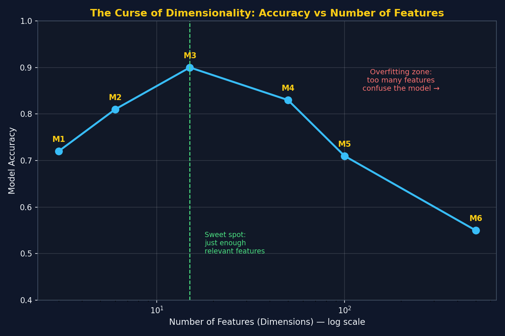

*Visual: accuracy climbs as genuinely useful features are added (M1→M3), then starts falling as more
and more low-value or irrelevant features get added (M4→M6) — even though the model has "more
information" on paper.*

- **M1 → M3:** As we add features that are **genuinely important** (size, bedrooms, bathrooms...),
  accuracy **increases**. Accuracy1 < Accuracy2 < Accuracy3.
- **M4 → M6:** As we keep piling on **more features** (50 → 100 → 500), many of which have **little or
  no real relevance** to house price, accuracy **starts decreasing**. Accuracy3 > Accuracy4 > Accuracy5 > Accuracy6.

> ⭐ **This counter-intuitive pattern — more data (columns) leading to WORSE performance — is called
> the Curse of Dimensionality.**

### 2.3 Why Does This Happen? (Two Reasons)

**Reason 1 — Overfitting:**
- A machine learning model is, underneath everything, a set of **mathematical equations**.
- As you keep feeding it more and more features — including irrelevant or barely-relevant ones — the
  model tries to **learn patterns from those features too**, even when there's no real pattern there.
- This causes the model to **overfit**: it starts fitting to noise rather than genuine signal, which
  hurts its ability to generalize to new/unseen data.

**Reason 2 — Model Performance / Computational Degradation:**
- As the number of dimensions increases, the **mathematical calculations** the model has to perform
  grow accordingly.
- More dimensions → heavier, more complex computation → the model's ability to find genuinely useful
  patterns gets diluted among the noise.

### 2.4 The Real-Estate Expert Analogy (Full Walkthrough)

> 🎯 This is the central analogy for understanding the Curse of Dimensionality intuitively.

Imagine asking a real-estate expert to estimate a house's price, and watch what happens as you keep
adding requirements:

1. **"What's the price in Location A?"** → Expert gives a rough estimate based on **one feature**
   (location): *"450K–500K."*
2. **"I want a 3BHK apartment."** → A second, clearly relevant feature is added. Estimate refines:
   *"500K–600K."*
3. **"I need it near a beach."** → Another clearly relevant feature. Price estimate rises accordingly.
4. **"Near a celebrity's house."** → Still relevant, price keeps adjusting.
5. **"There should be a lot of grocery shops nearby."** → A **weaker, less relevant** feature — it has
   *some* effect, but a small one.
6. **"How many schools are surrounding my house?"** → Another feature of debatable relevance gets piled
   on.

> ⚠️ **At some point, the expert gets overwhelmed.** Too many requirements — many of which don't
> meaningfully affect price — and the expert (just like an overloaded ML model) **gets confused** and
> can no longer give a confident, accurate estimate. Their performance **degrades**, exactly mirroring
> what happens to a model buried in hundreds of low-value features.

---

## 3. Why Do We Need Dimensionality Reduction? (3 Reasons — Common Interview Question)

> ⭐ **This is explicitly called out as a common interview question** — if asked *"Why use
> dimensionality reduction?"*, these are the three points to mention.

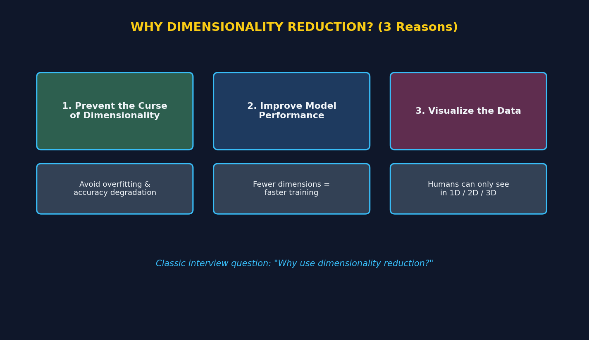

### Reason 1 — Prevent the Curse of Dimensionality
As covered in Section 2: too many features (especially irrelevant ones) confuse the model, increase
overfitting risk, and degrade accuracy. Dimensionality reduction directly addresses this.

### Reason 2 — Improve the Performance of the Model
- Every ML model applies **mathematical equations** across all of its input dimensions during training.
- More dimensions (e.g., 100 features = 100 dimensions) means the model has to perform **more
  computation** — which can noticeably **slow down training time**.
- Reducing the number of dimensions directly **speeds up model training**, without necessarily losing
  much predictive information (if done well).

### Reason 3 — Visualize the Data (and Understand It)
- Human beings can only **visually perceive up to 3 dimensions** (3D) — we can easily plot and
  interpret data in 1D, 2D, or 3D, but **not 4D or higher**.
- If a dataset has, say, 100 dimensions, there is **no direct way to visualize it** as-is.
- By reducing dimensions down to 2D or 3D, we can **actually plot and see the data** — which helps
  build genuine understanding of patterns, clusters, and relationships within it.
- 📌 **The core goal here isn't just plotting for its own sake — it's to *understand the data* itself.**

> 📌 **Quick summary for interviews:** *"We use dimensionality reduction to (1) prevent the curse of
> dimensionality, (2) improve model performance/training speed, and (3) visualize and better understand
> high-dimensional data."*

---

## 4. Two Ways to Fight the Curse of Dimensionality

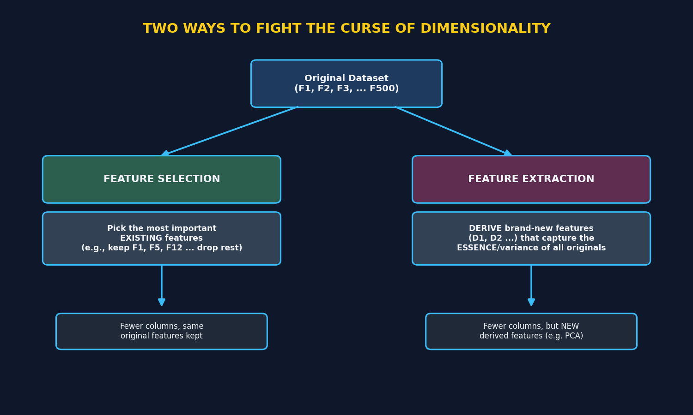

*Visual: Feature Selection keeps a subset of the ORIGINAL columns; Feature Extraction derives entirely
NEW columns that summarize the essence of all the original ones.*

### 4.1 Option 1 — Feature Selection

> 📌 **Definition:** Identify and keep only the **most important existing features**, and train the
> model using just those — discarding the rest.

- Example: out of 500 original features, you might determine that only 20 are genuinely useful, and
  train your model using just those 20.
- The kept features are **the same original columns** — nothing new is created.

### 4.2 Option 2 — Feature Extraction (Dimensionality Reduction)

> 📌 **Definition:** Instead of picking a subset of existing features, **derive brand-new features**
> from the original set — new columns that capture the **essence (variance)** of the original data in
> far fewer dimensions.

**Example (conceptual):**
```
Original features: F1, F2, F3  (+ Output)
                     │
                     ▼
Derived features:   D1, D2      (+ Output)
```
- `D1` and `D2` are **new features**, mathematically derived from `F1, F2, F3` — not simply a subset of
  them.
- These derived features aim to capture as much of the **essence/variance** of the original data as
  possible, just represented in **fewer dimensions**.
- This is the family of techniques this series will focus on — starting with **PCA (Principal Component
  Analysis)**.

### 4.3 Feature Selection vs Feature Extraction — Quick Comparison

| | Feature Selection | Feature Extraction |
|---|---|---|
| What it keeps | A **subset** of the original features | **Newly derived** features |
| Interpretability | High — features still mean the same thing (e.g., "bedrooms") | Lower — derived features (e.g., "D1") don't have a simple real-world meaning |
| Goal | Remove irrelevant/redundant columns | Compress information into fewer, information-dense columns |
| Example algorithms | Correlation-based filtering, Recursive Feature Elimination | **PCA**, and other dimensionality reduction techniques |

---

## 5. Feature Selection — Deep Dive (Covariance & Correlation)

Feature Selection identifies which **existing** features are actually useful by **quantifying the
relationship** between each input feature and the output — using **Covariance** and **Correlation**.

### 5.1 Reading Relationships from a Scatter Plot

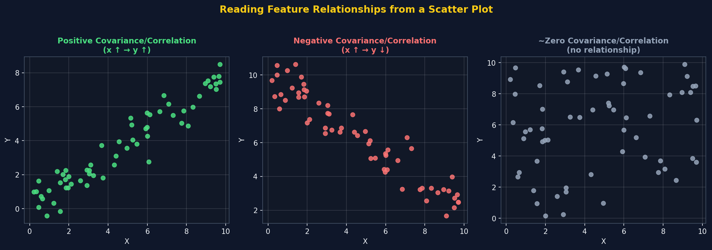

- **Positive relationship:** as X increases, Y increases (and as X decreases, Y decreases) — points
  trend **upward** on a scatter plot.
- **Negative (inverse) relationship:** as X increases, Y decreases (and vice versa) — points trend
  **downward**.
- **No relationship:** X changing has no consistent effect on Y — points look **scattered/circular**,
  with no clear trend.

> 📌 When a feature has a **strong linear relationship** (positive or negative) with the output, it's
> likely an **important feature** worth keeping. When the relationship is close to **zero/no pattern**,
> it's a candidate for **removal**.

### 5.2 Covariance — Quantifying the Relationship

$$ \text{Cov}(X, Y) = \frac{\sum_{i=1}^{n} (x_i - \bar{x})(y_i - \bar{y})}{n - 1} $$

*(We divide by `n - 1` rather than `n` because we're typically working with a **sample** of data, not
the full population.)*

**Interpreting the result:**

| Covariance value | Meaning |
|---|---|
| **Positive** | X and Y move in the **same direction** (positive/direct linear relationship) |
| **Negative** | X and Y move in **opposite directions** (negative/inverse linear relationship) |
| **≈ Zero** | **No meaningful relationship** between X and Y |

> ⚠️ **Limitation of covariance:** its value has **no fixed range** — it can be any positive or
> negative number, which makes it hard to judge *how strong* a relationship is just by looking at the
> raw number. This is where **correlation** helps.

### 5.3 Pearson Correlation — A Normalized, Easier-to-Interpret Version

$$ r = \frac{\text{Cov}(X, Y)}{\sigma_X \cdot \sigma_Y} $$

Where `σ_X` and `σ_Y` are the **standard deviations** of X and Y.

> ⭐ **Key advantage:** Pearson correlation is always scaled to fall **between −1 and +1**, making it
> much easier to interpret than raw covariance.

| Correlation value | Meaning |
|---|---|
| Close to **+1** | Strong **positive** correlation |
| Close to **−1** | Strong **negative** correlation |
| Close to **0** | **No meaningful** correlation |

> 📌 The notes also mention **Spearman Rank Correlation** as another related technique (useful for
> non-linear monotonic relationships) — worth exploring separately, but not covered in detail in this
> video.

### 5.4 Worked Example: Housing Dataset

**Setup:** Predicting **house price** using two independent features: `House Size` and `Fountain Size`
(for houses within an apartment complex).

**House Size vs Price:**
- Plotting House Size against Price shows a clear **linear relationship**.
- Calculating covariance/correlation confirms a **strong positive (or negative) value**.
- ✅ **Conclusion: House Size is an important feature — keep it.**

**Fountain Size vs Price:**
- Common sense already suggests fountain size **shouldn't meaningfully affect** house price within an
  apartment complex — most apartment complexes have decorative fountains regardless of unit price.
- Plotting Fountain Size against Price shows **no clear trend** — price stays roughly stagnant
  regardless of fountain size.
- Covariance/correlation comes out **close to zero** (e.g., in the 0 to 0.25 range).
- ❌ **Conclusion: Fountain Size is not an important feature — drop it.**

> 🎯 **Real-life analogy:** This is exactly how a hiring manager might realize that "favorite pizza
> topping" has no real bearing on job performance, while "years of relevant experience" clearly does —
> irrelevant factors get dropped, meaningful ones get kept.

---

## 6. Feature Extraction — Deep Dive

Feature Selection works well when you can clearly identify **individual features to drop**. But what if
**all** your features are genuinely important, and you still need to reduce dimensions?

### 6.1 The Problem Feature Selection Can't Solve

**Setup:** Predicting house **Price** using two independent features: `Room Size` and `Number of Rooms`.

- Unlike the "Fountain Size" example, **both** of these features clearly have a real relationship with
  price — bigger rooms and more rooms both plausibly increase price.
- If you calculated covariance/correlation for each, you'd find **both are meaningfully correlated**
  with the output.
- ❌ **You can't just drop one of them using Feature Selection** — you'd lose real, useful information.

### 6.2 The Feature Extraction Solution

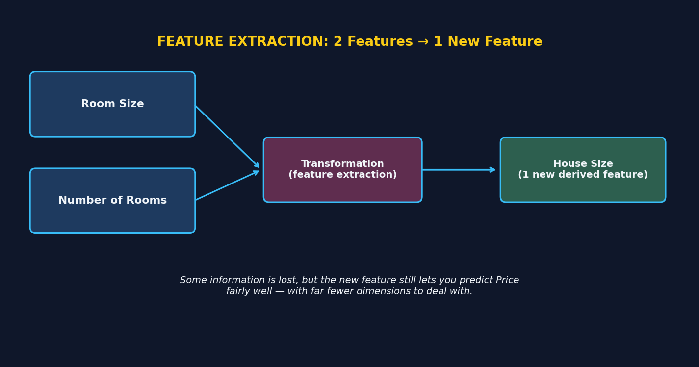

Instead of dropping a feature, **Feature Extraction transforms** the existing features into a **new**
one:

```
Room Size  ─┐
             ├──► [Transformation] ──► House Size (new derived feature)
Number of Rooms ─┘
```

- We take `Room Size` and `Number of Rooms`, apply **some transformation**, and derive a **new single
  feature**: `House Size`.
- This new feature is then used (instead of the original two) to predict `Price`.

### 6.3 Why This Works (Even Though Some Information Is Lost)

> 🎯 **Real-life analogy:** Imagine a domain expert given both `Room Size` and `Number of Rooms` — they
> can predict price accurately. Now give them just `House Size` instead. They can **still predict
> price reasonably well**, just with **slightly less precision** than having both original features.
> Some information is lost in the transformation, but the derived feature still captures **most of the
> useful essence** of the originals — while cutting the dimension count in half.

- In a real-world scenario, you might have **10–15 original features** and reduce them down to
  **2–3 derived features** using this kind of transformation.
- Once reduced to 2–3 dimensions, the data becomes **visualizable and interpretable** again (tying
  back to Reason 3 from Section 3).

> 📌 **What transformation, exactly?** The video flags this as the key question for the *next* video:
> understanding the **mathematical/geometric intuition behind PCA** — the specific technique used to
> perform this kind of transformation in a principled way.

---

## 7. Geometric Intuition Behind PCA

> This is the core "aha" moment for understanding PCA — everything else in this algorithm builds on
> this geometric picture.

### 7.1 Setting Up the Problem

Consider the housing example from Section 6: two features, `Size of the House` and `Number of Rooms`,
predicting `Price`. Since bigger houses naturally tend to have more rooms, plotting these two features
against each other produces a clear **diagonal, elongated cloud** of points — as size increases, number
of rooms tends to increase too.

**Goal:** reduce these **2 dimensions down to 1**, using PCA.

### 7.2 The Naive Approach (and Why It Fails)

The simplest possible way to go from 2D to 1D is to just **project every point straight down onto the
X-axis** (i.e., keep only the `Size` values, dropping `Number of Rooms` entirely) — similar in spirit
to Feature Selection.

> 📌 **Key concept: Spread = Variance.** The distance between the first and last projected points is
> the **spread** of the data. The bigger the spread, the bigger the **variance** — spread and variance
> are directly proportional.

**The problem:** projecting straight onto the X-axis captures the `Size` information well, but
**completely loses the `Number of Rooms` information**. Any variance/spread that existed along the Y-axis
direction is simply thrown away.

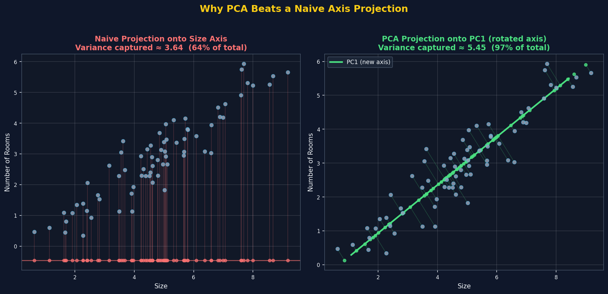

*Visual: projecting onto the raw Size axis (left) captures only ~64% of the total variance in the data
— all the diagonal spread along "Number of Rooms" gets discarded. PCA's rotated axis (right) captures
~97% of the total variance instead, because it's aligned with the actual direction the data spreads out
in.*

> ⚠️ **This is feature extraction done badly** — dimensions are reduced, but a large amount of
> genuinely useful information is lost in the process.

### 7.3 The PCA Approach: Rotate the Axes

Instead of projecting onto the *existing* X or Y axis, PCA **transforms/rotates the axes themselves** to
find a **brand-new axis** — one that's oriented in exactly the direction the data naturally spreads out
the most.

> 📌 **The transformation used to do this is called Eigen Decomposition, applied to a specific matrix**
> (the covariance matrix). The full math is covered in the next section — for now, focus on the
> geometric picture.

Once this new axis is found, every data point gets **projected onto it** instead of the original axes.
Because this new axis is aligned with the data's natural spread, **far less variance/information is
lost** compared to the naive approach.

### 7.4 Searching for the Best Line

Geometrically, PCA can be thought of as **trying out every possible line/direction** through the data
and asking: *"If I project all the points onto this line, how much variance do I capture?"* The line
that captures the **maximum variance** wins.

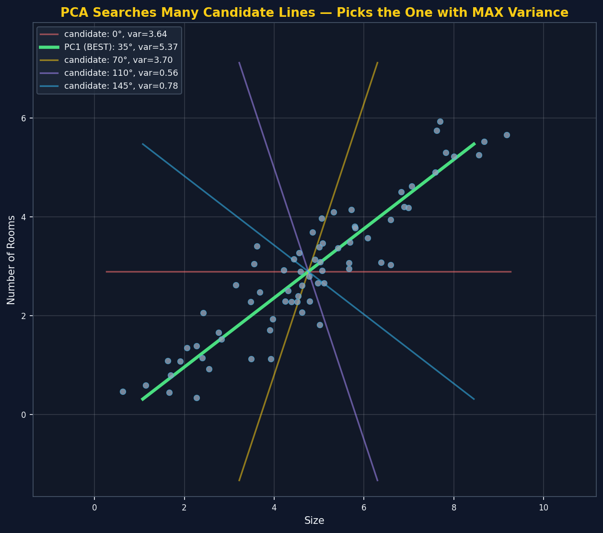

*Visual: five candidate lines at different angles through the same data. The winning line (green, ~35°)
captures far more variance (5.37) than any other candidate — including the original horizontal axis
(red, 0°, variance 3.64).*

> 🎯 **Real-life analogy:** Imagine trying to photograph a long, diagonally-parked line of cars from
> directly overhead so that as few cars as possible overlap in the photo. Shooting straight down one
> street-aligned axis might cause lots of cars to overlap (losing information about how spread out they
> really are). Rotating your camera angle to align with the actual direction the cars are parked in
> captures the full spread in a single, cleaner shot — that's exactly what PCA's rotated axis does with
> data.

### 7.5 Naming the New Axes: Principal Components

- The best line found (the one capturing **maximum variance**) is called **Principal Component 1 (PC1)**.
- If there's a second dimension, the line that captures the **next-most variance** — and which is always
  **perpendicular (orthogonal)** to PC1 — is called **Principal Component 2 (PC2)**.
- With 3 original dimensions, there would be a **PC3** too (capturing the 3rd-most variance, orthogonal
  to both PC1 and PC2), and so on.

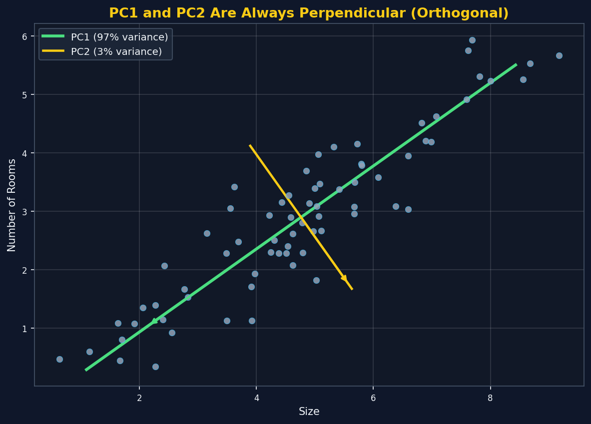

*Visual: PC1 (green) aligns with the data's dominant spread and captures 97% of the variance; PC2
(yellow) is mathematically forced to be perpendicular to PC1, capturing only the remaining 3%.*

> ⭐ **Golden rule:** `Variance(PC1) > Variance(PC2) > Variance(PC3) > ...` — always, by construction.
> Each successive principal component captures as much of the *remaining* variance as possible, while
> staying perpendicular to all previous components.

### 7.6 Choosing How Many Principal Components to Keep

The number of principal components you keep determines your **final reduced dimensionality**:

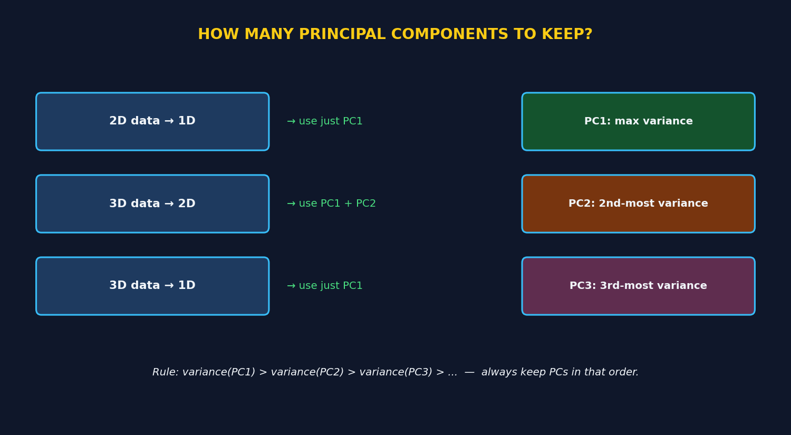

| Original Dimensions | Target Dimensions | Which PCs to Use |
|---|---|---|
| 2D | 1D | Just **PC1** |
| 3D | 2D | **PC1 + PC2** |
| 3D | 1D | Just **PC1** |
| N-D | K-D | **PC1 through PCK** (the top K components) |

> 📌 In general: to reduce an N-dimensional dataset down to K dimensions, you keep the **top K principal
> components** (ranked by variance captured) and discard the rest.

### 7.7 Key Lesson from the Geometric Intuition

- ✅ **Spread = Variance**, and **variance = information**. PCA's whole goal is to lose as little
  variance (information) as possible when reducing dimensions.
- ✅ A **naive projection onto an existing axis** (like plain Feature Selection) can lose a lot of
  information if the data's real spread runs diagonally across multiple original features.
- ✅ PCA instead **rotates the coordinate system** via a transformation (Eigen Decomposition on the
  covariance matrix) to find new axes aligned with the data's actual spread.
- ✅ These new axes are called **Principal Components**, ranked by how much variance each one captures:
  PC1 (most) → PC2 (next-most) → PC3 (next-most after that) → ...
- ✅ Principal Components are always **mutually perpendicular (orthogonal)** to each other.
- ✅ To reduce to K dimensions, keep the **top K principal components**.

---

## 8. Mathematical Intuition — Eigenvectors, Eigenvalues & the Full PCA Algorithm

> Section 7 explained PCA's goal *geometrically* (find the line capturing max variance). This section
> explains **exactly how that line is found mathematically** — using **Eigenvectors** and
> **Eigenvalues** of the covariance matrix.

### 8.1 The Setup: Projections and the Variance Cost Function

Before jumping to eigenvectors, it helps to see the **brute-force version** of the problem PCA is
solving — this motivates *why* eigenvectors are needed at all.

**The setup:** Say we have data points plotted on X-Y axes, and we want to reduce 2D → 1D. Take any
single data point `P1 = (x1, y1)` and treat it as a **vector**. Now pick a candidate direction to
project onto — represented by a **unit vector `u`** (a vector with magnitude/length exactly **1**).

#### 8.1.1 Projecting a Point onto a Unit Vector

The projection of `P1` onto `u`, called `P1'`, is given by:

```
Projection of P1 on u  =  (P1 · u) / |u|
```

Since `u` is a **unit vector**, `|u| = 1`, so this simplifies beautifully to just the **dot product**:

```
P1' = P1 · u
```

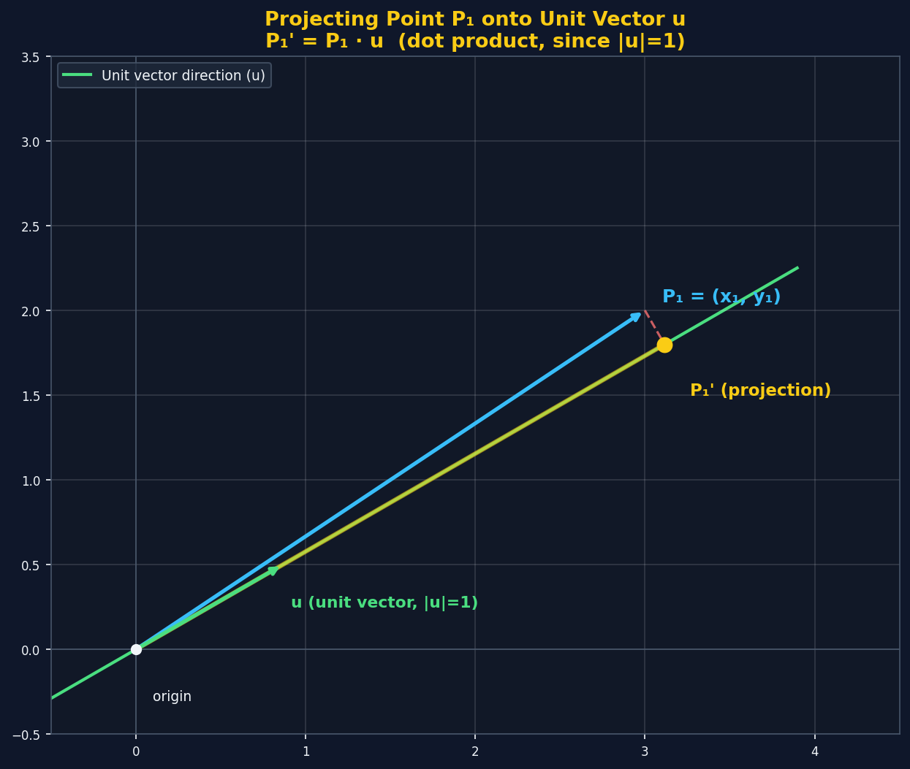

*Visual: P1 (blue) is projected straight onto the line defined by unit vector u (green), landing at
P1' (yellow) — a single scalar value representing how far along the `u` direction P1 sits.*

> 📌 **Key detail: the result is a single scalar number** — not a 2D point anymore. That scalar
> represents the **distance from the origin** to the projected point, along the `u` direction.

#### 8.1.2 Projecting Every Point, Then Measuring Variance

Repeat this projection for **every point** in the dataset (`P1 → P1'`, `P2 → P2'`, `P3 → P3'`, ...,
`Pn → Pn'`). This produces a full set of scalar values — effectively converting the entire 2D dataset
into a **1D list of numbers** along the `u` direction.

Once you have this list of scalars, computing the **variance** is straightforward, using the same
formula from Section 5.2:

```
Variance = [ Σ (xᵢ' - x̄') ² ] / n
```

*(where `xᵢ'` are the projected scalar values and `x̄'` is their mean)*

#### 8.1.3 The Cost Function: Maximize This Variance

> ⭐ **This variance calculation IS the cost function PCA is trying to optimize.** The goal is:
>
> ```
> Find the unit vector u that MAXIMIZES Variance(projections of all points onto u)
> ```

The best possible `u` — the one producing the highest variance among all its projections — **is
Principal Component 1**.

#### 8.1.4 Why Not Just Try Many Candidate Unit Vectors? (The Naive Approach)

In principle, you *could* solve this by brute force: try `u` pointing in many different directions,
project every point, compute the variance each time, and keep whichever `u` gave the highest variance
— similar in spirit to the "candidate lines" illustration in Section 7.4.

> ⚠️ **The problem:** this "hit and trial" approach is computationally impractical — there are
> infinitely many possible directions `u` could point in, and testing them one by one doesn't scale.

> 🎯 **Real-life analogy:** Imagine trying to find the best camera angle for a group photo by physically
> trying every possible angle around the room, one at a time, checking each result. It works in
> principle, but it's painfully slow. A better approach: use geometry/math to calculate the *ideal*
> angle directly. That's exactly what eigenvectors do for PCA.

### 8.2 What Is an Eigenvector? (Core Concept)

> 📌 **The defining equation:** `A·v = λ·v`
> Where `A` is a matrix (a linear transformation), `v` is a vector, and `λ` (lambda) is a scalar number.

In plain English: applying the transformation `A` to **most** vectors will **rotate them** — they end
up pointing in a different direction. But for a special set of vectors (the **eigenvectors** of `A`),
the transformation **doesn't change their direction at all** — it only **stretches or shrinks** them by
a factor of `λ` (the **eigenvalue**). The vector stays on the exact same line through the origin.

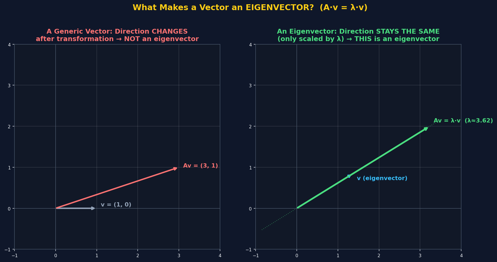

*Visual (left): a generic vector `v=(1,0)` gets rotated to `(3,1)` under transformation `A` — its
direction changed, so it's **not** an eigenvector of `A`. (right): a different vector gets mapped to
`λ·v` — same direction, just scaled by `λ≈3.62` — **this is a genuine eigenvector** of `A`.*

> 🎯 **Real-life analogy:** Imagine stretching a rubber sheet with a grid drawn on it. Most lines on the
> grid bend and rotate as you stretch. But a few special lines — the ones aligned with the exact
> direction you're pulling — stay perfectly straight, just longer. Those special, direction-preserving
> lines are the "eigen-directions" of the stretch.

### 8.3 Why Does PCA Need Eigenvectors?

> ⭐ **The key insight (proven mathematically, not derived here): the eigenvector of the covariance
> matrix with the LARGEST eigenvalue points in the exact direction of maximum variance in the data.**

That's it — that's why PCA uses eigenvectors. Instead of manually testing hundreds of candidate line
angles (like the illustration in Section 7.4), we can **directly compute** the best direction using
eigen-decomposition of the covariance matrix.

- The **eigenvector** with the **largest eigenvalue** → becomes **PC1**.
- The eigenvector with the **next-largest eigenvalue** (guaranteed perpendicular to PC1 for a symmetric
  covariance matrix) → becomes **PC2**.
- And so on for PC3, PC4, etc.
- **The eigenvalue itself tells you how much variance that principal component captures.**

### 8.4 Building the Covariance Matrix (Recap + Extension)

Recall the covariance formula from Section 5.2. For **2 features** (`X`, `Y`), the covariance matrix is
a **2×2 matrix**:

```
            X                Y
X   [  Var(X)          Cov(X,Y)  ]
Y   [  Cov(Y,X)         Var(Y)   ]
```

> 📌 Notice: `Cov(X,Y) = Cov(Y,X)` — the matrix is always **symmetric** along its diagonal. The diagonal
> entries are each feature's own variance; the off-diagonal entries are the cross-covariances.

For **3 features** (`X`, `Y`, `Z`), you'd build a **3×3 matrix** the same way — variances on the
diagonal, pairwise covariances everywhere else. In general, **N features → an N×N covariance matrix.**

### 8.5 The Full PCA Algorithm, Step by Step

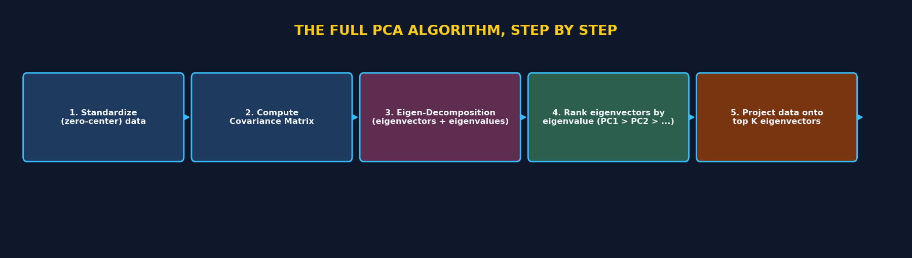

1. **Standardize the data** — center every feature to have **zero mean** (subtract each column's mean
   from itself). This ensures the analysis isn't skewed by features that happen to have larger raw
   values.
2. **Compute the Covariance Matrix** of the (standardized) features, as shown in 8.3.
3. **Eigen-Decomposition** — solve `A·v = λ·v` for the covariance matrix `A`, obtaining a set of
   eigenvectors and their corresponding eigenvalues (one pair per original feature/dimension).
4. **Rank the eigenvectors by their eigenvalues**, largest first: the top one is **PC1**, next is
   **PC2**, and so on.
5. **Project the data onto the top K eigenvectors** (whichever K you chose as your target
   dimensionality) — this projection *is* your final, dimensionality-reduced dataset.

### 8.6 Full Worked Example (Real Numbers, Verified)

Let's run the complete algorithm on the same `Size` vs `Number of Rooms` dataset from Section 7,
end-to-end, with real computed numbers.

**Step 1 — Standardize (zero-center):**

| | Size | Number of Rooms |
|---|---|---|
| Original mean | 4.76 | 2.90 |
| *(first record, centered)* | 2.86 | 2.85 |
| *(second record, centered)* | -0.52 | -0.60 |
| *(... 68 more records ...)* | ... | ... |

**Step 2 — Covariance Matrix:**

```
            Size      Rooms
Size   [  3.688      2.479  ]
Rooms  [  2.479      1.958  ]
```

**Step 3 — Eigen-Decomposition:**

| | Eigenvalue (λ) | Eigenvector direction |
|---|---|---|
| **PC1** | **5.449** | `(0.815, 0.579)` |
| **PC2** | **0.197** | `(-0.579, 0.815)` |

> ✅ **Verification:** Multiplying the covariance matrix by the PC1 eigenvector gives `(4.442, 3.155)`
> — and `5.449 × (0.815, 0.579) = (4.442, 3.155)` too. **`A·v = λ·v` checks out exactly.**

**Step 4 — Rank by eigenvalue:** PC1 (5.449) > PC2 (0.197) — PC1 is overwhelmingly dominant here.

**Step 5 — Project onto PC1** (reducing 2D → 1D): each point's new 1D value is computed as
`(centered point) · (PC1 direction)`. The first few projected values: `3.98, -0.77, 0.33, 1.16, -1.48, ...`

**Result:** `PC1` alone captures **`5.449 / (5.449 + 0.197) ≈ 96.5%`** of the total variance in the
original 2D data — matching the visual result from Section 7.2 exactly (where the rotated-axis
projection was shown capturing ~97% of variance).

### 8.7 Key Lesson from the Math

- ✅ **Projection onto a unit vector** reduces every point to a single scalar: `P' = P · u` (since
  `|u|=1`). Computing the **variance of all these projected scalars** gives PCA's **cost function** —
  the value we're trying to maximize.
- ✅ **Brute-force testing many candidate unit vectors** to find the one maximizing this variance is
  conceptually valid but computationally impractical — this is exactly the problem eigenvectors solve
  directly, without trial and error.
- ✅ **Eigenvectors** of a transformation matrix are the special directions that **don't rotate** under
  that transformation — they only get scaled by their **eigenvalue**.
- ✅ For PCA, the relevant matrix is the **covariance matrix** of your (standardized) features.
- ✅ The eigenvector with the **largest eigenvalue** IS the direction of maximum variance — i.e., **PC1**
  — no need to manually search candidate angles; eigen-decomposition finds it directly.
- ✅ Each eigenvalue tells you exactly **how much variance** its corresponding principal component
  captures — letting you calculate the **% of variance explained** by any chosen number of components.
- ✅ The 5-step algorithm (standardize → covariance matrix → eigen-decomposition → rank → project) is
  the complete PCA recipe, and it's exactly what libraries like `sklearn.decomposition.PCA` do
  internally.

---

## 9. Practical Implementation — PCA on the Breast Cancer Dataset (sklearn)

> With the theory and math fully covered, this section implements PCA in Python using `sklearn` —
> applying everything from Sections 7 and 8 to a **real dataset**.

### 9.1 The Dataset

The **Breast Cancer Wisconsin dataset**, built directly into `sklearn`, is used for this walkthrough:
- **569 records**, **30 numeric features** (radius, texture, perimeter, area, smoothness, compactness,
  concavity, concave points, symmetry, fractal dimension — each with "mean," "error," and "worst"
  variants).
- **Target:** `malignant` (212 records) or `benign` (357 records).

```python
from sklearn.datasets import load_breast_cancer
import pandas as pd

cancer_dataset = load_breast_cancer()
df = pd.DataFrame(cancer_dataset.data, columns=cancer_dataset.feature_names)
df.head()
```

> 📌 **Important framing:** PCA here is **not** being used to solve the classification problem directly
> — it's being used purely for **dimensionality reduction / feature extraction**. With 30 features, the
> data can't be visualized directly; PCA compresses it down to a size we actually *can* see (2D or 3D).

### 9.2 Step 1 — Standardize the Data (Mandatory for PCA!)

> ⚠️ **This step is not optional.** PCA is highly sensitive to the scale of each feature — a feature
> measured in the thousands (like `area`) would completely dominate a feature measured in tiny decimals
> (like `smoothness`) if left unscaled, even if the smaller-scale feature is actually more informative.
> **Always standardize before PCA.**

```python
from sklearn.preprocessing import StandardScaler

scaler = StandardScaler()
scaler.fit(df)
scaled_data = scaler.transform(df)
```

After this, every feature has **mean ≈ 0** and **standard deviation = 1** — matching the "standardize"
step from the PCA algorithm in Section 8.5.

### 9.3 Step 2 — Apply PCA (Reduce to 2 Components)

```python
from sklearn.decomposition import PCA

pca = PCA(n_components=2)
data_pca = pca.fit_transform(scaled_data)

print(data_pca.shape)   # (569, 2) -- 30 original features compressed into just 2
```

> 📌 `n_components=2` tells `sklearn` exactly how many principal components to keep — this single
> parameter encapsulates the entire "standardize → covariance matrix → eigen-decomposition → rank →
> project onto top K" pipeline from Section 8.5. `fit_transform()` does all of that internally.

### 9.4 Step 3 — Check How Much Variance Was Captured

```python
print(pca.explained_variance_)         # raw variance captured by each component
print(pca.explained_variance_ratio_)   # variance as a % of the TOTAL variance
```

Running this on the real breast cancer dataset:

| Component | Explained Variance Ratio |
|---|---|
| **PC1** | **44.3%** |
| **PC2** | **19.0%** |
| **Combined (PC1 + PC2)** | **≈ 63.2%** |

> 📌 So, compressing all **30 original features down to just 2** still retains **~63% of the total
> information (variance)** in the dataset — a dramatic dimensionality reduction with a manageable
> information trade-off.

### 9.5 Visualizing the Result

```python
import matplotlib.pyplot as plt

plt.figure(figsize=(8, 6))
plt.scatter(data_pca[:, 0], data_pca[:, 1], c=cancer_dataset.target, cmap='plasma', alpha=0.7)
plt.xlabel('First Principal Component')
plt.ylabel('Second Principal Component')
plt.show()
```

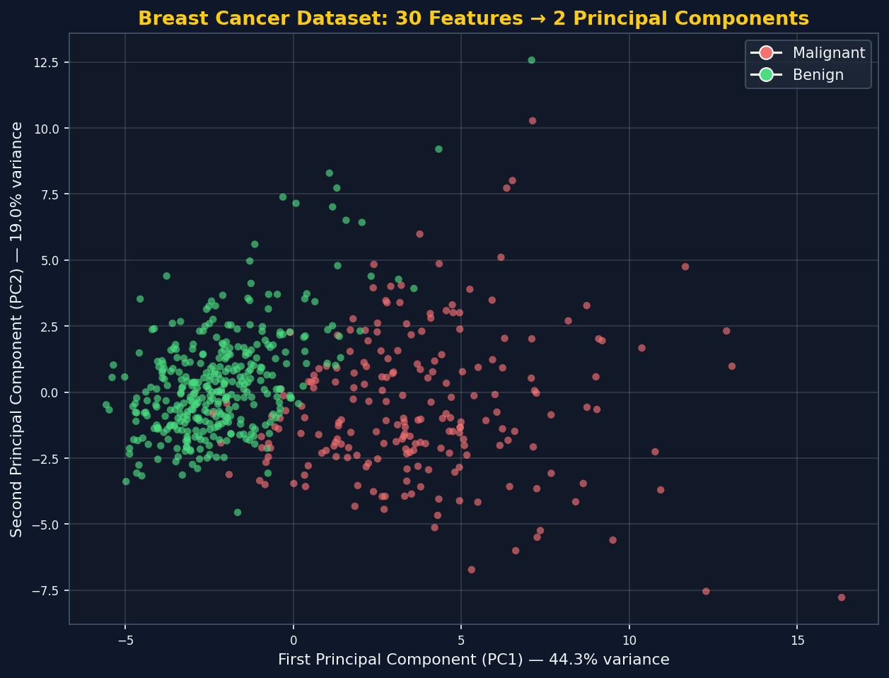

*Visual: even though PCA was never told the malignant/benign labels (it's unsupervised!), the two
classes end up **clearly, visually separable** in just 2 dimensions — strong evidence that PC1 and PC2
retained the genuinely important structure in the data.*

> 🎯 **This is the payoff of dimensionality reduction:** 30 columns of raw numbers are impossible to
> visually inspect. Two principal components later, the two tumor classes are **visually obvious** —
> exactly the "visualize the data" benefit from Section 3.

### 9.6 How Many Components Should You Actually Keep? (Scree Plot)

Instead of arbitrarily picking `n_components=2`, a common practical approach is to fit PCA with **no**
limit on components, then examine how much variance each one adds — visualized as a **Scree Plot**.

```python
pca_full = PCA()   # no n_components limit -- keeps all of them
pca_full.fit(scaled_data)

import numpy as np
cumulative_variance = np.cumsum(pca_full.explained_variance_ratio_)
```

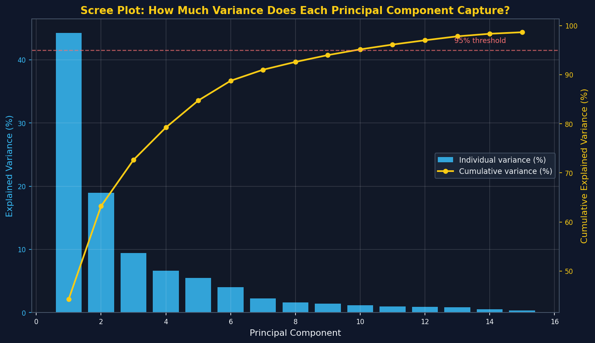

*Visual: individual variance captured per component (bars, left axis) drops off sharply after the
first couple of components — and cumulative variance (line, right axis) crosses the 95% mark at
around **10 components** (out of the original 30).*

> 📌 **Practical rule of thumb:** pick the smallest number of components whose **cumulative explained
> variance** crosses a threshold you're comfortable with (commonly 90–95%). Here, that means **10
> components instead of 30** would retain 95%+ of the information — still a **3x reduction** in
> dimensionality, with far less information loss than the 2-component version used for visualization.

### 9.7 Extending to 3 Components

The exact same pattern extends to any number of components:

```python
pca3 = PCA(n_components=3)
data_pca3 = pca3.fit_transform(scaled_data)

print(pca3.explained_variance_ratio_)   # 3 values: PC1 > PC2 > PC3, always
```

- This produces **3 columns**, enabling a **3D scatter plot** — useful when 2 components aren't quite
  enough to visually separate your data, but you still want something human-visualizable.
- As always: `Variance(PC1) > Variance(PC2) > Variance(PC3)` — confirmed directly by
  `explained_variance_ratio_`.

### 9.8 Key Lesson from the Practical Implementation

- ✅ **`StandardScaler` before `PCA` is mandatory** — skipping this lets large-scale features unfairly
  dominate the principal components.
- ✅ `sklearn`'s `PCA(n_components=K).fit_transform(data)` implements the **entire 5-step algorithm**
  from Section 8.5 in two lines of code.
- ✅ `explained_variance_ratio_` tells you exactly what percentage of the original information each
  component (and any combination of components) retains.
- ✅ A **Scree Plot** (individual + cumulative explained variance) is the standard practical tool for
  deciding **how many components to keep** — balancing dimensionality reduction against information loss.
- ✅ On the real Breast Cancer dataset, reducing 30 features to just 2 principal components (63% of
  total variance) was enough to make the two tumor classes **visually separable** — a compelling,
  concrete demonstration of PCA's value for both visualization and downstream modeling.

---

## 10. Key Takeaways

- ✅ **Dimensions = Features = Columns** — used interchangeably in this topic.
- ✅ **Curse of Dimensionality:** adding more and more features doesn't always help — beyond a certain
  point, accuracy actually **decreases** as irrelevant/low-value features confuse the model and
  increase overfitting risk.
- ✅ Two underlying reasons: **(1) overfitting** (model starts learning noise as if it were signal) and
  **(2) computational/performance degradation** (heavier math across more dimensions dilutes genuinely
  useful patterns).
- ✅ The real-estate expert analogy captures this perfectly: a domain expert (or model) given too many
  low-relevance details gets **confused and less accurate**, not more capable.
- ✅ **Two solutions** exist:
  1. **Feature Selection** — keep only the most important *existing* features (using **Covariance** and
     **Pearson Correlation** to measure relevance).
  2. **Feature Extraction (Dimensionality Reduction)** — *derive* new, information-dense features from
     the originals. **This series focuses here**, starting with **PCA**.
- ✅ **Geometric intuition of PCA:** naively projecting data onto an existing axis can lose a lot of
  variance/information if the data spreads diagonally. PCA instead **rotates the axes** (via Eigen
  Decomposition on the covariance matrix) to find new axes — **Principal Components** — aligned with
  the data's true spread.
- ✅ **PC1 captures the maximum possible variance**; each subsequent PC captures the next-most variance
  while staying **perpendicular** to all previous ones. To reduce to K dimensions, keep the top K PCs.
- ✅ **The math behind it:** Principal Components are literally the **eigenvectors of the covariance
  matrix**, ranked by their **eigenvalues** (which directly equal the variance each PC captures). The
  5-step recipe — standardize → covariance matrix → eigen-decomposition → rank → project — is the
  complete PCA algorithm, verified end-to-end with real numbers in Section 8.6.
- ✅ **In practice**, `sklearn.decomposition.PCA` implements this entire algorithm in two lines of code
  — but **`StandardScaler` beforehand is mandatory**. On the real Breast Cancer dataset, 30 features
  compressed to 2 principal components retained **~63% of total variance** and made the two tumor
  classes **visually separable** — with a **Scree Plot** as the standard tool for deciding how many
  components to actually keep in a real project.

---

## 11. What's Next?

- This completes the **core PCA series**: motivation (curse of dimensionality) → feature selection vs
  extraction → geometric intuition → mathematical intuition (eigenvectors/eigenvalues) → practical
  `sklearn` implementation. Future topics may build on this foundation with related techniques (e.g.,
  t-SNE, LDA) or apply PCA as a preprocessing step within a full end-to-end ML project.

---
*Notes prepared from machine learning lecture transcripts covering the complete PCA series: motivation
(Curse of Dimensionality), Feature Selection vs Feature Extraction, the geometric intuition behind PCA,
the mathematical intuition (eigenvectors, eigenvalues, and the full PCA algorithm), and the practical
`sklearn` implementation on the Breast Cancer dataset.*
