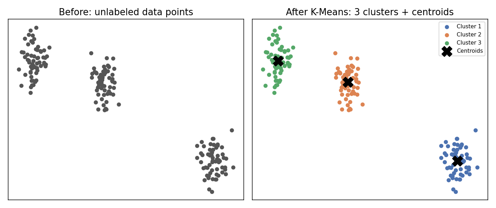
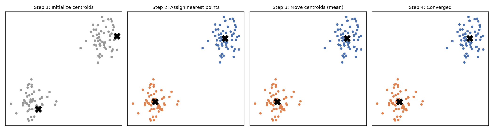
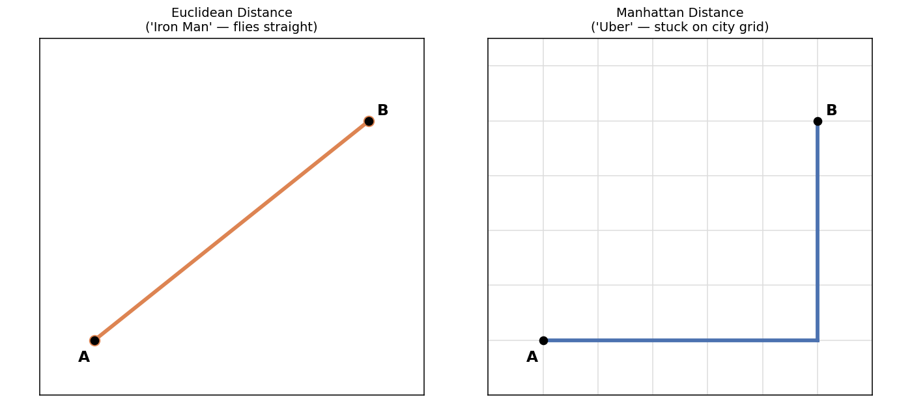
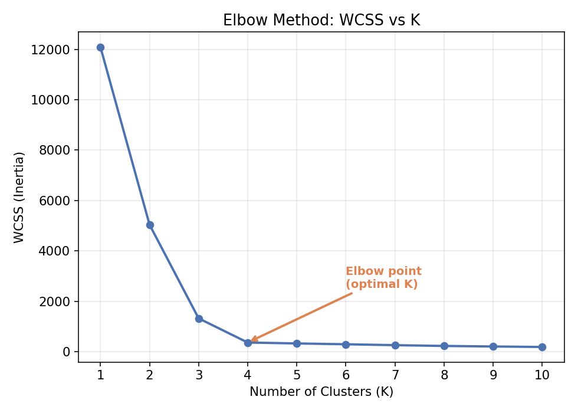
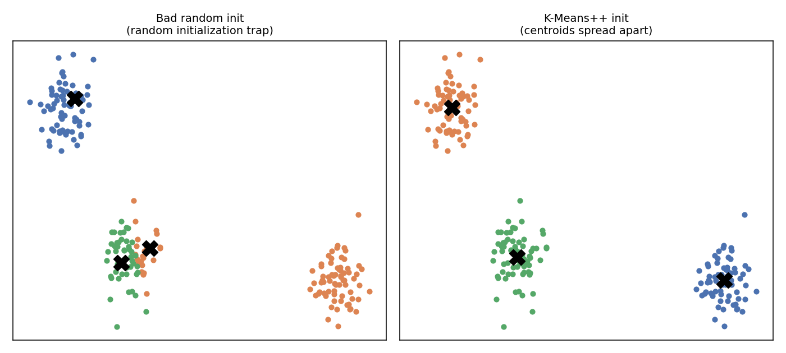

# K-Means Clustering — Complete Notes (Beginner → Advanced)

## 1. What is Clustering? (The Big Picture)

Before K-Means, understand **clustering** itself.

- In **Supervised Learning**, we have labels (input X, output Y) — e.g., "spam" or "not spam".
- In **Unsupervised Learning**, we have **no labels** — only input data (X). We ask the algorithm: *"Can you find hidden patterns/groups in this data yourself?"*

**Clustering** = grouping similar data points together, and separating dissimilar ones — without being told what the groups are.

> 🧠 **Real-life analogy:** Imagine you dump a basket of mixed fruits (apples, oranges, bananas) on a table and ask a kid (who has never seen these fruits before, so doesn't know their names) to group similar-looking things together. The kid will naturally put round red/green things in one pile, round orange things in another, and long yellow things in a third — purely based on similarity (shape, color, size). That's clustering. No one told the kid "this is called an apple" — the kid just grouped by similarity. That's exactly what unsupervised learning does.

**K-Means Clustering** is the simplest and most popular clustering algorithm. "K" = number of groups (clusters) you want to create.

---

## 2. Geometric Intuition (How It "Looks")

Imagine data points plotted on a 2D graph (X axis, Y axis). Just by looking at the scatter plot, your eyes can spot that points seem to form 2 (or 3, or more) natural "blobs".

**Goal of K-Means:** Automatically detect these blobs and assign every point to a group, and find the **center point (centroid)** of each group.

- If there are 2 natural groups → K-Means gives you **2 clusters** + **2 centroids**.
- If there are 3 natural groups → K-Means gives you **3 clusters** + **3 centroids**.

> 🧠 **Real-life example:** A supermarket has thousands of customers. If you plot customers based on "Annual Income" (X-axis) and "Spending Score" (Y-axis), you'll visually see clumps — e.g., high income + high spenders, low income + low spenders, high income + low spenders (savers), etc. K-Means finds these clumps automatically so the marketing team can target each group differently (this is called **Customer Segmentation** — a real, widely-used industry application).

**Centroid** = the "center of mass" (average position) of all points belonging to that cluster. Think of it as the representative/leader of that group.



---

## 3. The K-Means Algorithm — Step by Step

K-Means works in **3 repeating steps**, like a loop:

### Step 1: Initialize K Centroids
- Decide how many clusters you want: this is the value of **K**.
- Randomly place K points on the graph — these are your **initial centroids** (starting guesses, usually not accurate yet).

> Example: If you believe your customers fall into 2 types, you set K = 2, and randomly drop 2 centroid points anywhere on the plot.

### Step 2: Assignment Step (Group the points)
- For **every data point**, calculate its **distance** to each centroid.
- Assign the point to whichever centroid is **nearest**.
- This is usually done using **Euclidean Distance** (straight-line distance) — explained in detail below.
- Geometrically, this creates a **perpendicular bisector line** between two centroids — every point on one side belongs to one centroid, every point on the other side belongs to the other.

> 🧠 **Real-life analogy:** Think of 2 delivery hubs (centroids) in a city. Every household (data point) gets assigned to whichever hub is closer to it — that's literally how many delivery/logistics companies decide "which warehouse serves which locality."

### Step 3: Update Step (Move the centroids)
- For each cluster, calculate the **average (mean) position** of all points currently assigned to it.
- Move the centroid to this new average position. (This is *why* it's called "K-**Means**" — you're literally computing the mean/average repeatedly.)

### Step 4: Repeat
- Go back to Step 2 with the new centroid positions.
- Some points may now switch groups (because centroids moved).
- Keep repeating Steps 2 and 3.

### Step 5: Stopping Condition (Convergence)
- Stop when **centroids no longer move** (or move negligibly) between iterations — meaning no points are switching clusters anymore.
- At this point, the algorithm has **converged**, and you have your final clusters.

> 🧠 **Real-life analogy for the whole loop:** Imagine organizing students into 3 project teams (K=3) based on skill level. First, you randomly pick 3 "team leads" (centroids). Every student joins whichever lead they are "most similar" to. Then each team elects a new representative (the average skill of the team = new centroid). Some students realize they're now closer to a different team's rep, so they switch. This keeps happening until nobody wants to switch teams anymore — stable teams = converged clusters.



---

## 4. Distance Metrics — How "Nearest" is Calculated

This is the mathematical heart of Step 2.

### a) Euclidean Distance (most commonly used — straight-line distance)
For two points A(x₁, y₁) and B(x₂, y₂):

```
distance = √[ (x₂ − x₁)² + (y₂ − y₁)² ]
```

> 🧠 **Real-life example:** This is literally "as the crow flies" distance — like measuring distance between two cities directly with a ruler on a map, ignoring roads. Used when relationships between features are naturally geometric/continuous (income, age, height, weight, prices).

### b) Manhattan Distance (grid-based distance)
```
distance = |x₂ − x₁| + |y₂ − y₁|
```

> 🧠 **Real-life example:** Imagine walking in New York City where you can only move along streets (grid blocks), not diagonally through buildings. You must go 3 blocks right + 4 blocks up = 7 blocks total, not a diagonal shortcut. Useful when movement/features are constrained to grid-like paths (e.g., city block distances, chessboard-like data, high-dimensional sparse data).

| Aspect | Euclidean | Manhattan |
|---|---|---|
| Path | Straight line (diagonal allowed) | Grid-like (only horizontal/vertical) |
| Sensitive to outliers | More sensitive | Less sensitive |
| Best for | Continuous, dense features (default choice) | Grid-based, high-dimensional, or sparse data |
| Real example | Flight distance between airports | Taxi distance in a city with blocks |

**Rule of thumb for freshers:** Use **Euclidean distance** by default (it's what standard K-Means uses). Consider Manhattan distance when your data has many dimensions or when you want to reduce the effect of outliers.

> 🧠 **Real-life analogy — Iron Man vs. an Uber ride:** Think about how many US cities are laid out — in **grid blocks**, with buildings between the roads (like in a superhero city chase scene). If you book an Uber from Point A to Point B, the car **can't fly through buildings** — it must go along the grid (right, then up, then right again). That travel distance is exactly **Manhattan distance**. Now think about **Tony Stark (Iron Man)** doing the same trip — he just **flies straight** from A to B through open air, ignoring roads and buildings completely. That straight-line flight path is exactly **Euclidean distance**. So: constrained/grid-like movement → Manhattan; free/direct/"as the crow (or Iron Man) flies" movement → Euclidean. This is also why **air-traffic control** (planes moving freely in open airspace) naturally uses Euclidean-style distance, while **city taxi/delivery routing** naturally uses Manhattan-style distance.



---

## 5. Choosing the Right Value of K (Elbow Method)

This is the #1 question every fresher asks: *"How do I know how many clusters (K) to pick?"*

### The Elbow Method — Step by Step (with the math)

1. **Loop K from 1 to some max value** (commonly up to 20, or up to ~10 for smaller datasets). So you try K=1, then K=2, then K=3, ... one at a time.

2. **For each K, initialize that many centroids**, run K-Means fully (assign → update → converge), and then compute **WCSS (Within-Cluster Sum of Squares)** — also called **Inertia**:

   ```
   WCSS = Σ (distance between each point and its nearest/assigned centroid)²
   ```
   In words: for every single data point, take the distance to the centroid of the cluster it belongs to, **square it**, and **sum this up across all n points**.

3. **Trace through small examples of K:**
   - **K = 1** → Only **one centroid** for the *entire* dataset. Every point's distance to this lone centroid is computed. Since one centroid has to represent *all* the spread-out data, these distances are large → **WCSS is very high**.
   - **K = 2** → Now there are **two centroids**, so points split into two nearer groups. Each point is now closer, on average, to its assigned centroid than before → **WCSS drops**.
   - **K = 3, 4, 5...** → As K keeps increasing, each cluster gets smaller and tighter, so points sit closer to their centroid each time → **WCSS keeps decreasing**.
   - Eventually, adding more centroids barely reduces WCSS any further (the curve flattens out) — because you're already close to "one centroid per point," which is overfitting the clusters.

4. **Plot a graph**: **K (x-axis)** vs **WCSS (y-axis)**. Because of the pattern above, this curve starts high, **drops abruptly** for the first few K values, and then **flattens/stabilizes**.

5. **Find the "elbow"** — literally like the bend of your arm. It's the point where the curve stops dropping sharply and starts to flatten out. That bend point is your **optimal K**.



> 🧠 **Real-life analogy:** Imagine renting storage lockers for your college hostel friend group. If you rent 1 huge locker for everyone, it's messy (high WCSS). If you rent a separate locker for every single person, it's perfectly tidy but wastefully expensive (K = number of people). The "elbow" is the sweet spot — maybe 4 lockers (grouped by roommates) gives most of the tidiness benefit without excessive cost.

⚠️ **Important nuance for freshers:** WCSS will *never* increase as K increases — worst case it stays flat, because more centroids can only help fit the data more tightly. This is exactly why you can't just pick "the K with the lowest WCSS" (that would always be K = number of data points, which is useless) — you specifically need the **elbow bend**, not the minimum.

⚠️ **Also worth knowing:** if the initial centroids for a given K happen to be placed very close to each other, K-Means can converge to a poor/misleading result — this is the **Random Initialization Trap**, covered in detail with an example in Section 6 next, along with its fix (**K-Means++**).

### Other methods (Advanced, good to know)
- **Silhouette Score**: measures how similar a point is to its own cluster vs other clusters (ranges from -1 to 1; higher is better). More robust than the elbow method and doesn't require visually guessing the "bend."
- **Domain knowledge**: Sometimes business context already tells you K (e.g., "we want exactly 3 customer tiers: Bronze, Silver, Gold").

---

## 6. The Random Initialization Trap & K-Means++

### The Problem: Random Initialization Trap

Recall Step 1 of the algorithm: centroids are initially placed **randomly**. This works fine most of the time, but sometimes bad luck strikes.

**Example:** Suppose your data clearly has **3 natural groups**, and two of them sit close together on one side while a third is further away. If pure random initialization happens to drop **two centroids close to each other** (say, both inside/near the same natural group) and the **third centroid far away**, something bad happens:

- The two nearby centroids will "fight" to split what should have been **one single group** into two separate clusters.
- Meanwhile, an entire region that should have been split into two natural groups on the other side gets **merged into one big cluster** by the lone far-away centroid, because every point over there is nearest to it.

The algorithm still runs "correctly" step by step (assign → update → converge) — mathematically nothing is broken. But the **final grouping is wrong** compared to what your eyes can clearly see are the true natural groups. This bad outcome, caused purely by unlucky random starting positions, is called the **Random Initialization Trap**.

> 🧠 **Real-life analogy:** Imagine a college wants to form 3 project teams from students standing around a large hall based on their skill level, by picking 3 random students to be "team leads" and having everyone join their nearest lead. If, by bad luck, 2 of the picked leads happen to be standing right next to each other (i.e., very similar skill level) while the 3rd lead is picked from a totally different corner, you won't get 3 fair, well-separated teams. Instead, the two nearby leads will awkwardly split one group of similar-skilled students between themselves, while the 3rd lead ends up absorbing a huge, mixed group of everyone else. The teams end up lopsided and don't reflect the real skill groupings — purely because of *where the leads happened to be standing*, not because of any flaw in the "join your nearest lead" rule itself.



**Key interview point:** This doesn't happen for every dataset — only when the random draw happens to be unlucky. But since you can't control random luck, you need a smarter initialization strategy — that's **K-Means++**.

### The Solution: K-Means++ Initialization

**K-Means++** is a smarter way to pick the *starting* centroids, designed specifically to avoid the random initialization trap. The core idea:

> Pick initial centroids that are **as far apart from each other as possible**.

**How it works (conceptually):**
1. Pick the **first centroid** randomly from the data points (some randomness is still involved here).
2. For the **next centroid**, don't pick randomly — instead, favor points that are **far away from the already-chosen centroid(s)**.
3. Repeat this until you've picked all K centroids — each new one is likely to land far from the existing ones.
4. Now run the normal K-Means steps (assign → update → repeat) starting from these well-spread-out centroids.

Because the starting centroids are already spread across the data space (instead of clumping together by chance), each one is much more likely to "claim" a genuinely separate natural group from the very first iteration — completely avoiding the scenario above where two centroids compete over the same group while another group gets ignored.

> 🧠 **Real-life analogy:** Instead of randomly picking 3 team leads from wherever they happen to be standing, imagine you deliberately pick the first lead randomly, then specifically pick the second lead from **as far away in skill level** from the first as possible, and the third lead as far as possible from both. Now your 3 leads naturally represent 3 genuinely different skill groups from the start — so students split into fair, meaningful teams on the very first attempt.

**Practical takeaway:**
- `KMeans++` is the **default initialization method in scikit-learn's `KMeans` class** (`init='k-means++'`) — you usually get this protection automatically without doing anything extra.
- **Interview answer to memorize:** *"K-Means++ is used to initialize centroids such that they are as far apart from each other as possible, which avoids the random initialization trap and leads to better, more stable clustering results."*
- It's also common practice to run K-Means several times with different initializations (`n_init` parameter) and keep the result with the lowest WCSS — extra insurance on top of K-Means++.

---

## 7. Important Properties & Assumptions of K-Means

- **K-Means assumes clusters are roughly spherical/circular (convex) and similar in size.** It struggles with weirdly shaped clusters (crescents, spirals, nested circles).
- **Sensitive to initialization**: Bad random starting centroids can lead to poor clustering or getting stuck in a suboptimal solution — the **Random Initialization Trap** covered in Section 6. This is fixed using **K-Means++** (a smarter initialization strategy that spreads out initial centroids instead of pure random placement — this is the default in scikit-learn).
- **Sensitive to feature scale**: If one feature is "Income" (values in lakhs) and another is "Age" (values 18–60), Income will dominate the distance calculation unfairly. **Always scale/standardize your features first** (e.g., using StandardScaler) before applying K-Means.
- **Sensitive to outliers**: Since centroids are computed using the *mean*, one extreme outlier can drag a centroid far from the "real" center of a cluster.
- **You must pre-decide K**: Unlike some other clustering algorithms (like DBSCAN or Hierarchical Clustering), K-Means needs you to specify the number of clusters upfront.

> 🧠 **Real-life example of scale sensitivity:** If you're clustering houses by "Price (in ₹, ranging in lakhs/crores)" and "Number of Bedrooms (1–5)" without scaling, Price will completely dominate the distance calculation, and Bedrooms will barely matter — even though both are important. Scaling fixes this.

---

## 8. Time Complexity (Good to Know for Interviews)

K-Means complexity ≈ `O(n × K × I × d)`
- n = number of data points
- K = number of clusters
- I = number of iterations until convergence
- d = number of dimensions/features

This makes K-Means fairly fast and scalable — one reason it's so popular in industry for large datasets.

---

## 9. Advantages vs Disadvantages

### ✅ Advantages
- Simple to understand and implement.
- Fast and scales well to large datasets.
- Works well when clusters are naturally spherical and well-separated.

### ❌ Disadvantages
- Must specify K in advance.
- Sensitive to initial centroid positions (mitigated by K-Means++).
- Sensitive to outliers and feature scaling.
- Doesn't work well with non-spherical / overlapping / varying-density clusters.
- Can converge to a **local optimum** (not necessarily the best possible clustering) — this is why K-Means is often run multiple times with different initializations, and the best result (lowest WCSS) is kept (`n_init` parameter in scikit-learn).

---

## 10. Real-World Applications (Where K-Means is Actually Used)

| Industry | Use Case |
|---|---|
| **Retail / E-commerce** | Customer segmentation — grouping customers by income & spending behavior for targeted marketing (Amazon, Flipkart-style personalization) |
| **Banking** | Grouping customers by risk profile / transaction behavior for fraud detection or loan offers |
| **Image Processing** | Image compression — reducing the number of colors in an image by clustering similar pixel colors together |
| **Document/Text Analysis** | Grouping similar news articles or documents together (topic clustering) |
| **Geolocation** | Finding optimal locations for new store branches, delivery hubs, or cell phone towers based on customer density |
| **Healthcare** | Grouping patients with similar symptoms/genetic markers for personalized treatment plans |
| **Sports Analytics** | Grouping players by performance stats into tiers (e.g., IPL player categorization for auctions) |

---

## 11. Quick Summary (Cheat Sheet)

1. Clustering = unsupervised grouping of similar data.
2. K-Means steps: **Initialize centroids → Assign points to nearest centroid → Update centroids (mean) → Repeat until convergence.**
3. Distance is usually **Euclidean** (straight-line); Manhattan is the grid-based alternative.
4. Choosing K: **Elbow Method** (plot WCSS vs K) or **Silhouette Score**.
5. Always **scale your features** before running K-Means.
6. Use **K-Means++** initialization to avoid bad random starts.
7. K-Means works best on roughly circular, similar-sized, well-separated clusters.
8. Widely used in customer segmentation, image compression, document clustering, and more.
