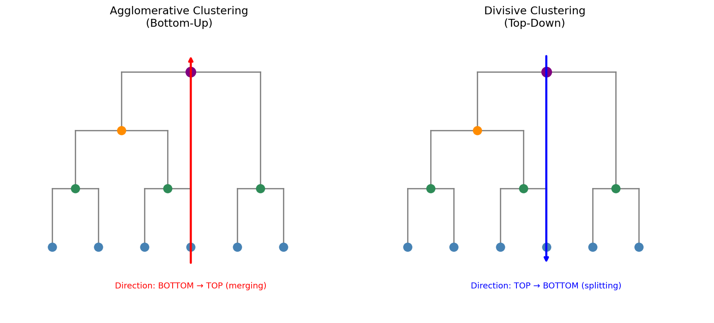
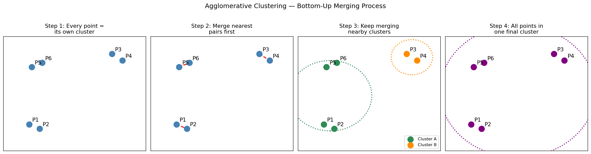
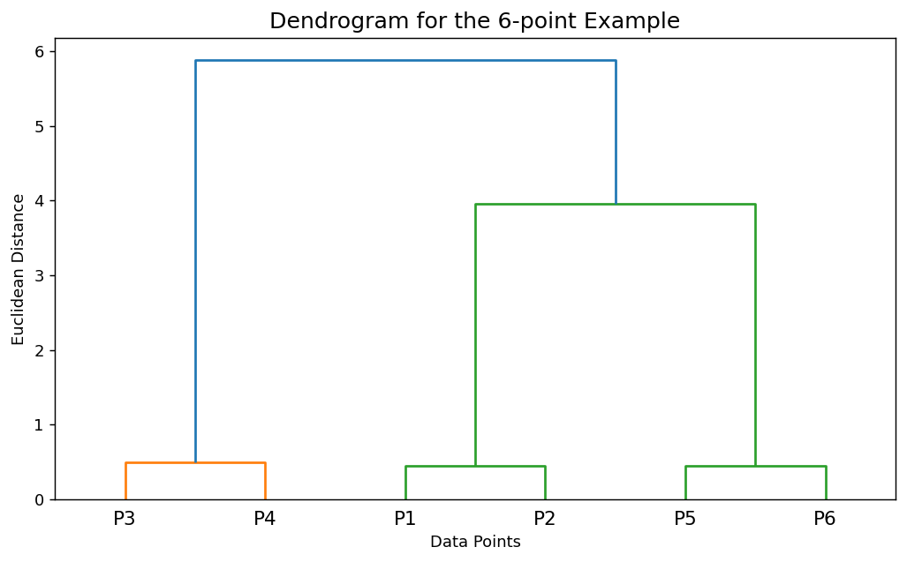
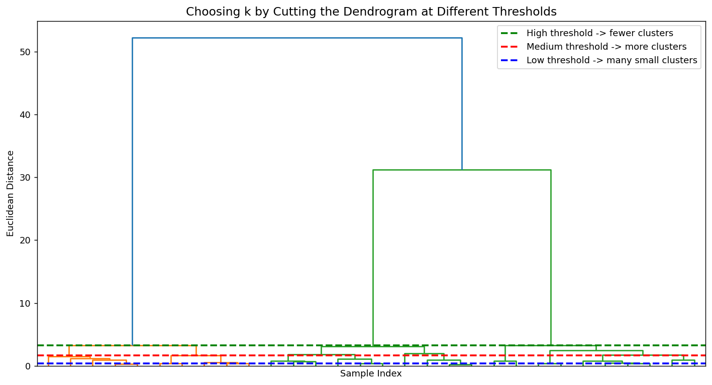
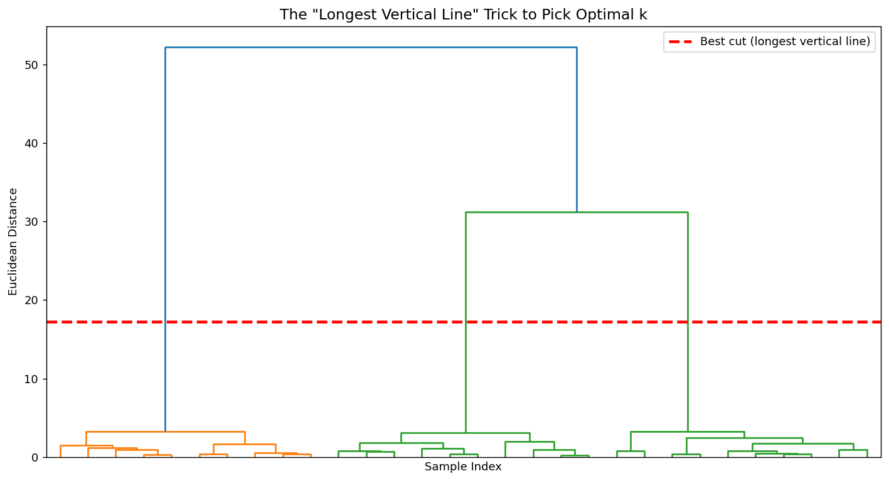
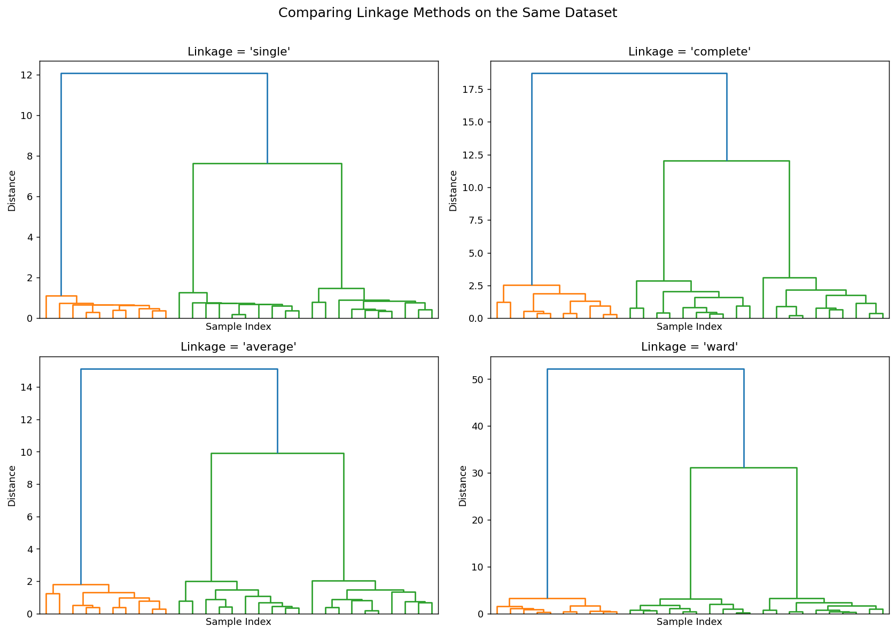
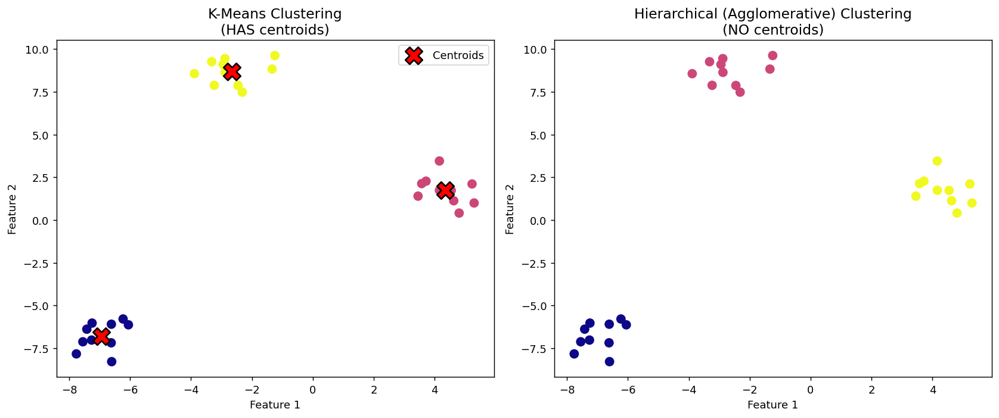

# Hierarchical Clustering — Complete Notes (Basic to Advanced)

## 1. What is Clustering? (Quick Recap)

Clustering is an **unsupervised learning** technique — we group similar data points together without having any labels telling us what the "right answer" is.

**Real-life example:** Imagine you own a supermarket and you have customer data (age, spending, income) but no labels like "high-value customer" or "budget customer". Clustering lets the algorithm discover these groups on its own.

You've probably already studied **K-Means Clustering**. Hierarchical Clustering is another popular clustering algorithm, and it solves the same kind of problem but in a very different way.

---

## 2. What is Hierarchical Clustering?

Hierarchical Clustering is a clustering technique that builds a **hierarchy (tree-like structure)** of clusters. Instead of directly telling the algorithm "give me 3 clusters" (like we do with `k` in K-Means), hierarchical clustering builds a full tree of merges/splits, and **we decide the number of clusters later** by "cutting" the tree at a chosen level.

**Real-life example:** Think of a **family tree**. At the individual level, everyone is separate. Parents and children combine into families, families combine into extended families, extended families combine into a whole clan. Hierarchical clustering works the same way — small groups keep merging into bigger groups until everything is one big group.

### Key difference from K-Means

| K-Means | Hierarchical Clustering |
|---|---|
| You must specify `k` (number of clusters) upfront | You decide the number of clusters **after** seeing the dendrogram |
| Produces **centroids** for each cluster | **No centroids** — just groupings |
| Fast, works well on large datasets | Slower (especially for large datasets) |
| Sensitive to initial centroid placement | Deterministic — same result every time |

> Even if K-Means and Hierarchical Clustering both give you 3 clusters (k=3), the *way* they arrive at those clusters is completely different, and Hierarchical Clustering gives no centroid — only groupings of points.

---

## 3. Two Types of Hierarchical Clustering

1. **Agglomerative Clustering** (Bottom-Up) — "Agglomerative" = combining
   - Start with every point as its own cluster
   - Keep merging the closest clusters until only one big cluster remains
   - **This is the most commonly used approach** (and what's implemented in libraries like scikit-learn by default)

2. **Divisive Clustering** (Top-Down) — "Divisive" = dividing
   - Start with all points in ONE big cluster
   - Keep splitting clusters until every point is its own cluster
   - This is simply the **reverse** of agglomerative

**Real-life example:**
- **Agglomerative** = Company growth: individual freelancers → small teams → departments → one whole company.
- **Divisive** = Company restructuring: one company → split into divisions → split into departments → split into individual employees.

If you understand one, you automatically understand the other because they are mirror images of each other.



---

## 4. Agglomerative Clustering — Step by Step (Geometric Intuition)

Let's say we have 6 data points: P1, P2, P3, P4, P5, P6.

### Step 1: Treat every point as its own cluster
Initially, each data point is considered a **separate cluster**.
- Cluster 1 = {P1}
- Cluster 2 = {P2}
- Cluster 3 = {P3}
- Cluster 4 = {P4}
- Cluster 5 = {P5}
- Cluster 6 = {P6}

### Step 2: Find the nearest pair of points/clusters and merge
We calculate the distance between all clusters (using **Euclidean Distance** or **Manhattan Distance** — the same distance metrics used in K-Means) and merge the **two closest** clusters into one new cluster.

Example merge order (based on distances):
1. P5 and P6 are nearest → merge into {P5, P6}
2. P1 and P2 are nearest → merge into {P1, P2}
3. P4 is very close to {P5, P6} → merge into {P4, P5, P6}
4. P3 is very close to {P1, P2} → merge into {P1, P2, P3}
5. Finally, {P1, P2, P3} and {P4, P5, P6} merge into one giant cluster {P1, P2, P3, P4, P5, P6}

### Step 3: Repeat until only one cluster remains
Keep merging the nearest clusters, over and over, until **all the points belong to a single cluster**.



> This entire merge history is what gets drawn as a **Dendrogram** (explained next).

---

## 5. The Dendrogram — Visualizing the Merges

A **dendrogram** is a tree diagram that records the entire merging history of agglomerative clustering.

- **X-axis:** the individual data points (P1, P2, P3, P4, P5, P6)
- **Y-axis:** the **Euclidean Distance** at which two clusters got merged

**Real-life example:** Think of a dendrogram like a **sports tournament bracket**, but upside down. Instead of showing who beat whom to reach the final, it shows which players/teams were "closest" and combined first, and how far apart (in skill/distance) the eventual combinations were.

### How it's built
1. P4 and P5 are closest → they merge first at a small height (small Euclidean distance)
2. P1 and P2 merge next, at a slightly bigger height
3. P6 joins the {P4, P5} cluster
4. P3 joins the {P1, P2} cluster
5. Finally, the two remaining big clusters merge at the top, forming one root

The **height at which two branches join tells you how "far apart" (dissimilar)** those two groups were when they merged. Low height = very similar/close. High height = very different, merged only because we forced everything into one cluster eventually.



---

## 6. How Do We Decide the Number of Clusters (k)?

This is the **most important practical question** in hierarchical clustering.

### The Threshold Method
We pick a **Euclidean distance threshold** and draw a horizontal line across the dendrogram at that height.
- **Count how many vertical lines this horizontal line crosses** → that count = number of clusters (k)

**Example:**
- Threshold = 4 → horizontal line crosses 2 vertical lines → **k = 2**
- Threshold = 2.5 → horizontal line crosses 4 vertical lines → **k = 4**
- Threshold = 0.5 → horizontal line crosses 6 vertical lines → **k = 6** (back to every point being its own cluster — not useful!)

> **Relationship:** As you **decrease** the threshold, the number of clusters **increases** (because fewer points get merged together). As you **increase** the threshold, the number of clusters **decreases**.

**Real-life example:** Think of it like a "closeness rule" at a party. If you say "only merge people into a group if they're best friends" (low threshold), you get many small tight groups. If you say "merge anyone who's even a distant acquaintance" (high threshold), you end up with one giant group.



### The "Longest Vertical Line" Trick (Best Practice)

Instead of guessing a threshold, use this simple hack:

> **Find the longest vertical line in the dendrogram such that no horizontal line (from any other merge) passes through it. Then draw a horizontal line through the middle of that longest line, and count how many vertical lines it crosses — that's your optimal k.**

This works because a long vertical line (with no interruptions) represents a big "gap" in distance — meaning the clusters on either side of the merge are genuinely quite different from each other, so cutting there gives the most natural/meaningful grouping.



This is exactly what tools like `scipy` help visualize, and you can do this in Python too (we'll do this hands-on in the notebook).

---

## 7. Linkage Methods (Advanced — How Do We Measure "Distance Between Clusters"?)

Once a cluster has more than one point, how do we measure distance between two *clusters* (not just two points)? This is called the **linkage criterion**.

| Linkage Type | How Distance is Calculated | Real-life Analogy |
|---|---|---|
| **Single Linkage** | Minimum distance between any two points in the two clusters | Distance between two friend groups = distance between their *closest* members. Tends to create long, "chained" clusters. |
| **Complete Linkage** | Maximum distance between any two points in the two clusters | Distance between two friend groups = distance between their *most different* members. Creates tighter, more compact clusters. |
| **Average Linkage** | Average distance between all pairs of points across the two clusters | Distance between two friend groups = the average distance between everyone. Balanced approach. |
| **Ward's Linkage** (most popular in practice) | Merges the pair of clusters that leads to the **minimum increase in total within-cluster variance** | Like merging two teams only if it keeps overall team "tightness"/consistency as high as possible. |

> In scikit-learn's `AgglomerativeClustering`, the default linkage is **`ward`**, which usually gives the best, most balanced-looking clusters for general use cases.



---

## 8. Advantages of Hierarchical Clustering

- No need to specify the number of clusters (`k`) in advance — decide later using the dendrogram
- The dendrogram gives a rich, interpretable visualization of how data points relate to each other at every level of granularity
- Works well with small-to-medium sized datasets
- Deterministic — no random initialization issues (unlike K-Means)

## 9. Disadvantages of Hierarchical Clustering

- **Computationally expensive**: time complexity is roughly O(n³) and space complexity O(n²) — not great for very large datasets (millions of rows)
- Once two points/clusters are merged, **it cannot be undone** (no "backtracking")
- Sensitive to noise and outliers
- Choosing the right linkage method and distance metric can significantly affect results

---

## 10. Hierarchical Clustering vs K-Means — Interview Cheat Sheet

Beyond the "working mechanism" differences, there are **two big-picture parameters** interviewers love to ask about: **Scalability** and **Flexibility**.

### 10.1 Scalability (Dataset Size)

- **Large dataset → use K-Means.**
- **Small dataset → use Hierarchical Clustering.**

**Why?** Hierarchical clustering builds a dendrogram. With a huge number of data points, the dendrogram becomes so dense and cluttered that it's **impossible to visually decide** how many clusters to pick. K-Means, on the other hand, scales much better computationally (no O(n²)/O(n³) distance matrix needed) and works fine even on millions of rows.

**Real-life example:** If you're clustering 500 students in a classroom by test scores, a dendrogram is perfectly readable. But if you're clustering 50 million e-commerce users, the dendrogram would be an unreadable wall of lines — K-Means (or K-Means-like scalable algorithms) is the practical choice there.

### 10.2 Flexibility (Type of Data)

- **K-Means → works only on numerical data.** It relies on Euclidean/Manhattan distance, which requires actual numeric coordinates.
- **Hierarchical Clustering → works on numerical AND non-numerical/mixed data**, because it only needs *some* way to measure "nearness" between two points — and that similarity measure doesn't have to be Euclidean distance.

**Cosine Similarity — the key enabler:** Hierarchical clustering can use **cosine similarity** (or other similarity measures) instead of Euclidean distance. This means it can cluster things that aren't naturally "numeric coordinates" at all.

**Real-life example:** Suppose you want to cluster **movies** by genre-similarity — e.g., an action movie vs. a comedy movie. These aren't naturally points in Euclidean space, but if you represent each movie as a vector (e.g., genre tags, embeddings, keyword frequencies), you can compute the **cosine similarity** between two movie vectors and use that as the "distance" in hierarchical clustering. K-Means can't easily do this because it's fundamentally tied to Euclidean-style centroids.

> **Interview one-liner:** *"K-Means only works with numerical data because it depends on centroid + Euclidean distance. Hierarchical Clustering can work with a variety of data types because it only needs a similarity/distance measure (Euclidean, Manhattan, or cosine similarity) between pairs of points — no centroid required."*

### 10.3 Visualization & Choosing Cluster Count

- **K-Means** uses the **Elbow Method** to choose k — plotting inertia/WCSS (within-cluster sum of squares) vs. k, and looking for the "elbow" where the decrease suddenly flattens. This can sometimes be **ambiguous/difficult to read** — the "elbow" isn't always obvious.
- **Hierarchical Clustering** uses the **dendrogram + longest vertical line trick** (Section 6), which is often **easier and more visual** to interpret — *as long as the dataset is small enough to plot clearly.*



### 10.4 Summary Table

| Aspect | K-Means | Hierarchical Clustering |
|---|---|---|
| Number of clusters | Must specify `k` beforehand | Decided after building dendrogram |
| Centroids | Yes | No |
| **Scalability (large datasets)** | **Clear winner** — scales well | Struggles — dendrogram becomes unreadable |
| **Flexibility (data types)** | Only numerical data | Numerical + other data types (e.g., text/movies via cosine similarity) |
| Distance/similarity measures | Euclidean, Manhattan | Euclidean, Manhattan, **Cosine Similarity**, and more |
| Result consistency | Can vary (random centroid init) | Always the same for given data |
| Choosing cluster count | Elbow Method (can be ambiguous) | Dendrogram + longest-vertical-line trick (usually clearer for small data) |
| Cluster shape | Assumes roughly spherical clusters | Can capture more complex/nested structures |

**Common interview questions:**
1. What is the difference between agglomerative and divisive clustering?
2. How do you decide the number of clusters in hierarchical clustering?
3. What is a dendrogram and how is it constructed?
4. What are linkage methods? Explain Ward's linkage.
5. What is the time complexity of hierarchical clustering, and why is it not preferred for large datasets?
6. Compare hierarchical clustering with K-Means in terms of **scalability** and **flexibility**.
7. Why can't K-Means be used on non-numerical data, but hierarchical clustering can?
8. What is cosine similarity, and when would you prefer it over Euclidean distance?

---

## 11. Real-World Applications (Real-Life Examples)

1. **Customer Segmentation** — An e-commerce company clusters customers by purchase behavior (frequency, amount, category preference) to design targeted marketing campaigns, without knowing in advance how many "types" of customers exist.
2. **Gene/DNA Sequence Analysis** — Biologists use hierarchical clustering (with dendrograms called "phylogenetic trees") to understand evolutionary relationships between species/genes.
3. **Document/Text Clustering** — Grouping news articles or research papers into topics without predefined categories.
4. **Social Network Analysis** — Identifying communities/friend-groups within a large social network.
5. **Image Segmentation** — Grouping pixels with similar color/texture in medical imaging (e.g., grouping tumor regions vs healthy tissue).
6. **Recommendation Systems** — Grouping similar products together based on customer co-purchase patterns.

---

## 12. Hands-On Implementation — Agglomerative Clustering on the Iris Dataset (Python + sklearn)

This is the **practical, code-level walkthrough** — the exact pipeline you'd use in a real project. We'll build this as a working notebook when you say "create notebook", but here's the full theory of every step first.

### 12.1 Why this problem is "made interesting"
Instead of just clustering raw 2D points, this implementation uses the **real Iris flower dataset** (4 numeric features: sepal length, sepal width, petal length, petal width) and adds **PCA (Principal Component Analysis)** to reduce those 4 features down to 2 dimensions — purely so we can **visualize** the clusters on a simple scatter plot. This mirrors real projects, where you often have far more than 2-3 features and need dimensionality reduction just to *see* what's happening.

**Real-life example:** Imagine a company profiling customers using 20 different features (age, income, visits/month, cart value, etc.). You can't plot 20 dimensions on a screen — so PCA compresses that into 2 "summary" dimensions that still capture most of the important variation, purely for visualization and/or faster clustering.

### 12.2 Step-by-step pipeline

**Step 1 — Import libraries**
```python
import pandas as pd
import numpy as np
import matplotlib.pyplot as plt
from sklearn import datasets
```

**Step 2 — Load the Iris dataset**
```python
iris = datasets.load_iris()
iris_data = pd.DataFrame(iris.data)
iris_data.columns = iris.feature_names
```
`iris` is a dictionary-like object containing:
- `data` → the 4 numeric features
- `target` → the actual flower species (0, 1, 2) — we won't use this during clustering (clustering is unsupervised!), only later to **compare** how good our clusters are.
- `target_names` → the species names (setosa, versicolor, virginica)

**Step 3 — Feature Scaling (Standardization) — CRITICAL step**
```python
from sklearn.preprocessing import StandardScaler
scalar = StandardScaler()
X_scale = scalar.fit_transform(iris_data)
```
> **Why this matters:** Hierarchical clustering relies on **distance calculations** (Euclidean/Manhattan). If one feature is measured in centimeters (0–10 range) and another in some other unit with a much bigger range, the bigger-range feature will unfairly dominate the distance calculation. Standardization rescales every feature to have **mean = 0, standard deviation = 1**, so all features contribute fairly.
>
> **Real-life example:** If clustering houses by "price" (₹10,00,000s) and "number of rooms" (single digits), price would completely dominate distance unless we scale both to comparable ranges first.

**Step 4 — Dimensionality Reduction with PCA**
```python
from sklearn.decomposition import PCA
pca = PCA(n_components=2)
pca_scaled_data = pca.fit_transform(X_scale)
```
This compresses our 4 scaled features into 2 principal components while retaining most of the meaningful variance/information — purely to make visualization (and this example) easier.

**Step 5 — Visualize before clustering (sanity check)**
```python
plt.scatter(pca_scaled_data[:,0], pca_scaled_data[:,1], c=iris.target)
```
This shows us the "ground truth" groupings (colored by actual species) so we have something to compare our clustering results against later.

**Step 6 — Construct the Dendrogram**
```python
import scipy.cluster.hierarchy as sc

plt.figure(figsize=(20,7))
plt.title('Dendrogram')
dend = sc.dendrogram(sc.linkage(pca_scaled_data, method='ward'))
plt.xlabel('Sample Index')
plt.ylabel('Euclidean Distance')
plt.show()
```
- `sc.linkage(data, method='ward')` computes the entire merge history using **Ward's linkage** (minimizes variance within merged clusters — see Section 7).
- Other available `method` values: `'single'`, `'complete'`, `'average'`, `'ward'` — try each and compare!
- `sc.dendrogram(...)` actually draws the tree.

**Step 7 — Read the dendrogram to pick k**
Apply the same "longest vertical line with no horizontal line passing through it" trick from Section 6. In the Iris example, this trick points to **k = 2** as the optimal number of clusters — even though we "know" there are 3 species! This happens because two of the three species (versicolor and virginica) are naturally very close together in feature space and aren't cleanly separable — a great real-world lesson that **unsupervised learning finds patterns in the data, not necessarily the labels humans assigned**.

**Step 8 — Apply Agglomerative Clustering**
```python
from sklearn.cluster import AgglomerativeClustering

cluster = AgglomerativeClustering(n_clusters=2, affinity='euclidean', linkage='ward')
cluster.fit(pca_scaled_data)
```
- `n_clusters` → the k we decided from the dendrogram
- `affinity` → the distance metric (`'euclidean'`, `'l1'`, `'l2'`, `'manhattan'`, `'cosine'`, etc.)
- `linkage` → the linkage method (must be compatible with the affinity chosen)

**Step 9 — Inspect and visualize the predicted clusters**
```python
cluster.labels_   # array of predicted cluster labels (0 or 1 for each row)

plt.scatter(pca_scaled_data[:,0], pca_scaled_data[:,1], c=cluster.labels_)
```
Compare this plot to the Step 5 plot (colored by real species) — you'll see the algorithm cleanly separates one species from the other two combined, confirming the dendrogram's suggestion of k=2.

### 12.3 Common Beginner Errors (from real practice)
- `AttributeError: module 'scipy.cluster.hierarchy' has no attribute 'Dendogram'` → **Spelling matters!** It's `dendrogram`, not `Dendogram`.
- `affinity='Euclidean'` (capital E) → sklearn parameter values are case-sensitive; use lowercase `'euclidean'`.
- Forgetting to **scale features before clustering** → leads to misleading distances and poor clusters.
- Using the `target`/label column accidentally as an input feature → defeats the purpose of unsupervised learning.

---

## 13. Real-World Mini Projects (To Be Implemented in Notebook)

Once you say **"create notebook"**, we'll build hands-on notebooks for:

1. **Project 1 — Mall Customer Segmentation**: Cluster mall customers based on Annual Income & Spending Score using Agglomerative Clustering, plot the dendrogram, and pick the optimal number of segments.
2. **Project 2 — Iris Dataset Clustering**: The full implementation from Section 12 — PCA + dendrogram + AgglomerativeClustering, comparing predicted clusters against actual species labels, and visualizing dendrograms with different linkage methods (single, complete, average, ward).
3. **Project 3 — Wholesale Customers Segmentation**: A slightly more advanced/real dataset with multiple features to demonstrate scaling, feature selection, and choosing the right linkage + distance metric combination.
4. **(Optional) Project 4 — Document/Text Clustering**: Grouping short text snippets into topics using hierarchical clustering on TF-IDF vectors — to show it's not just for numeric data.

---

## 14. Summary — Key Takeaways

- Hierarchical Clustering builds a **tree of clusters** instead of directly outputting `k` groups.
- **Agglomerative** (bottom-up, merge) is the common approach; **Divisive** (top-down, split) is its mirror opposite.
- The **dendrogram** visualizes the entire merge history, with the y-axis representing distance at which merges occurred.
- The number of clusters is chosen by **cutting the dendrogram** at a chosen threshold — best practice is to cut through the **longest vertical line with no horizontal line passing through it**.
- **Linkage methods** (single, complete, average, ward) define how distance between clusters is measured — `ward` is the most commonly used default.
- No centroids, unlike K-Means; more computationally expensive but gives much richer visual interpretability.

---

### Next Step
When you're ready, say **"create notebook"** and I will build:
- A theory-implementation notebook (dendrograms, agglomerative clustering from scratch + scikit-learn, linkage comparisons) — based on Section 12
- Separate project notebooks for each real-world project listed in Section 13
