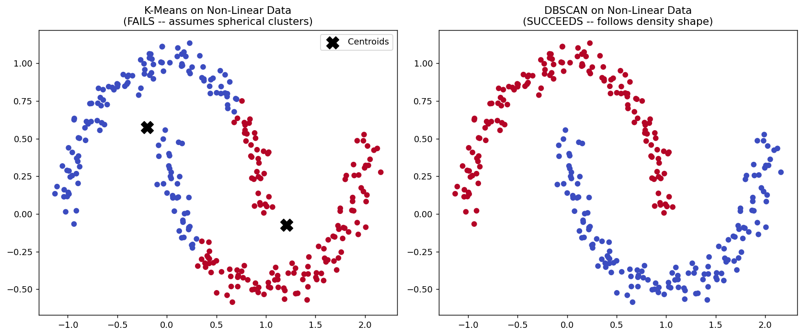
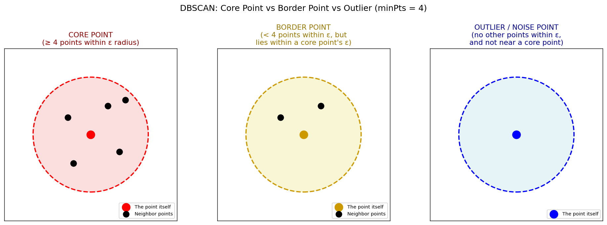
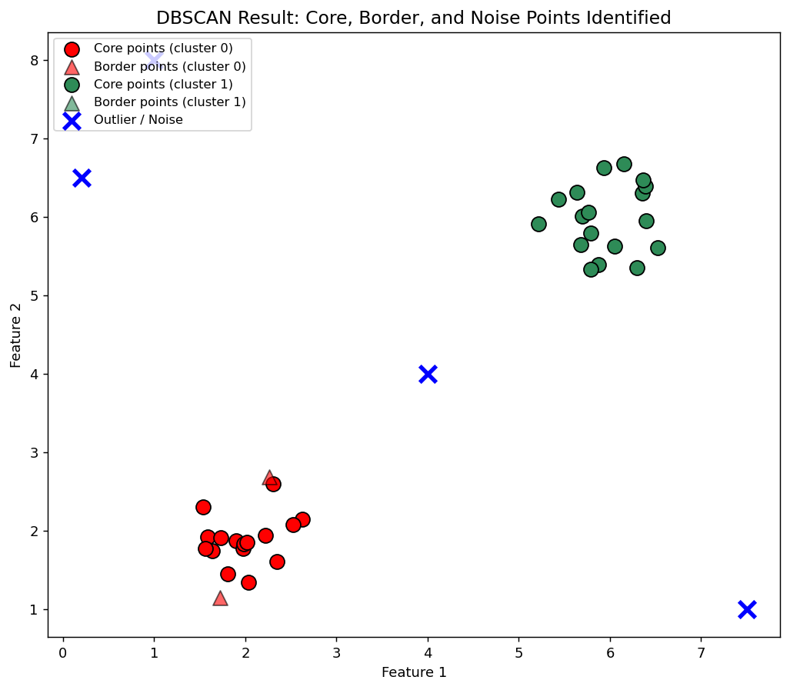
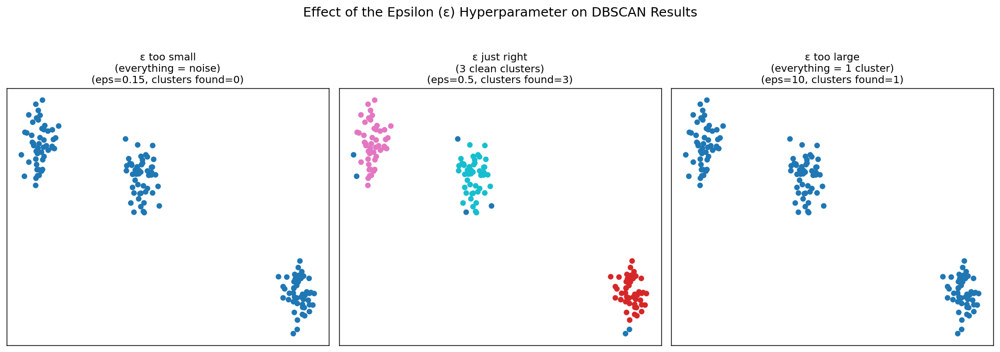
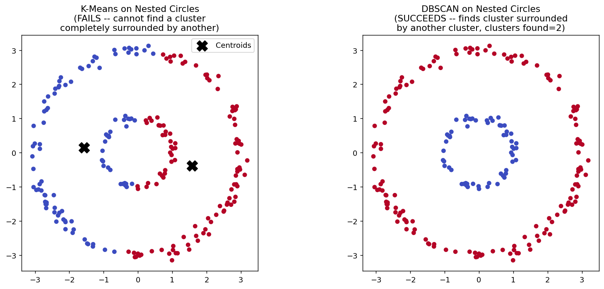

# DBSCAN Clustering — Complete Notes (Basic to Advanced)


## 1. Quick Recap — Where DBSCAN Fits In

So far you've studied two clustering algorithms:
- **K-Means** — needs `k` upfront, uses centroids, assumes roughly spherical clusters.
- **Hierarchical Clustering** — builds a dendrogram, no centroids, but still tends to struggle with weirdly-shaped clusters and doesn't natively handle noise/outliers.

**DBSCAN** (Density-Based Spatial Clustering of Applications with Noise) is a **third major clustering algorithm** that clusters points based on **density** — how tightly packed points are in a region — rather than distance-to-centroid or merge-order.

**Real-life example:** Imagine looking at a satellite photo of city lights at night. Cities and towns show up as **dense clumps of light**, while a stray farmhouse in the middle of nowhere is just a single dim dot. DBSCAN essentially finds those "dense clumps" (clusters) and correctly recognizes that lone farmhouse as **noise**, not force it into some cluster it doesn't belong to.

---

## 2. Why DBSCAN?

Two big real-world problems that K-Means and (to a lesser extent) Hierarchical Clustering struggle with:

1. **Non-linear / arbitrarily shaped clusters** — real data often isn't shaped like neat circles/blobs. Think of a spiral galaxy shape, two crescent moons, or a snake-like cluster.
2. **Noise / Outliers** — real-world data is messy. A few weird, isolated data points shouldn't be forced into a cluster; they should be recognized as noise.

DBSCAN elegantly solves **both** problems at once because it groups points based on **density-connectivity**, not distance-to-a-fixed-center.



**Real-life example:** Imagine GPS pings of delivery vehicles across a city. The "clusters" of activity (busy delivery zones) can be any weird shape depending on road networks and neighborhoods — never a neat circle. K-Means would force those into artificial round blobs; DBSCAN naturally follows the actual shape of dense activity.

---

## 3. The Two Key Hyperparameters

DBSCAN needs exactly **two** hyperparameters (no need to specify the number of clusters!):

| Hyperparameter | Meaning |
|---|---|
| **`epsilon (ε)`** | The radius of the circle (neighborhood) drawn around each point |
| **`minPoints (minPts)`** | The minimum number of points that must exist within that ε-radius circle for the point to be considered "dense" |

**Real-life example:** Think of `epsilon` as "how close is close enough to be neighbors" (like saying "anyone within a 2-minute walk is my neighbor"), and `minPts` as "how many neighbors do I need to call this a busy neighborhood" (like saying "at least 4 houses nearby makes this a proper neighborhood, not just a couple of houses on an empty street").

> These two values are usually chosen via **hyperparameter tuning** — trying different combinations and evaluating with metrics like the **Silhouette Score** (covered in a later topic).

---

## 4. The Three Types of Points in DBSCAN

This is the **most important concept** in DBSCAN. Every single data point gets classified into exactly one of three categories:



### 4.1 Core Point (Red)
A point is a **Core Point** if:

> **Number of points within its ε-radius circle ≥ minPts**

**Example:** If `minPts = 4` and a point has 4 or more other points within distance `ε` from it (including itself, depending on implementation), it's a **core point** — it's sitting in a "dense" region.

**Real-life example:** A shop in the middle of a busy market street, with at least 4 other shops within a short walking distance — that shop is clearly in a "commercial hub" (dense area).

### 4.2 Border Point (Yellow)
A point is a **Border Point** if:

> **Number of points within its ε-radius circle < minPts, BUT it lies within the ε-radius of some core point**

**Example:** If `minPts = 4` and a point only has 2 points within its own ε-circle, it doesn't qualify as core on its own — but if it's close enough to a core point (i.e., it falls inside a core point's circle), it still gets "adopted" into that cluster as a border point.

**Real-life example:** A small standalone shop right at the edge of that busy market street — not busy enough on its own to be called a "hub," but close enough to the hub that it's still considered part of the same commercial area.

### 4.3 Outlier / Noise Point (Blue)
A point is an **Outlier (Noise)** if:

> **No other points exist within its ε-radius circle, AND it doesn't fall within any core point's neighborhood either**

**Example:** A completely isolated point with nothing else nearby.

**Real-life example:** A single farmhouse far away from any town — it's not part of any "dense cluster," so DBSCAN correctly leaves it unclustered as noise, instead of forcibly assigning it to the nearest group (which is what K-Means/Hierarchical would do).

> **This is DBSCAN's single biggest advantage: it explicitly handles noise/outliers as a first-class concept**, rather than being thrown off by them.

---

## 5. Putting It All Together — A Full Example



In the plot above:
- **Red / Green filled circles** = Core points (each has ≥ minPts neighbors within ε) — these form the "skeleton" of each cluster.
- **Triangles** = Border points — not dense enough alone, but attached to a core point's neighborhood, so they still join that cluster.
- **Blue X marks** = Outliers / Noise — isolated points with no nearby cluster, correctly left unassigned.

**How clustering actually happens:** DBSCAN essentially "chains" together all core points that are within ε of each other into one cluster, then attaches any border points to whichever core point's neighborhood they fall into. Anything left over is noise.

---

## 6. Effect of the Epsilon (ε) Hyperparameter

Choosing `epsilon` correctly is critical — too small or too large and your results become meaningless.



- **ε too small** → Almost no point has enough neighbors within such a tiny radius → **everything becomes noise**.
- **ε just right** → Natural, meaningful clusters emerge, matching the real density structure of the data.
- **ε too large** → Every point ends up within reach of every other point → **everything collapses into one giant cluster**.

**Real-life example:** If you define "neighbor" as "within 1 meter," almost nobody in a city has any neighbors (too strict) — everyone looks isolated. If you define "neighbor" as "within 50 km," literally the whole city (and neighboring cities) count as one giant "neighborhood" — the definition becomes useless. You need a "just right" distance for the concept of "neighborhood" to be meaningful.

---

## 7. Real Examples — What DBSCAN Output Actually Looks Like

### 7.1 Non-Linear Shapes + Noise Rejection
On classic non-linearly-separable datasets (crescents, spirals, blobs with scattered noise), DBSCAN correctly:
- Groups points into their natural, non-circular shapes (something **K-Means, Gaussian Mixture/EM clustering cannot do**, since they assume convex/spherical groupings).
- Correctly identifies scattered stray points as **noise**, instead of forcing them into the nearest cluster.

(See the moon-shaped comparison in Section 2 — that's exactly this behavior in action.)

### 7.2 A Cluster Completely Surrounded by Another Cluster

One especially interesting capability: DBSCAN can detect **a cluster that is entirely enclosed inside another cluster** — e.g., a small inner ring of points surrounded by a larger outer ring. This is only possible because of the **`minPts` + core-point mechanism**; density, not distance-to-center, defines the group.



**Real-life example:** Imagine a **traffic roundabout** — a dense ring of cars circling close together, with a second, larger ring of cars in an outer lane further out. K-Means would try to slice this into two "pie-slice" halves using straight-line boundaries around a centroid — it has no concept of "inner ring" vs "outer ring." DBSCAN, because it only cares about local density, correctly identifies the two concentric rings as two separate, correctly-shaped clusters.

### 7.3 Multiple Irregular Clusters + Leftover Noise
On more complex real datasets with many naturally-forming groups of different shapes, DBSCAN can identify **several distinct groups simultaneously** (not just 2-3), while still setting aside a handful of scattered points as noise — something K-Means/Hierarchical Clustering would instead cram into whichever nearby cluster is "closest," even if it doesn't really belong there.

---

## 8. Advantages of DBSCAN (Detailed)

1. **Does not require specifying the number of clusters upfront.** Unlike K-Means (where you must set `k`), DBSCAN figures out the number of clusters purely from the density structure — via core points, border points, and noise — as shown in the examples above.

2. **Can find arbitrarily shaped clusters — including a cluster completely surrounded by another cluster.** This is possible specifically *because of* the `minPts` parameter and the core-point mechanism (Section 7.2's nested-rings example is the clearest illustration of this).

3. **Has a built-in notion of noise, and is robust to outliers.** Since DBSCAN explicitly detects and excludes outliers instead of forcing them into the nearest cluster, this is one of its most important properties. **If your dataset has a lot of outliers, DBSCAN is usually the right algorithm to reach for.**

4. **Requires just two parameters, and is mostly insensitive to the ordering of points in the dataset.** You configure `epsilon` and `minPts`, and (aside from certain border-point edge cases — see disadvantages) the order in which points are processed doesn't meaningfully change the result.

5. **Designed to work well with spatial databases that can accelerate region queries (e.g., using an R-tree index).** In large-scale systems, "find all points within distance ε of this point" is a common, optimizable query — which is exactly what DBSCAN repeatedly asks. This also connects DBSCAN to modern areas like **graph-based/spatial databases** — worth exploring further if you're interested in that space.

> The `epsilon` and `minPts` hyperparameters can also be set by a **domain expert** who understands the natural scale/density of the data, instead of purely relying on automated tuning.

---

## 9. Disadvantages of DBSCAN (Detailed)

1. **DBSCAN is not entirely deterministic.** A border point that is reachable from more than one cluster's core points can end up assigned to whichever cluster processes it first — meaning the exact same data, processed in a different order, could occasionally produce a slightly different assignment for such ambiguous border points.

2. **The quality of DBSCAN's clusters depends heavily on the distance measure used.** Most commonly Euclidean distance is used, but switching to Manhattan distance (or another "region query" distance function) can change which points count as neighbors — and therefore can change the resulting clusters entirely.

3. **DBSCAN cannot properly cluster datasets with large differences in density between clusters.** Because `epsilon` is a single, global threshold, a value that works well for a dense region may cause a sparser region's real points to be wrongly labeled as border points or even noise. (This was shown conceptually in Section 6 — a single global `epsilon` is a real limitation when different parts of your data have very different densities.)

4. **Choosing a good `epsilon` (and understanding your data's scale) can be difficult**, especially if your features are on very different scales. **Standardizing your dataset** (scaling every feature to a comparable range) is the standard way to make `epsilon` selection meaningful and consistent — the same "always scale before distance-based clustering" rule you've already seen with K-Means and Hierarchical Clustering.

---

## 10. DBSCAN vs K-Means vs Hierarchical Clustering — Interview Cheat Sheet

| Aspect | K-Means | Hierarchical | DBSCAN |
|---|---|---|---|
| Need to specify k? | Yes | No (decide from dendrogram) | No (discovered automatically) |
| Centroids? | Yes | No | No |
| Handles noise/outliers? | No (forces every point into a cluster) | No | **Yes — explicitly** |
| Handles non-linear cluster shapes? | No (assumes spherical) | Somewhat limited | **Yes — arbitrary shapes** |
| Scalability (large data) | Good | Poor | Good (with spatial indexing) |
| Key hyperparameters | `k` | linkage method, distance threshold | `epsilon`, `minPts` |
| Sensitive to varying density? | N/A | N/A | **Yes — a real limitation** |

**Common interview questions:**
1. What are the two hyperparameters in DBSCAN, and what does each control?
2. Explain the difference between a core point, a border point, and a noise point.
3. Why is DBSCAN better than K-Means for detecting outliers?
4. Why can DBSCAN find non-linear/arbitrarily shaped clusters when K-Means can't?
5. What happens if `epsilon` is set too small or too large?
6. What's a real limitation of DBSCAN when clusters have very different densities?

---

## 11. Hands-On Implementation — DBSCAN on Moon-Shaped Data (Python + sklearn)

This is the **practical, code-level walkthrough** — we'll turn this into a working notebook when you say "create notebook", but here's the full pipeline and reasoning behind every step.

### 12.1 Why `make_moons`?
Instead of a simple blob dataset, this implementation uses `sklearn.datasets.make_moons`, which generates **two interleaving crescent/half-moon shapes** — a classic non-linearly-separable dataset. This is deliberately chosen to *prove* DBSCAN's core advantage: K-Means or Hierarchical Clustering would struggle to correctly separate these two crescents, but DBSCAN handles it naturally because it clusters by density, not distance-to-centroid.

### 12.2 Step-by-step pipeline

**Step 1 — Import libraries**
```python
from sklearn.cluster import DBSCAN
from sklearn.datasets import make_moons
import matplotlib.pyplot as plt
%matplotlib inline
```

**Step 2 — Generate the moon-shaped dataset**
```python
X, y = make_moons(n_samples=250, noise=0.05)
```
- `n_samples=250` → total number of points to generate.
- `noise=0.05` → adds a small amount of random scatter/outliers around the two crescent shapes, so the data feels more realistic (not perfectly clean).
- `make_moons` returns `X` (the 2 numeric features/coordinates) and `y` (the *true* label — which crescent each point belongs to — useful only for comparison, since clustering itself is unsupervised).

**Step 3 — Visualize the raw data first**
```python
plt.scatter(X[:, 0], X[:, 1])          # without color -- just to see the raw shape
plt.scatter(X[:, 0], X[:, 1], c=y)     # colored by TRUE label -- for later comparison
```
This sanity-check plot confirms you really do get "two interleaving half circles" before you even touch DBSCAN.

**Step 4 — Feature Scaling (Standardization) — same rule as always**
```python
from sklearn.preprocessing import StandardScaler
scalar = StandardScaler()
X_scaled = scalar.fit_transform(X)
```
> Just like in K-Means and Hierarchical Clustering: DBSCAN relies on **distance calculations** to define neighborhoods (the `epsilon` radius), so features must be scaled first — otherwise `epsilon` means something different along each axis.

**Step 5 — Apply DBSCAN**
```python
dbscan = DBSCAN(eps=0.3)
dbscan.fit(X_scaled)
```
- `eps=0.3` → the neighborhood radius (this is the single most important hyperparameter to tune).
- `min_samples` is left at its scikit-learn default (5) here, but can be set explicitly too.
- `.fit()` runs the actual clustering — after this, every point has been classified as belonging to a cluster or as noise (label `-1`).

**Step 6 — Inspect the resulting labels**
```python
dbscan.labels_
```
This gives you an array of cluster labels (e.g., `0`, `1`, ... or `-1` for noise) — one per data point.

**Step 7 — Visualize the DBSCAN result**
```python
plt.scatter(X_scaled[:, 0], X_scaled[:, 1], c=dbscan.labels_)
```
Compare this to the Step 3 plot (colored by the *true* labels) — for a well-chosen `epsilon`, DBSCAN's clustering should look **almost identical** to the ground truth, correctly separating the two crescents without being told there are "2 classes."

### 12.3 What to Experiment With Next
- **Try different `epsilon` values** and observe how the result changes (too small → lots of noise; too large → the two crescents merge into one cluster) — exactly as shown in Section 6's diagram.
- **Use the Silhouette Score** to systematically compare different `epsilon` (and `min_samples`) combinations, and pick the value that gives the best-separated clusters — this will be covered as its own topic, and we'll apply it hands-on in the project notebooks.
- **Try this same pipeline on any other dataset** — the steps (scale → DBSCAN → visualize) stay exactly the same regardless of the data's shape.

---

## 12. Real-World Applications

1. **Anomaly / Fraud Detection** — flagging unusual transactions as "noise" points that don't belong to any normal spending-behavior cluster.
2. **Geospatial Analysis** — grouping GPS pings into meaningful "hotspot" regions (e.g., popular delivery zones, traffic congestion areas) which are rarely perfectly circular.
3. **Astronomy** — identifying star clusters or galaxy structures, which naturally form irregular, non-spherical shapes.
4. **Network Intrusion Detection** — identifying dense clusters of "normal" network traffic patterns, and flagging isolated/rare patterns as potential intrusions.
5. **Image Segmentation** — grouping pixels of similar color/intensity into regions of arbitrary shape (e.g., segmenting an object outline, not just a blob).
6. **Customer Behavior Analysis** — finding naturally-occurring behavior clusters online (e.g., browsing patterns) while automatically excluding one-off/bot-like behavior as noise.

---

## 13. Real-World Mini Projects (To Be Implemented in Notebook)

Once you say **"create notebook"**, we'll build hands-on notebooks for:

1. **Project 1 — Anomaly Detection in Transactions**: Use DBSCAN to flag unusual/fraudulent-looking transactions as noise points, compared against normal spending clusters.
2. **Project 2 — Geospatial Hotspot Detection**: Cluster simulated delivery/ride-share GPS pings into activity hotspots, visualized on a 2D map-like scatter plot.
3. **Project 3 — Non-Linear Shape Clustering Showdown**: Directly compare DBSCAN vs K-Means vs Hierarchical Clustering on moon-shaped and circular/nested data to visually demonstrate DBSCAN's core advantage.
4. **(Optional) Project 4 — Epsilon & minPts Tuning with k-distance Graph**: Implement the standard "k-distance graph" (elbow-style) technique for choosing a good `epsilon` value systematically instead of guessing.

---

## 14. Summary — Key Takeaways

- DBSCAN clusters based on **density**, not distance-to-centroid or merge order.
- Every point becomes one of three types: **Core**, **Border**, or **Noise/Outlier**.
  - Core: has ≥ `minPts` neighbors within `epsilon`.
  - Border: doesn't meet that threshold alone, but is within a core point's neighborhood.
  - Noise: isolated — belongs to neither.
- Two hyperparameters: **`epsilon`** (neighborhood radius) and **`minPts`** (density threshold).
- **No need to specify the number of clusters** — DBSCAN figures that out automatically from the data's density structure.
- Major strengths: **handles noise/outliers natively**, and **finds arbitrarily shaped clusters — even a cluster completely surrounded by another cluster**, both weak points for K-Means and Hierarchical Clustering.
- Major weaknesses: **not fully deterministic on ambiguous border points**, **struggles when clusters have very different densities**, results depend on the chosen distance measure, and choosing good `epsilon`/`minPts` requires care (domain knowledge, standardizing features, or techniques like a k-distance graph).

