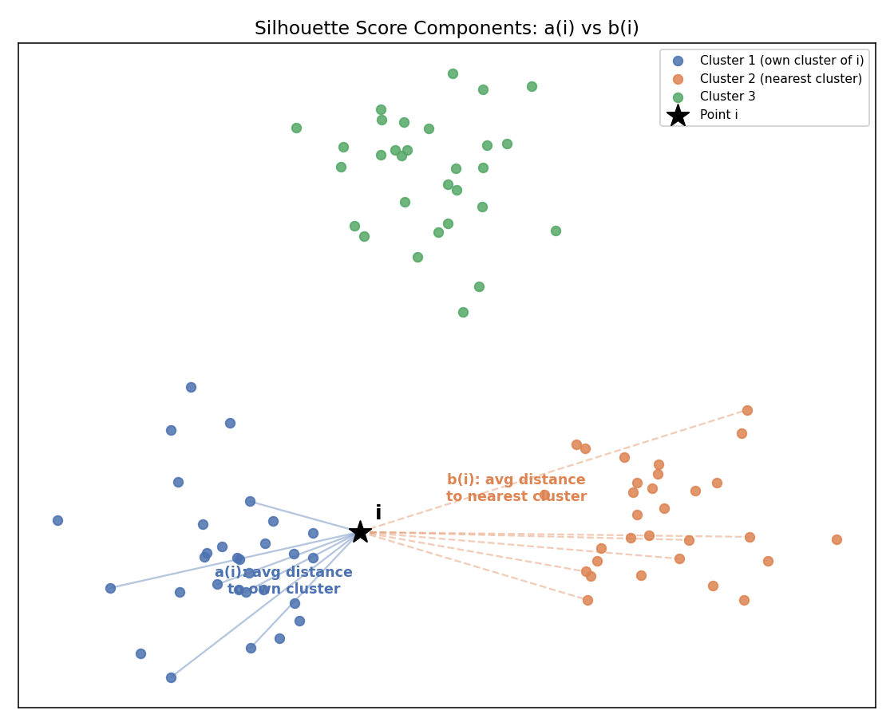

# Silhouette Scoring — Complete Notes (Beginner → Advanced)


## 1. Why Do We Need Silhouette Scoring? (The Big Picture)

In **supervised learning** (like classification), once you build a model, you can check how good it is using metrics like **accuracy, precision, recall** — because you have the *true labels* to compare against.

But in **unsupervised learning** (like K-Means or Hierarchical Clustering), there are **no true labels**. So how do you know if your clustering is actually *good*? How do you validate that "K = 4" (chosen via the Elbow Method) actually gives you sensible, well-formed clusters?

**Silhouette Scoring** is exactly this — a performance metric for clustering, playing the same role that accuracy/precision/recall play for classification.

> 🧠 **Real-life analogy:** Imagine you're organizing a wedding seating chart into tables (clusters) based on how well guests know each other, but you have no "correct answer sheet" to check against — there's no teacher grading your seating chart. Silhouette scoring is like walking around after the event and asking each guest two questions: *"How comfortable were you with the people at YOUR table?"* and *"How much more/less comfortable would you have been at the NEXT closest table?"* If everyone is clearly much happier at their own table than any other table, you did a great job. If people seem like they'd have been just as happy (or happier) at a different table, your seating chart wasn't very good.

**In short:** Silhouette Score tells you, for each data point, *"Are you clearly closer to your own cluster than to the next-nearest cluster?"* — and averages this across all points to give an overall clustering quality score.

---

## 2. The Three Steps of Silhouette Scoring

Let's say we've already run K-Means (or hierarchical clustering) and gotten some clusters. Now we validate the result, point by point.

### Step 1: Compute a(i) — "How well do I fit in my OWN cluster?"

For a data point **i** that belongs to cluster **C₁**:

```
a(i) = average distance from point i to every OTHER point in the SAME cluster C₁
```

Formula:
```
a(i) = (1 / (|C₁| - 1)) × Σ distance(i, j)     for all other points j in C₁
```

- `|C₁|` = number of points in cluster C₁.
- We divide by `|C₁| - 1` (not `|C₁|`) because we don't count the distance from point i to itself (that would just be 0, and including it would water down the average unnecessarily).

> **Low a(i)** = point i is very close to the other members of its own cluster → good sign.
> **High a(i)** = point i is quite far from its own clustermates → point i might be poorly placed.

> 🧠 **Real-life analogy:** a(i) is like asking "on average, how far (in personality/interests) am I from everyone else sitting at MY wedding table?" A small a(i) means you really fit in at your table.

### Step 2: Compute b(i) — "How close am I to the NEXT NEAREST cluster?"

Now look at **every other cluster** (not the one point i belongs to). For each of those other clusters, compute the *average* distance from point i to all the points in that cluster. Then take the **smallest** of these averages — i.e., the distance to the **single nearest neighboring cluster**.

Formula:
```
b(i) = minimum over all clusters C_j (j ≠ own cluster) of:
       [ average distance from point i to every point in C_j ]
```

- We use **minimum** because we specifically care about the *closest* competing cluster — the one point i is most "at risk" of actually belonging to instead.

> 🧠 **Real-life analogy:** b(i) is like asking "of all the OTHER tables at the wedding, which one would I have gotten along with best, and how close (in comfort) would I have been with that table's guests on average?" This identifies your "runner-up" table.

### Step 3: Compute the Silhouette Score for point i

```
silhouette(i) = ( b(i) − a(i) ) / max( a(i), b(i) )
```

This can equivalently be written (for the common case where a(i) < b(i)) as:
```
silhouette(i) = 1 − a(i)/b(i)
```

**The score always falls between -1 and +1:**

| Condition | Result | Meaning |
|---|---|---|
| a(i) << b(i) (much closer to own cluster than any other) | Score close to **+1** | Excellent — point is well-clustered |
| a(i) ≈ b(i) (equally close to own cluster and the nearest other cluster) | Score close to **0** | Borderline — point sits right on the boundary between two clusters |
| a(i) >> b(i) (closer to a DIFFERENT cluster than its own!) | Score close to **-1** | Bad — point was probably assigned to the wrong cluster |



> 🧠 **Real-life analogy for the final score:** Going back to the wedding — if you were clearly most comfortable at your own assigned table (a(i) small) compared to even the best alternative table (b(i) large), your silhouette score is close to **+1**: great seating decision. If you would have been equally comfortable at your table or the next-best one, your score is close to **0**: you're basically sitting right at the boundary between two friend groups. And if you'd actually have been *more* comfortable at a different table than your own, your score is close to **-1**: the seating chart made a mistake putting you where it did.

---

## 3. From One Point to the Whole Clustering: The Overall Silhouette Score

Everything above computes the silhouette value for **one single data point**. To judge the **entire clustering result** (e.g., "is K=4 good, or should it be K=5?"), you simply take the **average silhouette score across all data points** in the dataset:

```
Overall Silhouette Score = average of silhouette(i) across all points i
```

- This gives one single number between -1 and +1 that summarizes how good the *entire* clustering configuration is.
- **In practice (as covered in the K-Means notes' Elbow Method / Silhouette section):** you compute this overall score for several candidate values of K, and pick the K with the **highest average silhouette score** — this is a more robust, mathematically-grounded alternative (or companion) to the Elbow Method.

> 🧠 **Real-life analogy:** After the wedding, if you asked all 200 guests these two questions and averaged everyone's individual "comfort scores," you'd get one overall number representing how good your seating arrangement was as a whole — not just for one guest, but as an event-planning decision.

---

## 4. Interpreting Silhouette Score Values (Practical Guide)

| Average Silhouette Score | Interpretation |
|---|---|
| 0.71 – 1.00 | Strong, well-separated clustering structure |
| 0.51 – 0.70 | Reasonable clustering structure |
| 0.26 – 0.50 | Weak structure — could be artificial, worth double-checking |
| ≤ 0.25 | No meaningful clustering structure found |
| Negative | Many points are likely assigned to the wrong cluster |

**Rule of thumb for freshers:** When comparing several K values, don't just chase the single highest score — also check that no individual clusters have a lot of points with *negative* individual silhouette values (this usually means that specific cluster is poorly formed, even if the *overall average* still looks okay).

---

## 5. Why This Matters More Than Just the Elbow Method

Recall from the K-Means notes: the Elbow Method can sometimes be ambiguous — if the WCSS curve doesn't have an obvious sharp bend, it's hard to visually tell where the "elbow" really is.

**Silhouette Scoring fixes this ambiguity** because:
1. It gives you one clean, comparable **number** per K value — no need to eyeball a graph for a bend.
2. It directly measures **how well-separated the clusters are**, not just how tightly packed they are (which is all WCSS measures). A clustering can have low WCSS (tight clusters) but still have those clusters overlapping/bleeding into each other — silhouette scoring catches this, WCSS alone does not.
3. It works for **any clustering algorithm** — K-Means, Hierarchical Clustering, DBSCAN, etc. — not just ones with centroids, since a(i) and b(i) only need cluster membership and distances, not centroids.

> 🧠 **Real-life analogy:** WCSS is like measuring "how tightly packed is each wedding table" (are people sitting close together?). But that alone doesn't tell you if two neighboring tables were actually supposed to be one big table, or if someone at Table 3 should really have been at Table 4. Silhouette scoring specifically checks *relative* comfort — your own table vs. the best alternative — which WCSS completely ignores.

---

## 6. Quick Summary (Cheat Sheet)

1. **Silhouette Scoring** validates unsupervised clustering results — the equivalent of accuracy/precision/recall for supervised models.
2. **Step 1 — a(i):** average distance from point i to all other points in its **own** cluster (lower = better fit).
3. **Step 2 — b(i):** average distance from point i to all points in the **nearest neighboring** cluster (higher = better separation).
4. **Step 3 — Silhouette Score:** `(b(i) − a(i)) / max(a(i), b(i))`, ranges from **-1 to +1**.
   - Close to **+1** → well-clustered.
   - Close to **0** → sits on the boundary between two clusters.
   - Close to **-1** → likely assigned to the wrong cluster.
5. **Overall score** = average silhouette value across all points — used to compare and choose the best K.
6. More robust than the Elbow Method alone because it measures **cluster separation**, not just tightness, and works with any clustering algorithm.

---

## 7. What's Implemented in the Notebooks

Silhouette Scoring is already implemented and used across the existing K-Means notebooks — specifically:
- `kmeans_from_scratch_and_sklearn.ipynb` (Section 5: Silhouette Score alongside the Elbow Method)
- `kmeans_sklearn_implementation.ipynb` (Step 9: full silhouette score validation loop, plotted against K)

Both use `sklearn.metrics.silhouette_score(X, labels)`, which implements exactly the a(i)/b(i)/silhouette(i) formulas from this file internally, then averages across all points to return the single overall score. If you'd like a **dedicated** notebook that computes a(i) and b(i) from scratch (pure NumPy, point by point) to make the formulas fully concrete, just ask and one can be added alongside the others.
